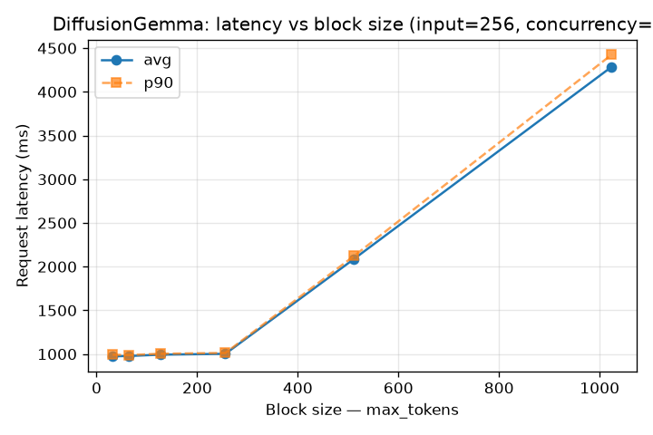
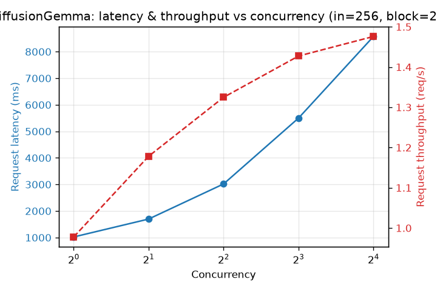
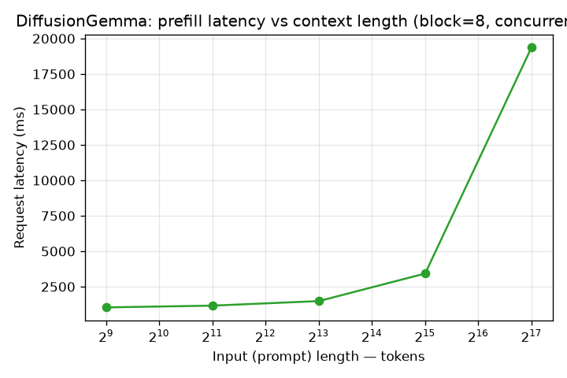

# DiffusionGemma-26B Serving Benchmark

**Date:** 2026-07-03
**Author:** Juncheng Yang
**Hardware:** 1 × NVIDIA RTX PRO 6000 Blackwell Max-Q (96 GB VRAM), gpu1 / rtx6000 node
**Model:** [`nvidia/diffusiongemma-26B-A4B-it-NVFP4`](https://huggingface.co/nvidia/diffusiongemma-26B-A4B-it-NVFP4) — 26 B block-diffusion LLM (Gemma4 backbone), NVFP4 weights (~19 GB on disk)
**Engine:** vLLM (`vllm/vllm-openai:gemma`, v0.22.1rc1) via `ops/local_deployment_proxy`, `--attention-backend TRITON_ATTN`, V2 model runner, `max_model_len=262144`, `gpu_memory_utilization=0.85`
**Harness:** NVIDIA `genai-perf` 0.0.16 (OpenAI `/v1/completions`), plus an async fallback client for high concurrency

> **Status:** this benchmark is why DiffusionGemma was **removed** from the rtx6000
> node (#896, reverted in #898). It remains served on DGX Spark. Kept here as the
> characterization record and for the `max_denoising_steps` throughput lever.

---

## 1. Executive summary

DiffusionGemma is a **block-diffusion** LLM: one denoising pass emits a whole
block of tokens at once, rather than one token at a time. This inverts the usual
serving economics, so the standard autoregressive (AR) metrics — TTFT vs TPOT,
inter-token latency, per-token decode throughput — **do not apply**. The
meaningful axes are **request latency** and **request throughput**.

Key findings (single RTX PRO 6000, live production instance on `:8001`):

- **~1 s latency floor.** A request emitting ≤256 output tokens costs ~1.0 s
  regardless of how many tokens it actually returns (32-token block = 974 ms,
  256-token block = 1002 ms). One denoising pass ≈ a **256-token block ≈ ~1 s**.
- **Block-linear latency.** Above 256 output tokens latency scales with the
  number of blocks: 512 → 2.1 s (2 blocks), 1024 → 4.3 s (4 blocks).
- **Throughput saturates at ~1.5 req/s.** Batching barely helps: from
  concurrency 8 → 48 throughput stays ~1.43–1.49 req/s while latency grows
  linearly (5.5 s → 19 s). The model is **compute-bound**, unlike AR MoE serving
  where batching multiplies token throughput. Effective capacity at saturation
  ≈ 1.5 req/s × 256 tok ≈ **~380 output tok/s**.
- **Prefill is cheap to ~8 K, then steep.** 512→8 K input adds only ~0.5 s;
  32 K → 3.4 s; 128 K → 19.4 s. Long-context prompts dominate latency.
- **No engine concurrency ceiling.** A direct burst sustained **48/48 concurrent
  requests at 100 % success**; genai-perf's HTTP-400s at c≥32 were a client-side
  artifact, not the server.

**Serving guidance:** DiffusionGemma is best for **short-to-medium outputs at low
concurrency** (its ~1 s flat-latency block is competitive there). It is a poor
fit for high-concurrency, long-output, or long-context workloads, where latency
climbs and throughput does not.

---

## 2. Method

Traffic was driven through the live gateway endpoint (`http://127.0.0.1:8001`,
`LOCAL_DEPLOYMENT_URL`) so the proxy kept the container warm. Output length was
requested with `ignore_eos:true`; note the block-diffusion decoder often stops
emitting real tokens early on synthetic prompts (so `out_tok` below is the actual
count), but **the denoising pass — and therefore latency — reflects the block
size (`max_tokens`), not the returned length**. Three sweeps:

1. **Block size** — input 256, concurrency 1, `max_tokens ∈ {32…1024}`
2. **Concurrency** — input 256, block 256, concurrency `∈ {1…48}`
3. **Prefill** — block 8, concurrency 1, input `∈ {512…131072}`

Reproduce: `scripts/run_sweeps.py` (sweeps → `results/`), `scripts/plot.py`
(→ `figures/`).

---

## 3. Results

### 3.1 Latency vs block size (input=256, concurrency=1)

| max_tokens | latency avg | p90 | actual out tok |
|---:|---:|---:|---:|
| 32 | 974 ms | 993 ms | 5 |
| 64 | 978 ms | 989 ms | 13 |
| 128 | 993 ms | 1004 ms | 23 |
| 256 | 1002 ms | 1013 ms | 27 |
| 512 | 2089 ms | 2123 ms | 257 |
| 1024 | 4287 ms | 4426 ms | 704 |

Flat ~1 s up to a 256-token block, then ~1 s per additional block.

### 3.2 Latency & throughput vs concurrency (input=256, block=256)

| concurrency | latency avg | throughput | source |
|---:|---:|---:|:--|
| 1 | 1022 ms | 0.98 req/s | genai-perf |
| 2 | 1697 ms | 1.18 req/s | genai-perf |
| 4 | 3019 ms | 1.32 req/s | genai-perf |
| 8 | 5500 ms | 1.43 req/s | genai-perf |
| 16 | 8575 ms | 1.48 req/s | genai-perf |
| 32 | 13323 ms | 1.49 req/s | async burst¹ |
| 48 | 19070 ms | 1.47 req/s | async burst¹ |

¹ genai-perf emitted spurious HTTP-400s at c≥32; a direct async burst confirmed
the server serves 48/48 at 100 % success, so c32/c48 were measured with that
client (full 256-token blocks forced).

Throughput plateaus at ~1.5 req/s; latency grows ~linearly.

### 3.3 Prefill latency vs context length (block=8, concurrency=1)

| input tokens | latency avg | p90 |
|---:|---:|---:|
| 512 | 1038 ms | 1055 ms |
| 2048 | 1163 ms | 1185 ms |
| 8192 | 1482 ms | 1578 ms |
| 32768 | 3426 ms | 3675 ms |
| 131072 | 19379 ms | 22825 ms |

---

## 4. Caveats

- Measured against the **live production instance** (shared GPU 0), not an
  isolated server; absolute numbers include real-request contention and proxy
  overhead.
- `genai-perf` is AR-oriented; its ITL / TPOT / output-token-throughput fields
  are omitted here because they are meaningless for block diffusion.
- The `/v1/chat/completions` path (real user traffic, streaming) showed **lower
  latency** than `/v1/completions` at high concurrency in a quick profile
  (~5 s vs ~13 s at c32). The endpoint/template difference is unexplained and
  worth a follow-up; the systematic sweep above uses `/v1/completions`.
- Single node, single GPU, single run per point (no repeats) — treat as a
  characterization pass, not a tuned production benchmark.
