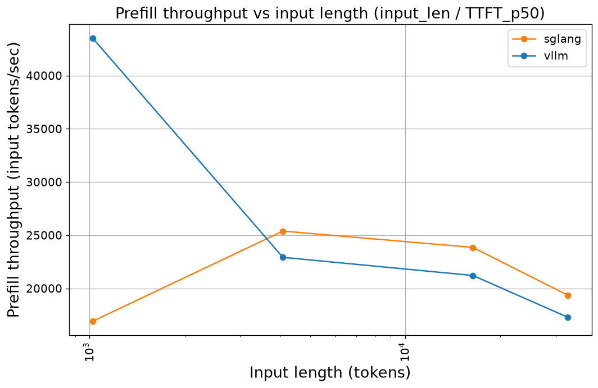
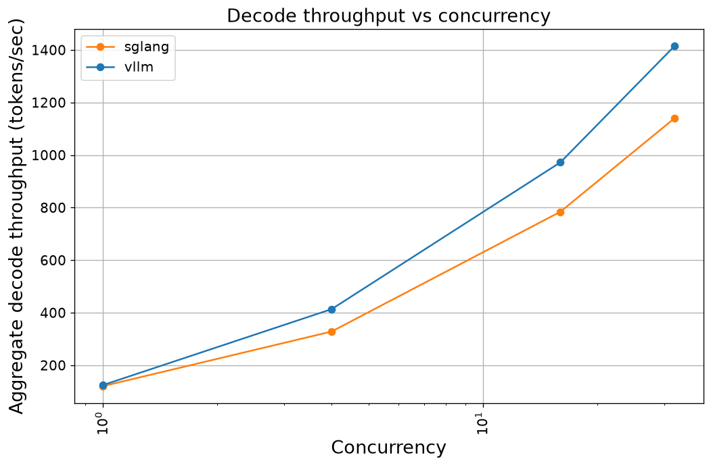
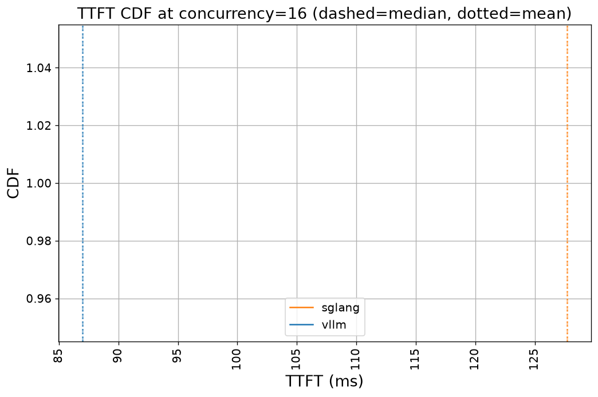
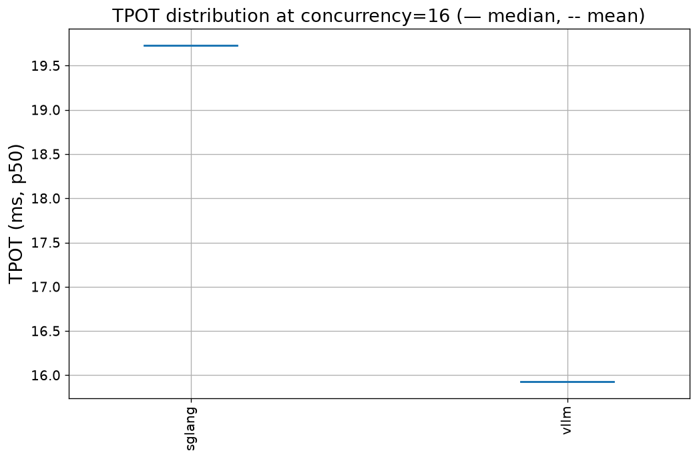

# MiniMax-M2.7 (FP8) Throughput Benchmark — vLLM vs sglang

**Date:** 2026-06-20
**Author:** Juncheng Yang
**Hardware:** 2 × NVIDIA H200 (GPUs 2 & 3), TP=2
**Model:** [`MiniMaxAI/MiniMax-M2.7`](https://huggingface.co/MiniMaxAI/MiniMax-M2.7) — MoE, ~230 B total / ~10 B active, **native FP8** (block-quantized e4m3, 230 GB on disk, 125 shards)
**Engines compared:** vLLM 0.23.0, sglang 0.5.9
**Benchmark harness:** NVIDIA `genai-perf` 0.0.16, OpenAI-compatible HTTP API

---

## 1. Executive summary

Two production serving engines were measured against the same FP8 model, on the
same two GPUs, with a single benchmark harness. As with the qwen3.6 study, **the
result is not a clean winner — each engine wins a different axis:**

- **sglang wins prefill** from 4 K context onward (~11–12 % higher input
  throughput, lower TTFT). vLLM only wins prefill at the 1 K overhead-bound point.
- **vLLM wins decode at every concurrency** (3–26 % higher aggregate throughput,
  lower per-token latency).

Workload-based recommendation:
- **Long-context / prefill-heavy / TTFT-sensitive** (RAG, agentic chains): **sglang**.
- **High-volume decode** (chat, completion): **vLLM**.

Both engines serve M2.7 comfortably on 2 × H200: weights take ~115 GB/GPU,
leaving a ~270 K-token (vLLM) / ~330 K-token (sglang) FP8 KV pool.

---

## 2. Setup

### 2.1 Hardware

| Item | Spec |
|---|---|
| GPUs | 2 × NVIDIA H200 (indices **2 and 3**; GPU 1 deliberately avoided) |
| VRAM | 143 GB/GPU (286 GB total) |
| Interconnect | NVLink **NV6** (full mesh); GPUs 2+3 share NUMA node 1 |
| Driver | 610.43.02 |
| Tensor parallel | 2 |

GPUs 2 and 3 were chosen as the "avoid GPU 1" pair because they sit on the same
NUMA node (1) and are NVLink-connected, giving the cleanest TP=2 placement.

### 2.2 Software — native, not Docker

Docker is unavailable on this shared host (installing it requires root-level
changes to the shared daemon). Both engines therefore run as **native processes
in isolated `uv` venvs** rather than the official containers used in the qwen3.6
study. This is the one methodological deviation worth flagging — see § 5.1.

| Component | Version | venv |
|---|---|---|
| vLLM | 0.23.0 | `/netscratch/juncheng/venvs/vllm` |
| sglang | 0.5.9 | `/netscratch/juncheng/venvs/sglang` |
| genai-perf | 0.0.16 | `/netscratch/juncheng/venvs/genai` |

Weights live at `/netscratch/juncheng/models/MiniMax-M2.7-FP8` (downloaded from
the official repo; the model ships natively in FP8, so no quantization step was
needed).

### 2.3 Engine configuration (held identical)

| Setting | Value |
|---|---|
| Tensor parallel size | 2 (GPUs 2,3) |
| `max_model_len` / `context-length` | 40,960 |
| GPU memory utilization / mem-fraction-static | 0.92 |
| Weight dtype | FP8 e4m3 (native, block-scaled 128×128) |
| KV cache dtype | FP8 (vLLM `fp8`; sglang `fp8_e4m3`) |
| Bound port | vLLM 8000, sglang 8001 |

**One required vLLM flag: `VLLM_USE_DEEP_GEMM=0`.** vLLM's default FP8 dense path
selects FlashInfer's DeepGEMM block-scale GEMM, which JIT-compiles a cubin via
`nvcc` at startup. There is no CUDA toolkit on this host, so the compile produces
no cubin and the engine asserts
(`tensorrt_llm/deep_gemm/runtime.cuh:63: !cubin.empty() || isPathValid(path_)`).
Disabling DeepGEMM makes vLLM fall back to its prebuilt **CUTLASS FP8 block-scale
kernel** (`CutlassFp8BlockScaledMMKernel`), which needs no `nvcc`. sglang uses its
Triton FP8 path and was unaffected.

---

## 3. Methodology

### 3.1 Test matrix

Two batteries per engine, run sequentially. The server is restarted between
batteries for a clean KV-cache state.

**Prefill battery** — input length sweep, prefill-only:
- Input lengths: 1 K, 4 K, 16 K, 32 K tokens
- Output length: 1 token · Concurrency: 1
- 30 warmup + 200 measurement requests per point

**Decode battery** — concurrency sweep:
- Input length: 1 K · Output length: 1 K
- Concurrency: 1, 4, 16, 32
- 30 warmup + 200 measurement requests per point

The sweep ranges are **trimmed from the qwen3.6 study** (which went to 128 K
input and 128-way concurrency). On 2 × H200 the 230 GB weights leave only
~13 GB/GPU for KV; the FP8 KV pool holds ~270 K tokens (vLLM). 40 K context and
32-way concurrency stay comfortably inside that budget; 128 K / 128-way would not.
See § 5.2.

`num_repeats = 1`, matching the qwen3.6 final run: each point already aggregates
200 internal samples, so p50/p95 within a point are meaningful, but run-to-run
variance is not captured (the CDF/violin plots are single-sample — see § 5.3).

### 3.2 Metrics

Per point (after genai-perf internal aggregation):
- **Prefill input throughput** — derived `input_len / TTFT_p50`.
- **Aggregate decode throughput** — output tokens/sec across all concurrent requests.
- **Per-user throughput** — tokens/sec a single user perceives.
- **TTFT** (p50) and **TPOT / ITL** (p50).

---

## 4. Results

### 4.1 Prefill throughput (input tokens/sec, concurrency = 1)



| Input | vLLM tok/s | vLLM TTFT | sglang tok/s | sglang TTFT | Winner |
|---:|---:|---:|---:|---:|:--|
| 1,024 | **43,558** | 23.5 ms | 16,934 | 60.5 ms | vLLM (2.57×) |
| 4,096 | 22,921 | 178.7 ms | **25,389** | 161.3 ms | sglang (1.11×) |
| 16,384 | 21,219 | 772.2 ms | **23,857** | 686.8 ms | sglang (1.12×) |
| 32,768 | 17,285 | 1,895.8 ms | **19,357** | 1,692.8 ms | sglang (1.12×) |

At 1 K both engines are overhead-bound; vLLM's fixed per-request overhead is
lower, so it wins decisively there. From 4 K up — where prefill is compute-bound —
**sglang is consistently ~11–12 % faster** and has lower TTFT, the same pattern
seen in the qwen3.6 study. Prefill throughput peaks around 4 K and declines as
attention's quadratic cost dominates; at 32 K, first-token latency is ~1.7–1.9 s.

### 4.2 Decode throughput (output tokens/sec, 1 K in / 1 K out)



| Concurrency | vLLM agg | vLLM/user | vLLM TPOT | sglang agg | sglang/user | sglang TPOT | Winner |
|---:|---:|---:|---:|---:|---:|---:|:--|
| 1 | **124.5** | 125.2 | 7.75 ms | 120.5 | 121.4 | 8.24 ms | vLLM (1.03×) |
| 4 | **413.6** | 103.9 | 9.62 ms | 328.5 | 83.3 | 12.03 ms | vLLM (1.26×) |
| 16 | **972.2** | 63.2 | 15.93 ms | 784.3 | 51.2 | 19.73 ms | vLLM (1.24×) |
| 32 | **1,415.9** | 48.4 | 21.14 ms | 1,141.0 | 39.3 | 26.17 ms | vLLM (1.24×) |

**vLLM wins decode at every concurrency.** The gap opens to ~24–26 % from
concurrency 4 onward and holds at saturation, with correspondingly lower TPOT
(21.1 ms vs 26.2 ms at concurrency 32). Both engines scale near-linearly to 32-way;
a single user sees ~125 tok/s at concurrency 1 — strong for a 230 GB / ~10 B-active
MoE.

### 4.3 Latency distributions




> With `num_repeats = 1` these distribution plots are degenerate (one sample per
> engine). The numeric p50/p95 inside each point are real; only the cross-run
> distribution shape is unobservable. See § 5.3.

---

## 5. Discussion

### 5.1 Native processes vs containers

The qwen3.6 study ran each engine in its official Docker image for version
pinning. Here both engines run natively in `uv` venvs because Docker isn't
available on the shared host. This does **not** affect the cross-engine
comparison — both engines hit the same GPUs, the same model, and the same
genai-perf harness — but absolute numbers are not directly comparable to a
containerized run (different CUDA/runtime stack). Versions are pinned by the venv
lockfiles instead of image digests.

### 5.2 The KV-budget constraint

A 230 GB model on 286 GB of VRAM is the defining constraint of this run. At
GMU 0.92 the KV pool is ~270 K tokens (vLLM) / ~330 K tokens (sglang) in FP8 — ample
for 40 K context at ≤32-way concurrency, but the reason the sweep stops short of
the qwen3.6 ceilings. FP8 KV (vs bf16) roughly doubles the pool and was used for
both engines; the accuracy cost is irrelevant for a throughput benchmark.

### 5.3 Limitations of `num_repeats = 1`

Each point was run once (200 internal samples). Consequence: CDF/violin plots are
single-sample, and run-to-run variance is not quantified. Re-running with
`num_repeats = 5` would populate the distributions (~30 min added wallclock).

---

## 6. Reproducing

```bash
# 1. Download weights (public, native FP8, ~230 GB)
hf download MiniMaxAI/MiniMax-M2.7 --local-dir /netscratch/juncheng/models/MiniMax-M2.7-FP8

# 2. Build venvs
uv venv --python 3.12 /netscratch/juncheng/venvs/vllm   && uv pip install --python /netscratch/juncheng/venvs/vllm/bin/python vllm
uv venv --python 3.12 /netscratch/juncheng/venvs/sglang && uv pip install --python /netscratch/juncheng/venvs/sglang/bin/python "sglang[all]"
uv venv --python 3.12 /netscratch/juncheng/venvs/genai  && uv pip install --python /netscratch/juncheng/venvs/genai/bin/python genai-perf pandas matplotlib requests

# 3. Run the full pipeline (both engines → CSV → plots)
cd benchmark/local/minimax-m2.7/scripts
bash run.sh                       # or: --engines vllm | --dry-run | --rerun <sentinel>
```

The pipeline is sentinel-gated (`results/.state/`) and resumable: re-running
picks up after the last completed stage. Long-format results land in
`results/summary.csv`; plots in `results/plots/`.

### 6.1 Directory layout

```
benchmark/local/minimax-m2.7/
├── README.md                     # this report
├── results/
│   ├── summary.csv               # tidy long-format metrics
│   ├── plots/*.png               # 4 comparison plots
│   ├── vllm/ · sglang/           # raw genai-perf JSON per point
│   └── .state/                   # resumability sentinels
└── scripts/
    ├── config.py                 # central config (GPUs, TP, FP8, sweep matrix)
    ├── orchestrate.py            # resumable pipeline driver
    ├── run.sh                    # entry point (wires up the genai venv)
    ├── run_genai_perf.py         # genai-perf argv wrapper
    ├── aggregate.py · plot.py · state.py
    └── engines/{vllm,sglang}.sh  # native TP=2 launch scripts (GPUs 2,3)
```

---

## 7. Open questions / next experiments

1. **`num_repeats = 5`** to populate distributions and quantify variance (~30 min).
2. **Containerized re-run** (if Docker becomes available) to compare against the
   native-venv numbers and isolate any runtime-stack effect.
3. **Restore DeepGEMM** by installing a CUDA toolkit (`nvcc`), to measure the FP8
   dense-GEMM uplift over the CUTLASS fallback on vLLM.
4. **Wider sweep** (longer context, higher concurrency) — feasible if the model is
   spread over 4 GPUs (TP=4), trading a device for KV headroom.
