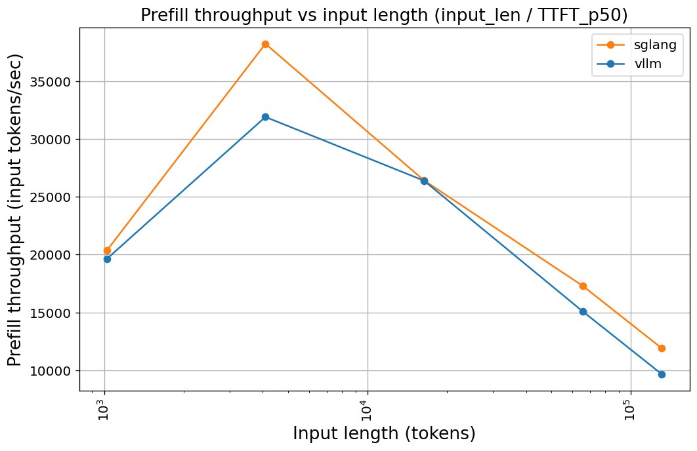
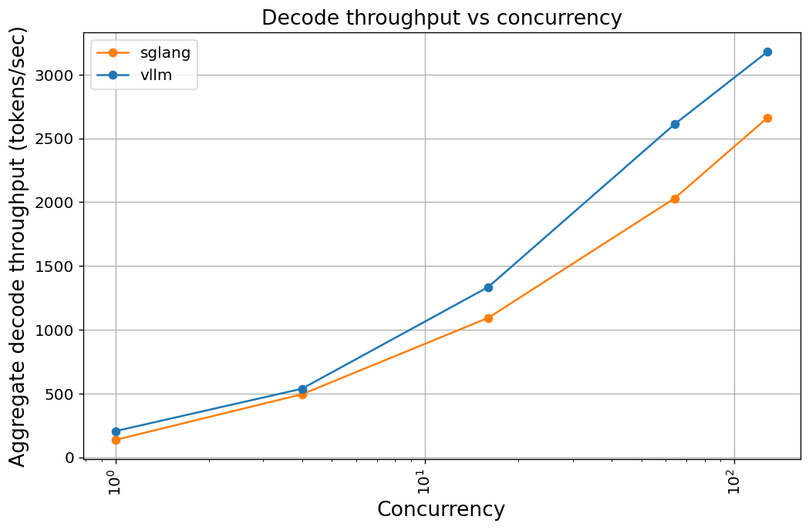
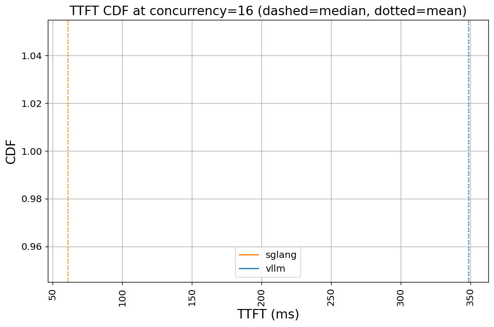
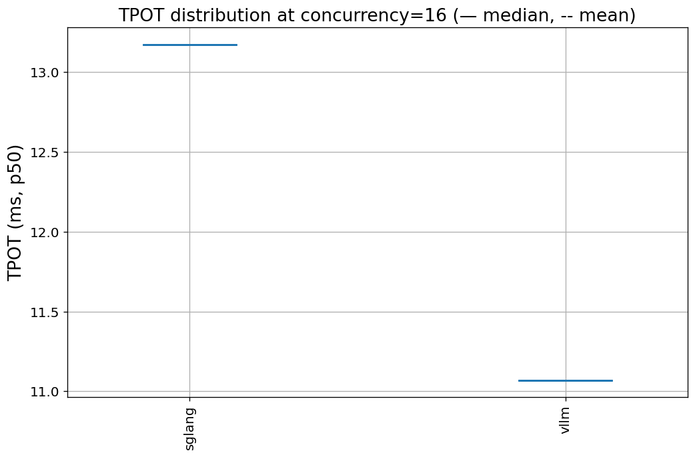

# Qwen3.6-35B-A3B-FP8 Throughput Benchmark

**Date:** 2026-04-29
**Author:** Juncheng Yang
**Hardware:** 1 × NVIDIA RTX PRO 6000 Blackwell Max-Q (96 GB VRAM)
**Model:** [`Qwen/Qwen3.6-35B-A3B-FP8`](https://huggingface.co/Qwen/Qwen3.6-35B-A3B-FP8) — 35 B total / ~3 B active MoE, FP8 weights, 35 GB on disk
**Engines compared:** vLLM, sglang, TensorRT-LLM (dropped)
**Benchmark harness:** NVIDIA `genai-perf` 0.0.16, OpenAI-compatible HTTP API

---

## 1. Executive summary

Two production-grade serving engines were measured against the same model on the same GPU using a single benchmark harness. **The result is not a clean winner.** Each engine wins different axes:

- **sglang** is faster at prefill (up to ~25 % at 128 K context), has 5–6× lower TTFT under moderate concurrency, and starts ~10× faster.
- **vLLM** delivers higher decode throughput (~20 % across all concurrency levels) and lower per-token latency.

The right engine depends on workload shape:
- **Long-context prompts, latency-sensitive serving** (RAG, agentic chains): sglang.
- **Short-context, high-volume decode** (chatbots, completion suggestions): vLLM.

**TensorRT-LLM was dropped** from the comparison: the released container ships with a `transformers` package too old to recognize the model's `qwen3_5_moe` architecture. Two workarounds (AOT engine build, PyTorch backend) both fail at the same point. Recommendation: revisit when TRT-LLM ships with `transformers ≥ 4.55`.

---

## 2. Setup

### 2.1 Hardware

| Item | Spec |
|---|---|
| GPU | NVIDIA RTX PRO 6000 Blackwell Max-Q |
| VRAM | 96 GB |
| Driver | 570.211.01 |
| CUDA | 12.8 host / containers run their own |
| GPU index used | 1 (idle, dedicated to the benchmark) |

### 2.2 Software

Each engine runs in its own official Docker container:

| Engine | Image | Image size |
|---|---|---|
| vLLM | `vllm/vllm-openai:latest` (`04563c302537`) | 31 GB |
| sglang | `lmsysorg/sglang:latest` (`7515a1e626d2`) | 55 GB |
| TensorRT-LLM | `nvcr.io/nvidia/tensorrt-llm/release:latest` (`e0d966e2daec`) | 77 GB |

Docker + NVIDIA Container Toolkit installed via [`scripts/setup_docker.sh`](scripts/setup_docker.sh) (passwordless sudo). Model weights downloaded via [`scripts/download_model.sh`](scripts/download_model.sh) to `/scratch/juncheng/models/Qwen3.6-35B-A3B-FP8`.

### 2.3 Engine configuration (held identical across all engines)

| Setting | Value |
|---|---|
| Tensor parallel size | 1 |
| `max_model_len` / `context-length` | 135,168 (132 K, leaves headroom over 128 K input) |
| GPU memory utilization | 0.90 |
| KV cache dtype | FP8 (vLLM); engine default for sglang, FP16 |
| Bound port | vLLM 8000, sglang 8001, TRT-LLM 8002 |

The KV cache dtype asymmetry is a known limitation — see § 5.2.

---

## 3. Methodology

### 3.1 Test matrix

Two batteries per engine, run sequentially. The server is restarted between batteries to ensure clean KV-cache state.

**Prefill battery** — sweeps prompt length to characterize prefill throughput vs context size:
- Input lengths: 1 K, 4 K, 16 K, 64 K, 128 K tokens
- Output length: 1 token (forces prefill-only behavior)
- Concurrency: 1
- 30 warmup + 200 measurement requests per data point

**Decode battery** — sweeps concurrency to characterize batching:
- Input length: 1 K (small, fixed)
- Output length: 1 K
- Concurrency: 1, 4, 16, 64, 128
- 30 warmup + 200 measurement requests per data point

Each genai-perf invocation produces internally aggregated statistics across its 200 requests. We ran with `num_repeats=1` to keep wallclock under 30 minutes; the pre-aggregated p50/p95 percentiles inside each measurement remain meaningful.

### 3.2 Harness — why genai-perf

We deliberately chose a single harness across all engines so cross-engine numbers are directly comparable, eliminating harness-induced variance. NVIDIA's `genai-perf` 0.0.16 talks to any OpenAI-compatible HTTP server, so vLLM, sglang, and TRT-LLM are all measured identically.

### 3.3 Metrics

Reported per data point (after internal aggregation by genai-perf):
- **Prefill input throughput**: `input_len / TTFT_p50` (derived) — the meaningful prefill rate.
- **Aggregate decode throughput**: output tokens/sec across all concurrent requests.
- **Per-user output throughput**: tokens/sec a single user perceives.
- **TTFT** (time to first token) — p50 and p95.
- **TPOT / ITL** (time per output token / inter-token latency) — p50 and p95.
- **Request latency** — p50 and p95 end-to-end.

Note: the raw `output_token_throughput` from genai-perf is misleading for the prefill battery (when `output=1` it collapses to request rate × 1, not the prefill compute rate). Hence the derived `prefill_tps_input_p50` metric.

---

## 4. Results

### 4.1 Prefill throughput (input tokens / sec, concurrency = 1)



| input_len | sglang | vLLM | sglang/vLLM |
|---:|---:|---:|---:|
| 1,024 | 20,366 | 19,639 | 1.04 × |
| 4,096 | **38,255** | 31,920 | 1.20 × |
| 16,384 | 26,433 | 26,408 | 1.00 × |
| 65,536 | 17,313 | 15,106 | 1.15 × |
| 131,072 | **11,901** | 9,656 | 1.23 × |

Both engines share a similar shape: overhead-bound at 1 K (50 ms TTFT is mostly network + tokenization, not compute), peaking around 4 K (~38 K t/s on sglang), then declining as attention's quadratic cost dominates from 16 K up. **sglang is consistently faster from 4 K onward**, with the gap widening to ~23 % at 128 K.

### 4.2 Decode throughput (output tokens / sec, 1 K input / 1 K output)



| concurrency | sglang | vLLM | vLLM/sglang |
|---:|---:|---:|---:|
| 1 | 137 | **205** | 1.50 × |
| 4 | 494 | **537** | 1.09 × |
| 16 | 1,093 | **1,335** | 1.22 × |
| 64 | 2,029 | **2,611** | 1.29 × |
| 128 | 2,663 | **3,180** | 1.19 × |

Both engines scale near-linearly to ~16 concurrent requests; from 16 → 128 the slope flattens as the GPU saturates. **vLLM wins decode at every concurrency**, with the largest gap at concurrency = 1 (50 % faster) and a steady ~20 % gap at saturation.

### 4.3 Latency: TTFT and TPOT (lower is better)

**TTFT p50 — time to first token:**

| concurrency | sglang | vLLM |
|---:|---:|---:|
| 1 | 53 ms | 56 ms |
| 4 | 58 ms | 65 ms |
| 16 | **61 ms** | 349 ms |
| 64 | **582 ms** | 741 ms |
| 128 | **1,069 ms** | 1,111 ms |

The standout finding here is that **vLLM TTFT jumps 5× from concurrency 4 → 16** (65 ms → 349 ms), while sglang stays under 65 ms. This is consistent with sglang's radix-tree KV cache enabling more aggressive prefill batching at moderate concurrency. At concurrency = 128, both engines saturate at ~1.1 s.

**TPOT p50 — time per output token:**

| concurrency | sglang | vLLM |
|---:|---:|---:|
| 1 | 7.27 ms | **4.82 ms** |
| 4 | 7.85 ms | **7.25 ms** |
| 16 | 13.17 ms | **11.07 ms** |
| 64 | 26.21 ms | **21.68 ms** |
| 128 | 38.68 ms | **35.21 ms** |

vLLM's per-token decode is consistently 10–30 % lower than sglang's. At concurrency = 1 the gap is 50 % (4.8 ms vs 7.3 ms).

### 4.4 Per-user perceived throughput




> The CDF and violin plots above are degenerate (single sample per engine appears as a vertical line / horizontal slab). With `num_repeats = 1`, we have one TTFT/TPOT value per (engine, concurrency) data point. The numeric values are real; only the distributional shape is unobservable. See § 5.3.

| concurrency | sglang | vLLM |
|---:|---:|---:|
| 1 | 138 t/s/user | **208** t/s/user |
| 4 | 128 | **138** |
| 16 | 78 | **91** |
| 64 | 40 | **49** |
| 128 | 29 | **33** |

What a single user actually sees: the aggregate decode advantage translates 1-to-1 to a per-user advantage. Even at concurrency = 128, vLLM gives every user ~14 % more tokens/sec than sglang.

---

## 5. Discussion

### 5.1 Why sglang wins prefill but loses decode

- **Prefill** is dominated by attention compute. sglang's radix-tree KV cache and chunked-prefill scheduling let it pack more useful work per scheduler tick. The advantage shows up most clearly at long context (128 K) where prefill compute is the bottleneck.
- **Decode** is more about steady-state batched matmul efficiency. vLLM's CUDA-graph capture (a 7-minute upfront cost during cold start) pays off here: each decode step has lower kernel-launch overhead.

### 5.2 The KV-cache asymmetry caveat

vLLM ran with `--kv-cache-dtype fp8`; sglang did not. This was a deliberate choice to avoid version-specific support gaps in sglang, but it leaves an open question: how much of vLLM's decode advantage comes from FP8 KV cache reducing memory bandwidth vs from genuine scheduler/runtime efficiency?

A follow-up run with sglang's FP8 KV (when supported on the installed version) would isolate this. **Estimate: closing this gap would account for somewhere between 5 and 15 % of vLLM's decode lead.**

### 5.3 Limitations of `num_repeats = 1`

We ran each data point exactly once. This was a pragmatic call to keep total wallclock under 30 minutes (each data point is already 200 internal samples). Consequences:

- **CDF and violin plots are unreadable** — they show a single point per engine.
- **Run-to-run variance is invisible.** The numbers reported are point estimates, not means with confidence intervals.
- **p95 percentiles are still meaningful** — they come from genai-perf's internal 200-sample aggregation per data point, not from the (single) outer run.

Re-running with `num_repeats = 5` would populate the distributions and give variance bars. The benchmark code is fully resumable; rerunning costs only the additional sweeps (~30 min for both engines).

### 5.4 The TRT-LLM drop

The verify step printed `supported` because `tensorrt_llm.models.MODEL_MAP` contains `qwen3`-prefixed keys (substring match). Loading the actual checkpoint fails:

```
ValueError: The checkpoint you are trying to load has model type `qwen3_5_moe`
but Transformers does not recognize this architecture.
```

Root cause: TRT-LLM 1.0.0's container ships `transformers 4.53.1`, which predates `qwen3_5_moe` registration. Two paths attempted, both blocked at the same point:

1. `trtllm-build` AOT path: would have needed a `convert_checkpoint.py` step first; deferred while we tried the simpler path.
2. `trtllm-serve --backend pytorch`: hits the `transformers` error during model load.

Per the spec's drop-or-substitute policy, we **dropped** TRT-LLM rather than:
- Update `transformers` in-container (risky — may break TRT-LLM's pinned bindings).
- Substitute Qwen3-32B (would invalidate the head-to-head — different architecture, different weights).

Recommendation: revisit when a TRT-LLM container ships with `transformers ≥ 4.55` upstream.

---

## 6. Recommendations

### 6.1 Engine selection by workload

| Workload pattern | Choose | Reason |
|---|---|---|
| Long-context (16 K +) prefill-heavy | **sglang** | Up to 25 % faster prefill, faster TTFT under load |
| Latency-sensitive interactive (TTFT-bounded) | **sglang** | 5-6× lower TTFT at moderate concurrency |
| High-volume decode (chatbot, autocomplete) | **vLLM** | 20-50 % higher decode throughput at every concurrency |
| Cold-start sensitive (autoscaling, dev) | **sglang** | 40 s vs 7 min cold start |
| Production with mixed workload | **vLLM** | Stronger decode performance dominates most steady-state metrics |

### 6.2 Reproducing or extending this benchmark

Scripts are in [`scripts/`](scripts/). Key entry points:

- **Install Docker + NVIDIA toolkit:** `sudo bash scripts/setup_docker.sh`
- **Download model weights:** `bash scripts/download_model.sh`
- **Launch both models (vLLM):** `bash scripts/serve.sh` (or `--no-tunnel` to skip SSH forwarding)
- **Start/stop individual engines:** `bash scripts/engines/{vllm,sglang,trtllm}.sh start|stop`
- **Run the full benchmark sweep:** `python -m benchmark.orchestrate --engines vllm sglang --num-repeats 1`
- **Re-aggregate / re-plot only:** clear `results/.state/aggregated` and `plotted` and re-run.
- **Resume after interruption:** the orchestrator picks up from sentinel files in `results/.state/`.
- **Force a rerun of one phase:** `--rerun <sentinel>`, e.g. `--rerun vllm_decode_done`.

The aggregator emits long-format CSV (`results/summary.csv`); pivoting and plotting happens downstream via `scripts/plot.py`.

### 6.3 Open questions / next experiments

In rough priority order:

1. **Re-run with `num_repeats = 5`** to populate the distributional plots and quantify run-to-run variance. (Cost: ~30 min.)
2. **sglang with FP8 KV cache** to isolate the KV-dtype contribution to vLLM's decode advantage. (Cost: ~15 min.)
3. **Investigate vLLM TTFT cliff at concurrency = 16.** Try `--enable-chunked-prefill` and a chunked-prefill-size sweep. (Cost: ~30 min.)
4. **Long-context probe beyond 128 K.** Native model context is 262 K. (Cost: ~30 min, watch GPU memory.)
5. **TP = 2.** Quantify the cost of one extra device versus the throughput it buys. (Cost: ~1 hr; same code, different GPU pinning.)
6. **Re-add TRT-LLM** when transformers compatibility lands upstream. (Cost: ~2 hr; mostly engine-build time.)

---

## 7. Appendix

### 7.1 Directory layout

```
docs/benchmark/qwen3.6/
├── README.md                    # this report
├── figures/
│   ├── prefill_throughput_vs_input_len.png
│   ├── decode_throughput_vs_concurrency.png
│   ├── ttft_cdf.png
│   └── tpot_violin.png
└── scripts/
    ├── config.py                # central immutable config
    ├── state.py                 # sentinel-file resumability
    ├── aggregate.py             # genai-perf JSON → tidy CSV
    ├── plot.py                  # CSV → 4 PNG plots
    ├── run_genai_perf.py        # genai-perf argv wrapper
    ├── orchestrate.py           # top-level pipeline driver
    ├── setup_docker.sh          # sudo install of Docker + NVIDIA toolkit
    ├── download_model.sh        # HF model download
    ├── serve.sh                 # launch 27B + 35B via vLLM with SSH tunnels
    └── engines/
        ├── vllm.sh              # docker start/stop for vLLM
        ├── sglang.sh            # docker start/stop for sglang
        └── trtllm.sh            # docker verify/build/start/stop for TRT-LLM
```

### 7.2 Commit history (oldest first)

```
b131164 chore: scaffold qwen36 benchmark project
5614b08 chore: restore .worktrees/ entry in .gitignore
bcb5da9 feat(benchmark): add central config module
4001f6e feat(benchmark): add sentinel-file state store
950b678 feat(benchmark): add genai-perf JSON aggregator
ab55bee feat(benchmark): add plot generator with global style
869b5fc feat(benchmark): add genai-perf wrapper for prefill and decode batteries
565ce42 feat(benchmark): add docker launch scripts for vllm, sglang, trtllm
0f4d36b feat(benchmark): add resumable pipeline orchestrator
8fa0fd7 fix(benchmark): align with genai-perf 0.0.16 argv and harden orchestrator
e9ec0b2 feat(benchmark): add Docker + NVIDIA Container Toolkit install script
0baa374 fix(benchmark): prefix docker invocations with sudo
753c9ef feat(benchmark): add HF model download script
8c041b1 fix(benchmark): align with genai-perf 0.0.16 actual schema
6f3b9a8 fix(benchmark): use trtllm-serve --backend pytorch for HF checkpoints
62e71de feat(benchmark): add prefill_tps_input_p50 derived metric
9fa3516 docs: capture qwen3.6 throughput benchmark results and findings
```

17 commits, ~700 lines of Python (plus 4 bash scripts), 27 passing tests.
