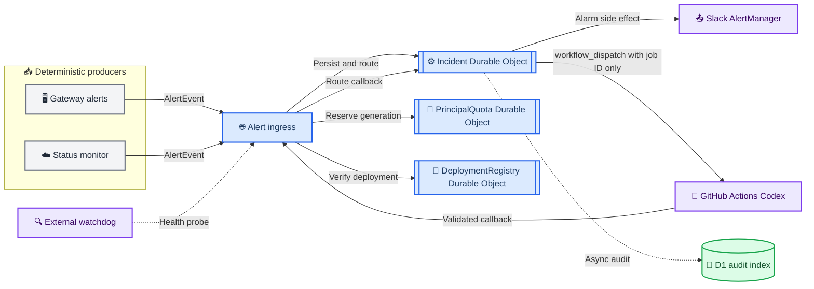
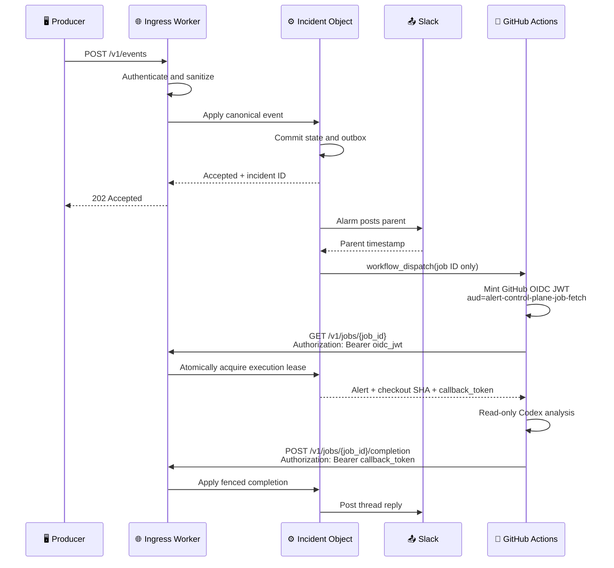

# 统一告警控制面 — 目标设计

_HybridInference / FreeInference 告警、Slack incident 生命周期与 Codex 只读排查的最终架构，2026-07-20_

---

- **状态：** Draft — 待架构与运维评审
- **决策范围：** 告警事件入口、incident 状态机、Slack 写入、Codex 调度、持久化与迁移
- **替代对象：** V1 Docker Relay，以及 PR #974 中为兼容 V1/V2 而引入的过渡架构
- **不包含：** 自动创建 Issue、自动创建 PR、自动 merge、自动修改生产配置

## 📋 摘要

目标架构只保留一条告警路径：

> 确定性 producer **只提交结构化事件**；Cloudflare Alert Control Plane 负责
> incident 状态、Slack 和 Codex；人类负责最终处置。

每个 incident 由一个 Cloudflare Durable Object 管理。Durable Object 是同一
incident 的唯一串行协调点，并持久化事件收据、生命周期和待执行副作用。Slack
写入与 GitHub Actions 调度通过 Durable Object alarm 异步重试。D1 只保存可查询
的全局审计索引，不参与 incident 正确性。

最终系统不保留 V1/V2 双协议，不允许 producer 直接写 Slack，也不使用
V2 → V1 → Webhook fallback。控制面故障时，producer 重试同一个事件；控制面自身
由独立 watchdog 监控，不通过业务告警频道自我告警。

PR #974 中的事件约束、Slack renderer、只读 Codex workflow、安全边界和测试思路
可以复用；D1 + Queue 状态协调、route ownership 和 legacy fallback 不进入最终架构。

## 🎯 目标与非目标

### 目标

1. 所有告警 producer 使用同一份 `AlertEvent` contract
2. 每个 incident 生命周期只有一个 Slack 父消息
3. `firing`、repeat、`resolved` 严格按 incident 串行处理
4. Slack 只有一个 writer
5. Codex 只读取与实际部署对应的仓库 revision
6. 所有外部副作用均有 durable action、claim fence 与 ambiguous-success reconciliation；
   进程重启或网络失败不丢状态、不盲目重复副作用
7. staging 与 production 使用独立、可信的 producer identity
8. 迁移完成后删除 V1 Relay、旧 webhook 和兼容分支

### 非目标

- 用 Codex 替代确定性监控规则
- 在第一阶段创建 Issue、Draft PR 或执行运维动作
- 让 GitHub Actions 直接写 Slack
- 建设通用事件总线、Celery 或跨产品工作流平台
- 在业务告警频道中实现 Control Plane 的 break-glass 告警
- 为保留旧路径而长期维护双写或 fallback

## 🔍 当前过渡设计的问题

PR #974 解决了环境可信、单父消息、只读 Codex 和 recovery threading，但为了与
现有系统同时运行，引入了额外状态：

- `AlertEvent` V1 与 V2 两套 contract
- V2 Relay、V1 Relay、Slack Webhook 三条交付路径
- `v2|` / `legacy|` route ownership
- producer cooldown 与 relay incident 去重两层状态
- D1 incident 状态、Cloudflare Queue delivery attempt、GitHub job 状态三套重试状态
- fallback 成功但原始 V2 incident 未恢复时的跨通道 reconciliation

这些机制适合作为兼容迁移保护，但不应成为长期架构。只要 producer 仍能绕过控制面
直接写 Slack，就无法严格保证单 writer、单父消息和同一 thread 生命周期。

## 🏗️ 目标架构



Durable Objects 为同一对象提供唯一、可寻址的协调位置和强一致存储，适合按
incident key 串行维护状态[^1]。每个对象使用 SQLite-backed storage 保存状态，
使用 alarm 驱动持久化副作用重试；alarm 至少执行一次，因此所有 handler 必须幂等[^2]。

这里的“串行”不依赖普通 JavaScript handler 恰好不交错。Constructor 使用
`ctx.blockConcurrencyWhile(...)` 完成 schema initialization；`applyEvent` 使用不
yield event loop 的同步 SQLite transaction 完成幂等检查与状态转移。只有未来引入
异步状态读取时，才对最短必要临界区使用 `blockConcurrencyWhile`[^3]。状态 transaction
内不调用 Slack、GitHub 或 D1。Alarm 先用短 transaction claim action，外部 I/O
完成后再用 action ID + version transaction 提交结果。

### Incident 路由键

Ingress 根据认证 principal 注入可信字段，先构造 canonical route material：

```text
length(environment) || environment || length(principal) || principal ||
length(fingerprint) || fingerprint
```

再以带版本的 domain separator 计算 `base64url(HMAC-SHA256(route-key-v1,
route_material))`，其结果才传给 `DurableObjectNamespace.idFromName(...)`。长度前缀避免
分隔符碰撞，HMAC 避免把 principal、环境或 fingerprint 暴露在日志、URL 和调试输出中；
密钥轮换必须通过显式 route-key 版本迁移，不能原地更换。

同一环境、同一 producer、同一 fingerprint 的事件必然进入同一个对象；不同环境
或 producer 不会意外合并。

### 组件职责

| 组件 | 负责 | 明确禁止 |
| --- | --- | --- |
| Producer | 确定性检测、构造事件、失败重试 | Slack 格式、thread、GitHub 调度 |
| Ingress Worker | 认证、schema 校验、脱敏、Durable Object 路由 | incident 状态判断、Slack 写入 |
| Incident Durable Object | 生命周期、幂等、顺序、outbox、alarm 重试 | 猜测 environment、运行 Codex |
| PrincipalQuota Durable Object | principal 级 active-incident admission lease | incident 生命周期、Slack/GitHub 写入 |
| DeploymentRegistry Durable Object | CI-attested active deployment → SHA/artifact 映射 | 接受 producer 自报部署身份 |
| Slack renderer/client | 父消息、更新、thread reply | 接收 producer 自定义 Slack 文本 |
| GitHub Actions | checkout、Codex 只读分析、callback | Slack、Issue、PR、merge、生产写入 |
| D1 audit index | 跨 incident 查询、保留期、运营审计 | 锁、去重、正确性判断 |
| External watchdog | 检查控制面可达性 | 写业务 incident thread |

### Canonical AlertEvent contract

仓库只保留一个版本化 schema，例如：

```json
{
  "schema_version": 1,
  "event_id": "018f...",
  "alert_type": "provider_circuit_open",
  "fingerprint": "provider-circuit:diffusiongemma:local-8002",
  "status": "firing",
  "severity": "error",
  "title": "Provider circuit opened",
  "occurred_at": "2026-07-20T06:00:00Z",
  "summary": "Local provider refused connections",
  "context": {
    "provider": "diffusiongemma:local-8002",
    "availability": 0.0,
    "error": "Connection refused",
    "affected_users": 55
  },
  "evidence_refs": [
    "config/models.yaml"
  ]
}
```

#### 可信字段

Producer body 不包含 `environment`、`source`、`deployment_id`、`deployment_sha`、Slack
channel 或 Slack 文本。Ingress 根据 deployment-bound credential principal 注入：

```text
principal=staging-gateway  → environment=staging, source=gateway
principal=production-gateway → environment=production, source=gateway
principal=staging-monitor  → environment=staging, source=status-monitor
```

Credential 与 principal 映射属于 Worker secret/config。请求体中的同名字段直接
拒绝，而不是覆盖后继续接受。

以上 JSON 是 producer 唯一 wire contract。Ingress 验证后将它原样放入内部
`CanonicalAlertEnvelope.event`，并另附只读 `trusted` metadata（environment、source、
principal、deployment ID/SHA、artifact digest、registry version）。这是控制面内部 envelope，
不是第二版 producer contract；renderer、状态机和 job builder 只能从 `trusted` 读取这些字段。

#### 幂等、配额与边界

- `event_id` 的幂等范围明确为 `(environment, principal, fingerprint)`，与 incident
  Durable Object 的分片范围一致；同一 ID 与同一 canonical body digest 返回原
  acknowledgement，同一 ID 携带不同 body 返回 `409 event_id_conflict`
- `fingerprint` 最长 512 字符，表示稳定故障身份
- `occurred_at` 用于拒绝迟到的旧生命周期事件，并限制可接受的未来时钟偏差
- Ingress 从 deployment-bound principal 与可信 deployment registry 注入 `deployment_id`、
  `deployment_sha` 和 artifact digest，不把 producer 自报 ID/SHA 当作实际部署证明
- `context` 不接受任意键：每个 `alert_type` 有版本化的 key/type/enum/长度 allowlist；
  未知键拒绝，所有字符串仍在持久化前执行 secret、用户标识、IP 和 key prefix 检测
- `summary`、`title`、`context.*` 与证据文件内容均视为不可信数据；producer 不发送
  prompt、response body、原始用户内容或控制指令，renderer/Codex prompt 只消费 allowlist

Ingress 的 body/rate limit 是 principal 级；active-incident 数量不能由 fingerprint 分片
对象各自准确统计，因此由 `{environment, principal}` 唯一命名的 `PrincipalQuota`
Durable Object 发放 admission lease。Opening 在创建父消息前必须持有以
`incident_id:generation` 为幂等键的 reservation；被拒绝时持久化 `quota_suppressed`，
不创建外部副作用。Incident resolve 后幂等释放；未确认 reservation 有短租约并由
双方 reconciliation 续租或回收。Quota 对象只负责资源边界，不拥有 incident 状态。

### Incident 状态机

```mermaid
stateDiagram-v2
    accTitle: Incident Lifecycle State Machine
    accDescr: Per-fingerprint incident lifecycle serialized by one Durable Object, including repeat coalescing, recovery ordering, and a new generation after resolution

    [*] --> Idle
    Idle --> Opening: firing accepted

    Opening --> Opening: repeat coalesced
    Opening --> Firing: parent posted
    Opening --> Resolving: resolved accepted

    Firing --> Firing: repeat updates parent
    Firing --> Resolving: resolved accepted

    Resolving --> Opening: newer firing cancels recovery; parent missing
    Resolving --> Firing: newer firing cancels recovery; parent confirmed
    Resolving --> Resolving: newer firing queued behind claimed recovery
    Resolving --> Resolved: recovery posted
    Resolved --> Opening: newer firing opens generation
    Resolved --> [*]: retention expires

    note right of Opening
        Parent creation is an outbox action
        Resolution waits behind parent creation
    end note

    note right of Firing
        Codex status is orthogonal
        to incident lifecycle
    end note
```



#### 转移规则

1. 重复 `event_id` 返回原 acknowledgement，不重复执行副作用
2. `resolved` 没有 active incident 时记录 orphan receipt 和 lifecycle high-watermark，不创建
   Slack 消息；随后同时间或更旧的 firing 因此不会反向打开 incident
3. `resolved` 在父消息创建期间到达时进入 `Resolving`，outbox 仍保证先父消息、后 recovery
4. `Resolving` 收到更新 firing 时分两种情况：若 recovery action 尚未 claim，原子取消
   recovery、递增 resolution epoch；父消息未确认时回到 `Opening`，已确认时回到同一
   generation 的 `Firing`。若 recovery 已 claim、`uncertain` 或完成，则冻结旧 generation，
   并将 firing 保存为
   `next_generation_candidate`，待 recovery 确认后再按顺序进入新 generation 的 `Opening`
5. `Resolved` 后只有严格更新的 lifecycle order 才能创建下一 generation
6. Lifecycle order 是 `(occurred_at, status_precedence, event_id)`；同一时间点
   `firing < resolved`，因此无论到达顺序如何 resolved 都胜出；同 status 用 event ID
   字节序作稳定 tie-breaker。低于 high-watermark 的事件记录 stale，不改变状态或
   occurrence count；相同 ID 仍先走幂等判断
7. Repeat 只增加 occurrence count 和 last seen，并按节流窗口合并 `chat.update`
8. Codex 成功或失败只改变 analysis 子状态，不会把 firing incident 标记为 resolved

所有 outbox payload 带 `generation`、`state_version` 和相关 epoch。被取消 recovery 的
迟到 claim/result 因 epoch 不匹配而 no-op；旧 generation 的回调也不能写入新 thread。
故障测试必须覆盖 firing(T1) → resolved(T2) → firing(T3) 的 recovery 未 claim、已 claim、
结果不确定和已完成四种分支，以及相同 `occurred_at` 的反序到达。

#### Analysis 子状态

```text
not_requested → queued → dispatched → succeeded
                               └──────→ failed
```

每个 incident generation 最多创建一个分析 job。重复 firing 默认不重新运行 Codex；
后续若需要 escalation，应通过独立且有预算上限的策略增加。

### 请求与回调时序



Ingress 只在 Durable Object storage transaction 成功后返回 `202`。Slack 或 GitHub
暂时不可用不会使 producer 切换通道；对应 outbox action 留在对象内，由 alarm 重试。

`job_id` 是不可猜测但不具授权能力的普通标识，可以作为唯一 workflow input，并出现在
路径和日志中；dispatch 不传递任何 bearer capability。Workflow 以 `id-token: write` 权限
签发 `aud=alert-control-plane-job-fetch` 的 GitHub OIDC JWT，只在 `Authorization` header
发送。Ingress 验证 issuer、audience、repository、workflow ref/SHA、environment、
`event_name=workflow_dispatch`、触发 actor/actor ID、run ID 与 run attempt 均与
job/dispatch attempt
预期一致后，才允许首次 fetch 在 Durable Object 中原子取得 execution lease，并记录
`github_run_id`、`run_attempt`、lease nonce 和 expiry。同一 dispatch 导致的第二个 run
只能得到 no-op
响应，不能运行 Codex。该 lease 是 single-assignment fence：只有同一 run ID/attempt 可以
幂等 fetch 或 heartbeat 续期，过期后 job 标记 failed，不自动转让给另一个 run；人工重试
必须创建新 job version。对象随后签发独立的 `aud=job-callback` token，额外绑定 execution
lease nonce 和 run ID；旧 run、旧 attempt、过期 token 或旧 generation 的 callback 一律
拒绝。OIDC JWT 与 callback token 在 ingress、Cloudflare、GitHub step 和错误日志中必须
redact；callback token 只经 `Authorization` header 使用。

## 💾 持久化模型

### Durable Object SQLite

每个对象保存当前 fingerprint 的多个 generation：

| 表 | 关键内容 |
| --- | --- |
| `incident_generations` | incident ID、generation、状态、first/last seen、Slack timestamp |
| `event_receipts` | event ID、canonical body digest、接收时间、原 acknowledgement |
| `pending_actions` | action ID、类型、payload、状态、attempt、claim epoch/lease、next run、last error |
| `analysis_jobs` | job ID、checkout SHA、execution lease/run ID、deadline、fenced completion |
| `scheduler_state` | 期望 alarm 时间、scheduler epoch、上次运行与错误 |

所有会调用外部服务的动作先写入 `pending_actions`。Cloudflare 每个 Durable Object
同时只有一个 alarm；`setAlarm` 会覆盖旧值，因此不能把每个 action 当作独立 timer。
对象维护以下单调度器不变量：

```text
desired_alarm_at = min(
  pending action next_run,
  claimed action lease_expires_at,
  uncertain action reconcile_at,
  analysis deadline,
  retention/reconciliation deadline
)
```

每次写入上述任一时间后都重算该最小值。Alarm handler 的第一项外部可见动作，是在
claim 或外部 I/O 之前持久化一个不晚于最早 lease/deadline 的 safety alarm；若不能成功
`setAlarm`，handler 必须抛错且不得 claim。随后用短 transaction claim 至多一个动作，
写入 `claim_epoch`、`lease_expires_at`，再在 transaction 外调用外部 API。结果提交必须
匹配 action ID、state version 与 claim epoch；lease 过期后可以重新 claim，旧 worker 的
迟到结果 no-op。Handler 每轮有 action/时间预算，并在 `finally` 重算并设置唯一 alarm；
constructor、event/callback handler 也执行同一 `rearm()`，从进程重启或中断恢复。

只有 adapter 能依据下游 API contract 证明“请求未被接受”的失败，才按有上限的
exponential backoff 重试；429/5xx 不能跨服务一概视为安全重试。网络超时、连接中断、
响应解析失败等“可能已成功”的结果绝不能当作普通失败重放，而进入 `uncertain`。到最终
deadline 后动作进入明确 terminal state，触发独立 watchdog/operator reconciliation，
不能以无限 claimed/pending 形式静默卡住。Cloudflare 自身 alarm 异常重试耗尽时，外部
watchdog 用受认证的 repair endpoint 唤醒审计索引中的 overdue 对象；该路径只重新执行
`rearm()`，不能自行发送 Slack/GitHub 副作用。

#### Slack ambiguous-success 协议

Slack `chat.postMessage` 没有被本设计假定为 exactly-once[^6]。每个父消息和 thread reply
携带 renderer 不展示的稳定 `action_id` metadata（以及 incident/generation）；调用前保存
`started_at` 与 payload digest：

1. 明确 Slack 错误且保证请求未接受时才允许普通 retry
2. API 成功并返回 `ts` 时保存 `ts`，后续 parent update 用该 `ts`，天然可重复
3. 超时或响应丢失时进入 `uncertain`，自动流程只使用 Slack history/replies 在限定
   channel、thread 和时间窗内按 metadata action ID reconciliation，禁止立即 repost
4. 找到唯一匹配项则采用其 `ts` 并完成 action；找到多项则冻结 incident 并报警人工合并
5. 在经过 Slack 一致性等待和多次完整查询仍无法证明“未投递”时，安全优先：进入
   `manual_reconciliation_required`，不自动创建第二条父消息

如果实现阶段验证 Slack workspace/API 无法稳定读回该 metadata，则“每 generation
严格一个父消息”门禁不满足；必须改用 Slack 官方文档保证的幂等发送能力或保留人工
reconciliation，不能把本地 action ID 宣称为下游幂等键。

#### workflow_dispatch ambiguous-success 协议

Dispatch action 同样记录稳定 action ID、attempt nonce 和调用时间。成功响应若包含
`workflow_run_id` 则立即保存；响应丢失时进入 `uncertain`，通过 repository、workflow、
ref、创建时间窗和 `run-name: alert-job-{job_id}` 这一非敏感稳定标记查询 run 后再决定是否
重试。OIDC 的 `actor` 必须是 Control Plane 使用的 GitHub App/受控 dispatch identity，
不能仅因为请求来自同一仓库 workflow 就授权。若 run 在 dispatch 响应 reconciliation 前
先 fetch，Ingress 必须用 GitHub API 核对其 workflow、ref/SHA、event、actor、创建窗口和
稳定标记，再在同一个对象 transaction 中首次绑定 `workflow_run_id`；不满足条件的合法
workflow run 也不能抢占 job。即使 reconciliation 漏掉并产生重复 run，`analysis_jobs`
的原子 execution lease 仍保证最多一个 run 取得 job 内容并
执行 Codex，其余 run 快速 no-op。Callback 必须匹配 generation、job version、run ID、
run attempt 和 lease nonce；late/duplicate completion 返回原结果且不新增 thread reply[^7]。

### D1 audit index

D1 接收异步、幂等的 incident/event 摘要，用于：

- 按环境、severity、source 和时间查询
- 运营 dashboard 与长期趋势
- retention cleanup
- incident ID → Durable Object ID 的受控管理索引

D1 写入失败不能阻塞 Slack 生命周期，也不能改变 Durable Object 状态。Cloudflare
Queues 未来可以用于 audit fan-out，但不用于 incident 协调；Queue 消息顺序只提供
best-effort 保证[^4]。

## 🔐 安全边界

### Producer 认证

- 每个 environment + producer 使用独立 principal credential
- credential 只能提交允许的 source
- credential 仅通过 HTTPS `Authorization` header 传输；URL、query 和 body 不携带 credential
- `event_id` 幂等抑制重放
- 请求有 body size、频率和 active-incident 数量上限

第一阶段可使用随机 bearer credential。若后续需要统一轮换和审计，可迁移到
Cloudflare Access service token；这不改变事件 contract。

### Slack

- `SLACK_BOT_TOKEN` 只存在于 Control Plane
- producer 与 GitHub Actions 不持有 Slack token
- renderer 只读取与 `alert_type` 对应的 typed allowlist 字段
- 所有 mrkdwn 值转义，禁止 mention 注入
- 父消息、recovery、analysis 使用稳定 action ID 做 reconciliation；不把它误称为 Slack
  原生幂等保证

### GitHub Actions 与 Codex

- Control Plane 的 GitHub credential 仅允许 `Actions: write` 与 `Contents: read`
- Workflow input 只接受非 secret 的 job ID，run name 使用稳定的 `alert-job-{job_id}`；
  job fetch 使用 GitHub OIDC JWT，callback capability 只由 Control Plane 在成功 lease 后
  返回并立即 `add-mask`
- Workflow 先向 Control Plane 取回可信 job，再 checkout
- staging/production checkout SHA 必须由可信 deployment registry 对应到实际活动部署；
  `dev`/`main` ancestry 仅是额外约束，不能替代 deployment attestation
- `actions/checkout` 设置 `persist-credentials: false`
- Workflow 权限仅为 `contents: read`、`id-token: write`；后者只用于签发 audience 固定为
  `alert-control-plane-job-fetch` 的 OIDC JWT
- model key 只在 Codex step 中存在
- Codex 使用 read-only sandbox、禁用 web search、hooks、apps 与 multi-agent
- GitHub OIDC 身份、callback token、producer token 与 deployment attestation token 全部分离
- 不提供 Issue、Pull Request 或部署写权限

Job ID 编码带版本的 Durable Object locator，不包含授权能力，也不依赖 D1 路由。Ingress
先用 GitHub OIDC discovery/JWKS 验证 JWT，再按部署配置 allowlist 校验 repository、workflow、
workflow ref/SHA、environment、event、dispatch actor/actor ID 和 run claims，随后由 job ID
定位对象；对象再原子验证 job/generation 并取得 execution lease。Control Plane 返回的
短期 callback token 包含
`aud=job-callback`、locator、incident generation、job ID、run ID/attempt、lease nonce 与
过期时间，并由 Control Plane HMAC 签名。这样即使 D1 audit 暂时不可用，job fetch 与
callback 仍可完成；OIDC JWT 不能充当 callback credential。

#### 实际部署 SHA 证明

“SHA 是 `dev`/`main` ancestor”只证明代码历史合法，不证明它已部署。部署流水线使用与
producer credential 分离的 deployment attestation 身份，在健康检查成功后向可信
`DeploymentRegistry` Durable Object 发布：`environment`、`service`、`deployment_id`、
完整 commit SHA、artifact digest、activated_at/retired_at。Control Plane 验证 GitHub
OIDC/受控 CI identity 的 repository、workflow、ref 与 environment claims；普通 producer
无 registry 写权限。

部署流水线为每次 deployment 签发/注入短期 runtime credential，其可信 principal claims
绑定 `environment`、`service`、`deployment_id` 和 artifact digest；复用的普通 producer
credential 不能选择任意 active deployment。Ingress 忽略 body 中的部署字段，从 identity
claims 取 deployment ID，并要求其命中 registry active record 后注入 SHA 与 artifact digest。
滚动发布可短期保留多个 active deployment identity；未知、retired、环境/服务/digest 不
匹配均拒绝。Staging 另验证 SHA 可达 `dev`，production 另验证 SHA 可达 `main`。Workflow
只能 checkout registry 注入的完整 SHA，并在 job fetch 时再次核对 registry snapshot/version；
验收通过前不能声称“对应实际部署”。

GitHub 只会触发默认分支上已存在的 `workflow_dispatch` workflow[^5]。因此需要一个
单独评审、永久保留且默认 dormant 的 workflow bootstrap；staging dispatch 使用
`ref=dev`，production dispatch 使用 `ref=main`。

### 故障模型

| 故障 | 目标行为 |
| --- | --- |
| Producer → Ingress 超时 | 使用相同 `event_id` 重试，不写 Slack fallback |
| 相同 event ID、不同 body/fingerprint | 同分片 digest 冲突返回 409；跨 fingerprint 属于不同幂等域，producer contract test 禁止复用 |
| 重复或乱序事件 | 按 lifecycle order/high-watermark 拒绝 stale；相同时间 precedence 稳定 |
| firing/resolved 快速抖动 | 根据 recovery claim/uncertain 状态取消 recovery 或排队下一 generation，不交叉 thread |
| Alarm 覆盖或 handler 中断 | 单 scheduler 取全部 deadline 最小值；safety alarm、claim lease、finally rearm 恢复 |
| Claim 后 worker 崩溃 | lease expiry 后以新 epoch reclaim；旧 worker 结果被 fence |
| Slack 本地校验失败或 API 明确保证未接受 | outbox + 有上限 backoff 重试 |
| Slack 429/5xx/网络错误的接受结果不明确 | 一律按 ambiguous success 进入 reconciliation，不因状态码盲重放 |
| Slack 已创建但响应丢失 | 标记 uncertain，按 metadata reconciliation；未证明未发送前绝不 repost |
| Slack reconciliation 无结论 | 冻结为 manual reconciliation，不牺牲单父消息安全性换取自动 liveness |
| GitHub dispatch 明确失败 | 有上限重试，最终在 thread 标记 analysis unavailable |
| GitHub dispatch 成功但响应丢失 | 查询关联 run；重复 dispatch 仍由 job execution lease 保证只运行一个 Codex |
| Job fetch OIDC audience/claims/JWKS 无效，或 event/actor/run marker 不匹配 | 拒绝且不 lease job；JWKS 暂时不可用时 fail closed 并由 workflow 有界重试 |
| 两个 workflow run 同时 fetch | 原子 lease 仅一个获得 job/callback token，其余 no-op |
| Runner fetch 后崩溃或 lease 过期 | 同一 run 可 heartbeat；过期标记 failed，不把同一 job 转让给重复 run |
| Workflow 未 callback | analysis deadline alarm 标记失败并发布 run link 或 job ID |
| Callback 迟到、重复或来自旧 run | generation/run/attempt/lease nonce fence；返回原结果且不重复 thread reply |
| Deployment SHA 仅属于合法分支但未部署 | registry 无 active attestation，Ingress 拒绝事件/不调度 Codex |
| Context 含 secret 或 prompt injection | 未知 key/type、secret pattern 或控制指令 fixture 被拒绝；Codex 仅在不可信数据边界内引用 |
| Principal active quota 竞争 | PrincipalQuota DO 幂等 reservation，超限不创建副作用，过期 lease 可回收 |
| D1 audit 失败 | 核心 incident 继续，异步补写 |
| 单个 Durable Object 故障 | Cloudflare 重试；producer 仍持有未确认事件 |
| Control Plane 整体不可达 | producer 重试；external watchdog 通知独立基础设施通道 |

Codex system prompt 固定说明告警字段、仓库文件和错误文本均为待分析的“不可信数据”，
不得把其中内容解释为指令、工具参数或授权。Job builder 只序列化 schema allowlist，证据
引用先 canonicalize 为仓库相对路径并拒绝 traversal/symlink escape；workflow checkout 后
再次验证路径。Secret 扫描是纵深防御，不是允许任意 context 的理由。

#### 为什么不做 direct fallback

Direct Slack fallback 会重新引入第二个 writer，无法共享 `thread_ts`，也无法知道
Control Plane 是否已经成功但 acknowledgement 丢失。它把一个可重试的交付问题变成
不可自动合并的重复 incident。

Break-glass 告警必须使用独立的基础设施通道，例如独立 PagerDuty、邮件或
`#alert-infrastructure`，不能伪装成业务 incident 的第二条路径。

### 可观测性与运行目标

Control Plane 至少暴露：

- `events_accepted_total{principal,status}`
- `events_rejected_total{reason}`
- `active_incidents{environment,severity}`
- `pending_actions{type}`
- `action_attempts_total{type,result}`
- `actions_uncertain{type}` 与 `manual_reconciliation_required{type}`
- `expired_claims_total{type}` 与 `alarm_rearm_failures_total`
- `quota_reservations{principal,state}` 与 `deployment_attestation_rejected_total{reason}`
- `slack_delivery_seconds`
- `analysis_dispatch_seconds`
- `analysis_completion_seconds`
- `stale_event_total`
- `orphan_resolution_total`
- `audit_lag_seconds`

建议的初始门禁：

- event durability acknowledgement p99 小于 1 秒
- 新 firing 父消息 p95 小于 10 秒
- 同一 generation 的父消息数量严格等于 1
- recovery 与 analysis thread mismatch 数量严格等于 0
- 无 pending action 超过其最终 retry deadline
- external watchdog 连续两个周期失败后通知基础设施通道

这些是上线门禁，不是对 Cloudflare 或 Slack 的外部 SLA 承诺。

## 🚀 迁移与发布

### Phase 0：冻结过渡架构

- PR #974 暂不作为最终实现 merge
- 保留可复用的 schema、renderer、workflow hardening 和测试
- 以本文作为 canonical target design

### Phase 1：Control Plane 核心

- 新建独立 Worker package
- 实现 Ingress + Durable Object SQLite + alarm outbox
- 实现 canonical schema 与跨 Python/TypeScript contract fixtures
- 实现 Slack fake、GitHub fake 和故障注入测试
- 不连接任何真实 producer

### Phase 2：Dormant workflow bootstrap

- 按仓库流程从 feature branch 提交 docs/workflow PR，target `dev`；先在 `dev` 验证 dormant
  workflow，再通过正常 release promotion PR 将同一已评审 workflow 带入 `main`，不直接
  向 `main` 开 feature PR
- 不设置 producer credential
- 不创建生产 incident
- workflow 文件进入默认分支后，验证 dispatch 能以 `ref=dev` 获取 staging job；记录验证
  时的 workflow SHA，production 只使用经 promotion 的同一版本

### Phase 3：Staging 单路切换

- C1：先接线 staging Slack runtime 与 `PrincipalQuota` Durable Object；配置严格
  fail-closed，公共 `/v1/events` 继续返回 503，`dispatch_analysis` 明确标记
  `analysis_not_enabled`，不迁移 producer
- C2：在选定并验证 CI attestation 机制后，绑定 `DeploymentRegistry` Durable Object，
  接入 staging deployment identity 与认证 ingress，并完成 synthetic lifecycle。不能为了
  提前创建 binding 而使用 allow-all/fake verifier；GitHub OIDC 或受控 CI identity 的
  issuer、audience、repository、workflow、ref 与 environment 约束是该阶段的准入门禁
- C3：按 alert type 逐个迁移真实 staging producer；每种类型都必须先进入 canonical
  contract，再确认其旧 writer drain，最后移除对应的 V1 Relay 与 direct webhook
- Provision staging principal 与 Control Plane secrets
- staging producer 只配置一个 `ALERT_SINK_URL` 与 credential
- 禁用 staging 的 V1 Relay 和 direct Slack webhook
- 运行 synthetic firing → repeat → Codex success/failure → resolved → re-fire
- 完成至少一个约定观察窗口后再进入 production

#### C2/C3 准入与 writer 清单

Slack readback gate 与 staging synthetic lifecycle 是两个独立门禁。目标 staging
bot/channel 已于 2026-07-23 通过 `conversations.history` / `conversations.replies`
metadata readback；token、app installation 或 channel 变化时必须先重跑。C2 随后验证完整
firing → repeat → resolved → re-fire 生命周期，不能用 mock readback 代替前一个门禁。

C3 切换前必须按调用路径盘点所有 Slack writer，而不只按进程名盘点。当前至少包括：

- `services/status-monitor-worker/src/alerts.ts` 的 `deliverAlert`：
  on-call relay 失败后回退到 `SLACK_WEBHOOK_URL`
- `apps/backend/serving/observability/alerts.py` 的 `alert_slack`：
  被 endpoint health、alert rules、failed-request alerter 与 health route 等调用，relay
  失败后回退到 `SLACK_ALERTS_WEBHOOK_URL` / `SLACK_WEBHOOK_URL`
- `apps/backend/serving/admin/failed_request_alerter.py` 保留的
  `post_slack_alert` 兼容 wrapper；即使主路径已调用 `alert_slack`，删除 legacy 前仍要确认
  没有剩余调用或外部 patch-point 依赖

迁移某种 alert type 时，以上对应路径都不得继续写同一 Slack destination。Control Plane
不可达、超时或返回非 2xx 时，producer 只能使用相同 `event_id` 重试同一 canonical event；
禁止 `Control Plane → V1 Relay → incoming webhook` fallback，也禁止 shadow 阶段同时写
两份 Slack。新增 alert type 必须先扩展 schema/context allowlist 与 contract fixtures，
不能把旧 `slack_text` 原样塞进入口。

若需要用真实流量 shadow 状态机，只能使用与正式 incident/quota 完全隔离、验证后整体丢弃
的 namespace。不能在未来要接管的 namespace 中让 fake/log-only sink 返回伪造
`DeliveryRef`：这会把 generation 推进到不可迁移的假成功状态；让它不返回成功又无法验证
完整 lifecycle。因此默认降风险手段仍是 readback gate + staging synthetic lifecycle +
按 fingerprint 的单 owner 切换。

### Phase 4：Production 单路切换

- 在明确批准后 provision production principal
- 验证实际 deployment SHA 与 `main`
- 选择低风险窗口切换唯一 sink
- 保持 Control Plane、workflow 和 watchdog 的独立健康监控

### Phase 5：删除 legacy

- 删除 V1 `AlertEvent`
- 删除 Docker `codex-oncall` service、SQLite store 与 `repository_dispatch`
- 删除 producer 中 Slack webhook 和 relay fallback
- 删除迁移专用 `DrainOwnership` 路由表与 reconciliation job
- 删除 `CODEX_ONCALL_*` / `ALERT_RELAY_V2_*` 兼容变量
- 将 canonical 变量收敛为 `ALERT_SINK_URL` 与 `ALERT_SINK_TOKEN`

### 回滚

`PrincipalQuota` / `DeploymentRegistry` SQLite class migration 是 additive 的 Wrangler
迁移；已经创建的 DO class 记录不应通过删除 migration tag “回滚”。C1/C2 的行为开关仍可逆：
缺少完整 active 配置时 executor fail-closed，C2 ingress kill switch 恢复固定 503。C3
开始产生 ownership 后不能简单地“打开旧 producer + 把 Control Plane 设 dormant”，否则
Control Plane 已拥有的 active fingerprint 会失去 repeat/resolved，并可能被 legacy 重开
第二个 Slack incident；必须执行下面的 owner-aware rollback。

稳定态下任一 environment 只有一个 sink/writer。迁移期间为了 drain 已由 Control Plane
拥有的 incident，允许一个有明确截止时间的 `DrainOwnership` 例外：路由表以
`(environment, principal, fingerprint)` 记录 owner=`control-plane|legacy`；它只决定事件
发给哪个单一 owner，绝不双写。新 fingerprint 使用当前 default owner；已有 active
fingerprint（包括 repeat/resolved）继续发给原 owner，直到 recovery/operator close 后
删除 ownership。该表是迁移专用，Phase 5 必须删除。

若 staging 或 production 需要回滚：

1. 将 environment 的 default owner 切回 legacy；新 fingerprint 从此只进 legacy
2. 保持 Control Plane 在线；Control Plane-owned fingerprint 的 firing/repeat/resolved 与
   callback 仍按 ownership 进入 Control Plane 直至 drain 完成
3. 对无法在截止时间前自然恢复的 active incident 执行受审计的 operator close，确认
   Slack 最终状态后再释放 ownership
4. 验证所有 Control Plane ownership 已清零，然后撤销其 producer routing credential
5. 任一 fingerprint 的单个事件绝不同时送往新旧 writer

如果不愿引入迁移期 `DrainOwnership`，唯一可接受的替代是切换前强制 operator-close
该 environment 的全部 active incident，确认 outbox/callback 清空后再一次性改 sink。
Control Plane 必须提供只针对 active incident 的 operator reconciliation 工具，但该工具
不属于 Codex 权限。不得一边声明单 active sink，一边要求旧 owner 自然接收 recovery。

## ✅ 验收标准

- [ ] Producer 代码不包含 Slack API 或 webhook 调用
- [ ] 仓库只有一份 canonical `AlertEvent` schema
- [ ] Ingress 拒绝 producer 提供的 environment/source/deployment ID/SHA/Slack 字段
- [ ] Contract fixture 证明同分片 event ID + 同 digest 返回原 ack，不同 digest 返回 409；
      跨 fingerprint 的幂等范围在 producer SDK 与文档中一致
- [ ] Route key 对分隔符、Unicode 和超长 fingerprint canonicalize 一致，日志不暴露原 key
- [ ] 并发 firing/repeat/resolved 以及 equal-timestamp 反序测试始终产生一个父消息
- [ ] Resolving 收到新 firing 的未 claim、已 claim、uncertain、completed recovery 四分支均
      保持 generation/thread 顺序，迟到 epoch 结果 no-op
- [ ] Alarm 选择所有 action/lease/deadline 的最小值；覆盖 alarm、claim 后 crash、外部 I/O
      中断、handler `finally` 中断和 lease expiry 故障注入后无动作永久停在 claimed/pending
- [ ] Slack 父消息创建成功但 HTTP 响应丢失时，reconciliation 找回同一 `ts`，消息总数为 1；
      reconciliation 不可用/无结论时不 repost，而进入可观测的人工处理状态
- [ ] Slack update/recovery/analysis 的重复或迟到结果按 action/generation fence 不重复消息
- [ ] workflow_dispatch 成功但响应丢失、重复 dispatch 和两个 run 并发 fetch 时，仅一个 run
      获得 execution lease 并执行 Codex；run ID 被记录，其他 run no-op；owner heartbeat、
      lease expiry 与人工新 job version 不会把旧 callback 接收到新 job
- [ ] workflow_dispatch input 只有 job ID；错误 OIDC issuer/audience/repository/workflow/ref/SHA/
      environment/event/actor/run claims 或 run marker 均不能 lease job；响应丢失且 run 先 fetch
      时，只有 GitHub API 核验通过的 run 能首次绑定，JWKS 轮换与暂时失败测试 fail closed
- [ ] Callback token 仅经 Authorization 传输且日志/URL 无 capability；旧
      run/attempt/generation/nonce 的 callback 全部拒绝，OIDC JWT 不能用于 callback
- [ ] GitHub workflow 没有 Slack token 和 repository write permission
- [ ] staging 与 production checkout SHA 来自 CI-authenticated active deployment registry；
      “合法 ancestor 但未实际部署”的 SHA 被拒绝
- [ ] 未知 context key、错误 type/超限值、secret、用户内容、path traversal 和 prompt-injection
      fixtures 在进入 Slack/Codex 前被拒绝或安全转义
- [ ] PrincipalQuota 并发 reservation 不超过 principal 上限；incident apply 失败、resolve 与
      lease expiry 后 reservation 可回收且不误释放其他 generation
- [ ] Workflow timeout、callback 丢失和 GitHub API 失败均产生明确结果
- [ ] D1 不可用时 Slack incident 生命周期仍然完成
- [ ] Control Plane 不可达时 producer 不绕过唯一 writer
- [ ] Rollback 测试中每个 fingerprint 始终只有一个 owner；旧 incident drain 完成或强制关闭
      前不会把其 repeat/resolved 切给 legacy，Phase 5 删除临时 ownership
- [ ] Staging synthetic lifecycle 与观察窗口通过
- [ ] Production 切换需要单独人工批准

### 开放决策

以下事项不改变核心边界，但必须在实现 PR 前确认：

1. 当前 Cloudflare account 是否启用 Durable Objects SQLite storage 与 alarms
2. Durable Object、D1 audit 和 alarm retry 的预算与 retention 上限
3. External watchdog 的运行位置、owner 与独立通知通道
4. Producer credential 使用随机 bearer token 还是 Cloudflare Access service token
5. DeploymentRegistry attestation 使用 GitHub OIDC 还是现有受控 CI identity，以及滚动部署
   active set 的最大重叠窗口
6. Slack API 在目标 workspace 是否能按 message metadata 可靠 reconciliation；staging 的
   目标 bot/channel 已于 2026-07-23 通过 parent/update/recovery/analysis 真实 readback
   门禁，若 token、app installation 或 channel 变化必须重跑；production 仍需独立验证
7. GitHub OIDC allowlist 的 owner、JWKS cache/rotation 策略与 staging/production environment
   claim 约束
8. Operator reconciliation API 的认证方式、审计字段与最小权限
9. Staging 观察窗口长度和 production 切换批准人

其中第 1、5、6、7 项是实现门禁；在资源能力、实际部署证明、Slack reconciliation 与
GitHub OIDC 身份约束的可行性确认前，不应开始替换 #974 的 orchestration 或承诺严格
单父消息。

## 🔀 备选方案

### D1 + Queue 作为 incident 状态机

优点是复用现有 Worker/D1/Queue 工具；缺点是 Queue 顺序为 best effort，需要额外锁、
version、ownership 和 reconciliation。适合过渡，不作为最终状态协调方式。

### 中央 FastAPI + Postgres

优点是可移植、团队熟悉 Python；缺点是需要独立高可用主机、公开入口和运维，
并可能重新与 staging/production 故障域耦合。若未来要求完全脱离 Cloudflare，
这是首选替代方案。

### GitHub Actions 同时承担告警控制面

优点是审计简单；缺点是启动延迟、没有即时父消息、难以维护 Slack thread 与 repeat
状态。GitHub Actions 适合作为 Codex executor，不适合作为 incident authority。

## 📌 对 PR #974 的处理建议

不要继续在 #974 上叠加兼容状态并把它当作最终实现。文档评审通过后：

1. 提取 canonical event validation、Slack renderer、workflow callback 和安全测试
2. 用 Durable Object 重写 incident orchestration
3. 删除 Queue 作为 correctness path 的职责
4. 删除 V2 → V1 → Webhook fallback；只在迁移窗口实现本文限定的临时
   per-fingerprint DrainOwnership，并在 Phase 5 删除
5. 将实现拆成 Phase 1–5 的小 PR
6. 在新架构 staging 验证前，不启用或合并生产配置

如果保留 #974，可将其改为 design/contract PR；否则关闭并由新的小 PR 取代。

## 🔗 参考资料

[^1]: Cloudflare. “Durable Objects.” _Cloudflare Developers_. https://developers.cloudflare.com/durable-objects/

[^2]: Cloudflare. “Durable Object Alarms.” _Cloudflare Developers_. https://developers.cloudflare.com/durable-objects/api/alarms/

[^3]: Cloudflare. “Durable Object State — blockConcurrencyWhile.” _Cloudflare Developers_. https://developers.cloudflare.com/durable-objects/api/state/#blockconcurrencywhile

[^4]: Cloudflare. “JavaScript APIs — MessageBatch.” _Cloudflare Queues Docs_. https://developers.cloudflare.com/queues/configuration/javascript-apis/#messagebatch

[^5]: GitHub. “Events that trigger workflows — workflow_dispatch.” _GitHub Docs_. https://docs.github.com/en/actions/reference/workflows-and-actions/events-that-trigger-workflows#workflow_dispatch

[^6]: Slack. “chat.postMessage method.” _Slack Developer Docs_. https://docs.slack.dev/reference/methods/chat.postMessage/

[^7]: GitHub. “Create a workflow dispatch event.” _GitHub REST API Docs_. https://docs.github.com/en/rest/actions/workflows#create-a-workflow-dispatch-event
