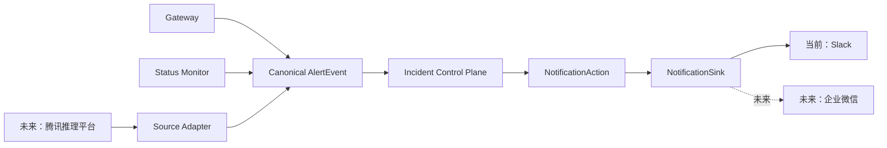

# Alert Control Plane 通知出口抽象设计

_在 #980 统一告警控制面中隔离 Slack 实现，并为未来通知平台保留最小扩展缝，2026-07-21_

---

- **状态：** Proposed — 范围已确认，待随 #980 实现评审
- **决策范围：** `NotificationSink`、`DeliveryRef`、通知类 outbox action/result、Slack 映射与迁移
- **依赖设计：** [PR #980](https://github.com/HarvardMadSys/hybridInference/pull/980) 中的
  `2026-07-20-unified-alert-control-plane-target-design.zh.md`
- **当前实现：** 只实现 Slack
- **明确不包含：** 腾讯推理平台接入、企业微信接入、多 sink 路由、同时 fan-out

## 📋 摘要

#980 的 incident authority、幂等收据、生命周期排序、Durable Object outbox 和 Codex
调度都不应该依赖 Slack 的 `thread_ts`。本设计只增加一条很窄的边界：incident 状态机
产生平台无关的通知意图，唯一配置的 `NotificationSink` 将该意图渲染并投递到 Slack。

本次仍然只有一个 sink、一个 writer 和一个 Slack channel。不会实现通知路由器、插件
注册表、平台 capability negotiation、通用卡片 DSL，或任何腾讯/企业微信代码。未来真有
需求时：腾讯推理平台通过 **Source Adapter** 把其告警转换成 canonical `AlertEvent`；
企业微信通过新的 **Notification Sink** 展示同一个 incident 生命周期。两者是相反方向
的边界，不能混为一个“adapter”。

核心决策如下：

1. `IncidentGeneration.slackThreadTs` 改为单个 `deliveryRef: DeliveryRef | null`
2. 保留现有四种通知 action 名称，只让其 payload/result 平台无关
3. `NotificationSink` 只有一个执行入口，支持 outbox 的 `execute` 与 `reconcile` 模式
4. Slack thread 是 `SlackSink` 的展示能力，不是 incident 生命周期的正确性前提
5. ambiguous success 先 reconciliation，无法确认时进入人工处理，不盲目重发

## 🎯 目标与非目标

### 目标

- incident、store 和通用 outbox 不再出现 Slack channel、`thread_ts` 或 Slack API 类型
- 保持 #980 的单 writer、单父消息、generation 顺序和 fenced result 不变量
- 当前 Slack 用户体验不变；未来新增 source 或 sink 时不迁移 incident 状态机
- 在 #980 merge 前直接移除 `slackThreadTs` / `slack_thread_ts`，避免制造兼容状态

### 非目标

- 不连接腾讯推理平台，不实现企业微信机器人、应用消息或卡片
- 不支持多平台同时发送，也不按 environment、severity、source 动态选择 sink
- 不定义跨平台“功能完全等价”；不同平台可以用不同方式表达同一生命周期
- 不建立通用模板语言、插件系统、运行时 discovery，也不抽象非通知类组件

这里刻意遵守 YAGNI：数据模型仍然只保存**一个** `DeliveryRef`，配置仍然只启用**一个**
`NotificationSink`，`NotificationPlatform` 在当前代码中仍然只有 `"slack"`。将来增加第二个
平台时，通过显式代码和 schema 评审扩展，而不是现在预建一个未验证的多平台框架。

## 🧭 两类边界



### Source Adapter：进入控制面之前

Source Adapter 验证厂商签名和防重放信息，把告警类型、状态、严重度映射到受支持的
canonical schema，生成稳定 fingerprint/event ID，并以受认证 principal 提交到正常 ingress。
它不能选择 destination、提供通知文本或绕过可信 identity/context allowlist。Gateway 与
Status Monitor 已直接产生 canonical event，当前不需要额外包一层 Adapter。

若以后接入腾讯推理平台，它属于这一侧；本设计不预先猜测其 webhook schema。

### Notification Sink：incident 状态机之后

Notification Sink 只接收已验证的 envelope、可信 metadata、incident 快照和稳定 action ID，
负责渲染、外部 API、通用结果转换与限定范围 reconciliation。它隐藏 token、channel、
thread/reply 等细节，但不拥有 incident 状态、决定 generation、重新排序事件或调度 Codex。

## 🧱 设计不变量

1. Durable Object 仍是 fingerprint 的唯一生命周期 authority；通知只来自已 claim 的 outbox。
2. 每个 environment 只有一个 sink/writer，不 fan-out、fallback 或由 producer 直写平台。
3. `DeliveryRef` 只描述投递位置；thread 是否存在不能决定 firing/resolved。
4. execute、reconcile、重启和 lease reclaim 始终复用同一个 `actionId`。
5. 只有 sink 证明请求未接受时才普通 retry；不确定结果必须先 reconciliation。
6. result 受 action/generation/state/epoch/claim fence；旧结果不能污染新 generation。
7. `DeliveryRef.sinkId` 一旦产生便固定，不能因默认配置更新切换已有 incident。

## 📦 最小数据模型

### DeliveryRef

`DeliveryRef` 是控制面持久化的、可验证的外部投递引用：

```ts
type NotificationPlatform = "slack";

interface DeliveryRef {
  readonly schemaVersion: 1;
  readonly sinkId: string;
  readonly platform: NotificationPlatform;
  readonly destinationId: string;
  readonly messageId: string;
  readonly conversationId?: string;
}
```

字段语义：

| 字段 | 含义 | Slack v1 映射 |
| --- | --- | --- |
| `schemaVersion` | 引用结构版本，不是 AlertEvent 版本 | `1` |
| `sinkId` | 配置中的逻辑 sink 实例；非 secret | 例如 `slack-primary` |
| `platform` | 平台类型 | `slack` |
| `destinationId` | 平台内目标位置的 opaque ID | channel ID |
| `messageId` | 本 generation 的主外部表示 | 父消息 `ts` |
| `conversationId` | 可选的后续消息关联位置 | thread root `ts` |

当前 `platform` 只接受 `slack`。`sinkId` 与 `destinationId` 来自 Worker config，不来自 producer；
message/conversation ID 对状态机是 opaque string。所有字段有长度和字符约束，解析失败时不
调用外部 API；引用中不得保存 token、webhook URL、用户文本或原始 provider response。

`conversationId` 可缺省。未来某个平台没有 thread，可以只返回 `messageId`；其 sink 可通过
更新原消息、发送带 incident ID 的新消息，或平台原生 incident API 表达后续状态。状态机
只要求 sink 履行 action 的语义，不要求平台模拟 Slack UI。

### IncidentGeneration 变化

```ts
interface IncidentGeneration {
  // 其余 lifecycle、quota、event 字段保持不变
  deliveryRef: DeliveryRef | null;
}
```

`opening` 时引用为空，`post_parent` 成功后进入 `firing` 并保存引用；`resolving` 只表示
`post_recovery` 已排队或执行，`resolved` 表示 sink 已应用恢复。状态机只检查引用存在且
`sinkId` 匹配，不解释 `messageId` 或 thread。多 delivery 必须另写设计，本次不预设数组。

## 📤 通知类 outbox contract

### Action

Quota 与 GitHub dispatch action 保持现状；四个现有通知 action 用下面的窄类型进入 sink：

```ts
type NotificationActionType =
  | "post_parent"
  | "update_parent"
  | "post_recovery"
  | "post_analysis";

interface NotificationAction {
  readonly type: NotificationActionType;
  readonly actionId: string;
  readonly sinkId: string;
  readonly incidentId: string;
  readonly generation: number;
  readonly payloadDigest: string;
  readonly deliveryRef: DeliveryRef | null;
  readonly payload: Readonly<Record<string, unknown>>;
}
```

各 action 的语义与前置条件：

| Action | 语义 | `deliveryRef` |
| --- | --- | --- |
| `post_parent` | 创建本 generation 唯一的主通知 | 必须为 `null`；成功后由 result 返回 |
| `update_parent` | 让主通知反映最新 firing/occurrence 快照 | 必须存在 |
| `post_recovery` | 在同一外部 incident 上明确表达恢复 | 必须存在 |
| `post_analysis` | 关联一次 fenced Codex completion | 必须存在 |

`payload` 保存平台无关且已验证的数据，例如 canonical envelope、first/last seen、occurrence
count 和结构化 analysis。它不得保存 Slack blocks、mrkdwn、channel、`thread_ts` 或企业微信
card JSON，也不得包含 state version、resolution epoch、claim epoch 等 fence 字段。平台
renderer 从该 payload 构建请求；`payloadDigest` 在 action 创建时确定，用于确认 execute 与
reconcile 查找的是同一个效果。

依赖关系保持 #980 现有语义：

```text
post_parent
  ├─ update_parent（合并 repeat，串行更新）
  ├─ post_recovery（不得越过未确认 parent/update）
  └─ post_analysis（不得在主通知确认前发送）
```

### Result

```ts
interface NotificationReceipt {
  readonly deliveryRef: DeliveryRef;
  readonly externalEffectId?: string;
}

type NotificationActionResult =
  | { readonly outcome: "success"; readonly receipt: NotificationReceipt }
  | { readonly outcome: "retry"; readonly errorCode: string; readonly retryAtMs?: number }
  | {
      readonly outcome: "uncertain";
      readonly errorCode: string;
      readonly reconcileAtMs?: number;
    }
  | {
      readonly outcome: "manual_reconciliation_required";
      readonly errorCode: string;
    }
  | { readonly outcome: "failed"; readonly errorCode: string };
```

`externalEffectId` 是可选外部效果 ID：Slack open/update 可用父消息 `ts`，recovery/analysis
可用回复 `ts`。它只用于审计和 reconciliation，不替代主 `DeliveryRef`；当前不支持后续编辑
recovery/analysis reply，也不能凭该字段生成新的 update action。

成功时 `post_parent` 必须返回新 `DeliveryRef`；其他 action 必须保持输入的 sink/platform/
destination/message。试图改变主引用时提交失败并进入人工 reconciliation。Outbox 先按
claim fence 提交 result，再由 lifecycle hook 写入 generation。

`retry` 只表示 adapter 能证明请求没有被平台接受，或平台明确要求稍后重试。`uncertain`
表示请求可能已经生效，不能直接 replay。`failed` 是确定的永久失败，例如认证或配置错误。
`SlackSink` 必须捕获并分类所有 API/网络异常，只返回稳定、脱敏的 `errorCode`，不能把原始
异常抛给 executor。若任意 executor 意外 throw，通用 outbox 也只能持久化固定通用 code
（例如 `action_executor_threw`），绝不能保存 `error.message`、raw response/body 或 token。

### NotificationSink

```ts
type NotificationAttemptMode = "execute" | "reconcile";

interface NotificationSink {
  readonly sinkId: string;
  readonly platform: NotificationPlatform;

  execute(
    action: NotificationAction,
    mode: NotificationAttemptMode,
  ): Promise<NotificationActionResult>;
}
```

接口刻意只有一个方法。Outbox 已负责 claim、lease、backoff、deadline 和 fence；
`mode="reconcile"` 只能查询已有外部效果，证明未应用后才可返回 `retry`。

启动时只构造一个 `SlackSink`；quota、GitHub 和 audit 继续走各自 executor。当前不需要
`SinkRouter`、`Map<platform, sink>` 或 capability registry。

### Sink / Outbox 接线

```ts
class NotificationActionExecutor implements ActionExecutor {
  constructor(private readonly sink: NotificationSink) {}

  async execute(claim: ActionClaim): Promise<ActionExecutionResult> {
    const action = projectNotificationAction(claim.action);
    return serializeNotificationResult(await this.sink.execute(action, claim.mode));
  }
}
```

这是唯一接线层。`projectNotificationAction` 只投影 allowlist，不把 store record、fence 字段或
任意原始 payload 交给 sink；fence 仍由通用 outbox 在 claim/result commit 时执行。

Sink 的 `success.receipt` 被序列化到 `ActionExecutionResult.result.receipt`；其他 outcome 的
`errorCode` 填入现有 `ActionExecutionResult.error` 字段，retry/reconcile 时间原样映射。Incident
lifecycle hook 从 success result 解析并校验完整 `DeliveryRef`：`post_parent` 保存新引用，其余
action 返回的引用必须与已有 `DeliveryRef` 完整逐字段相等。该结构化校验替代当前只检查
`slackThreadTs` 非空字符串的逻辑；executor 不拥有或修改 generation。

依赖方向必须是 `outbox/store → executor → notification contract ← SlackSink`。`SlackSink` 和
renderer 不得 import `PendingAction`、`ActionClaim`、incident/store 模块；用静态/import boundary
测试固定该约束。

## 💬 SlackSink 映射

| 通用语义 | Slack 操作 | 结果 |
| --- | --- | --- |
| `post_parent` | `chat.postMessage` 创建父消息 | `DeliveryRef(channel, parent ts, thread root ts)` |
| `update_parent` | `chat.update` 更新同一父消息 | 保持原 `DeliveryRef` |
| `post_recovery` | 在父消息 thread 中发送 recovery reply | 保持原 `DeliveryRef`，reply `ts` 为 effect ID |
| `post_analysis` | 在父消息 thread 中发送 analysis reply | 保持原 `DeliveryRef`，reply `ts` 为 effect ID |

Slack renderer 继续使用现有的 blocks、mrkdwn escaping 和 fallback `text`，但移动或保持在
`SlackSink` 所属模块中。状态机只生成 semantic payload。每个 Slack 外部效果继续携带隐藏的
稳定 metadata：`action_id`、`incident_id`、`generation`、`payload_digest`；四项均为必选，
且不放 credential、fingerprint 原文或 alert context。

本设计不要求 recovery 同时更新父消息为绿色，也不改变当前“父消息 + recovery/analysis
thread reply”的用户体验。以后若产品希望更新父消息状态，应作为 Slack renderer 行为调整，
而不是增加 incident lifecycle 状态。

当前不做 capability negotiation。未来 sink 可以更新卡片或发送关联消息，且可以不返回
`conversationId`；是否接受展示退化应在新增该 sink 的 PR 中评审，不能由运行时猜测。

### 最高风险：`post_parent` 的 channel-level reconciliation

`post_parent` 响应丢失时尚无 `DeliveryRef`，只能在已配置 channel 与严格时间窗内按必选
metadata 做对账。这是 Phase B 的最高风险和 exit criterion：必须在目标 workspace 实测
channel-scoped readback 能稳定读到 `action_id` 与 `payload_digest`，并能唯一恢复父消息引用。
本设计不预设未经验证的 Slack API 细节。

若能力不存在、查询不完整或无法唯一匹配，只能进入 `manual_reconciliation_required`，不得
repost。该门禁未通过前，不能声称 strict single parent，也不能启用 staging/production
producer；类型抽象和 fake 测试通过不等于该风险已解决。

## 🔁 Ambiguous success 与 reconciliation

通用 outbox 继续遵守 #980 的安全模型，`SlackSink` 负责根据 Slack API contract 分类：

1. 调用前，outbox 已持久化稳定 `actionId`、`payloadDigest`、attempt 和 `startedAt`
2. API 明确成功时，sink 验证返回值并返回 `success`
3. API 明确未接受请求时，sink 返回 `retry` 或永久 `failed`
4. 网络超时、连接中断、响应解析失败、未知 5xx 等可能已成功的情况返回 `uncertain`
5. 下一次 claim 使用 `mode="reconcile"`，限定在 `DeliveryRef.destinationId`、已知 thread、
   action 时间窗和稳定 metadata 内查询
6. 找到唯一且 payload digest 一致的效果时返回 `success`
7. 找到多个匹配、匹配内容冲突或查询不完整时返回 `manual_reconciliation_required`
8. 只有 Slack API 能可靠证明不存在该效果时才返回 `retry`；否则不 repost

对 `post_parent`，reconciliation 成功后从唯一匹配父消息恢复完整 `DeliveryRef`。对其余
action，查询必须限制在已有 `DeliveryRef` 所指向的 channel/message/thread 内。任何时候都
不能在 uncertain 后切换到另一个 sink 或 direct webhook；这会破坏单 writer 和单父消息。

实现门禁仍然是：目标 Slack workspace/API 必须能够可靠读回用于 reconciliation 的 metadata。
如果做不到，则不能声称严格单父消息。可接受的退路只有 Slack 官方保证的幂等能力，或
明确进入人工 reconciliation；不能把本地 `actionId` 自称为 Slack 幂等键。

## 💾 从 Slack 专用字段迁移

```text
TypeScript: slackThreadTs     → deliveryRef
SQLite:     slack_thread_ts   → delivery_ref_json
Payload:    slack_thread_ts   → deliveryRef
Result:     slackThreadTs     → receipt.deliveryRef
```

#980 尚未合并且 Worker 固定返回 503，没有真实 producer 或生产 incident。本设计应在 merge
前直接替换 TypeScript 类型、SQLite schema、payload 和 result；保留四个 action type，不做
dual-read、dual-write 或 action 类型迁移。这样可以避免为不存在的线上数据永久携带兼容状态。

`incident.ts` 必须一次改全：success hook 的 receipt 解析/ref 不可变比较、`opening/firing`
判定、recovery/analysis dependency、parent/update/recovery payload helper，以及 generation
初始化与 next-generation materialize。任何一处继续读取 `slackThreadTs` 都视为迁移未完成。

实现前仍应检查是否有人曾部署 Phase 1 测试 namespace。若没有持久数据，删除测试 namespace
或直接使用新 schema；若存在需要保留的测试 incident，才做一次性 additive migration：新增
`delivery_ref_json`，用已知 Slack sink/channel 和 `slack_thread_ts` 合成 `DeliveryRef`，保持
action ID 与状态不变。无法唯一确认 channel 时转人工处理，不跨 channel 猜测。该兼容逻辑只
服务测试 namespace，不进入 production steady-state 代码。

## ⚠️ 故障模型

| 故障 | 目标行为 |
| --- | --- |
| `post_parent` 成功但响应丢失 | `uncertain`，按 action metadata 找回同一父消息和 `DeliveryRef` |
| `update_parent` 超时 | reconciliation 查父消息 metadata/digest；未确认前不覆盖或盲重发 |
| recovery/analysis reply 成功但响应丢失 | 在已知 thread 内按 action ID 查找唯一 reply |
| Slack 明确 rate limit 且保证未接受 | `retry`，尊重 `Retry-After`，保持同一 action ID |
| Slack 5xx/网络错误，接受状态未知 | `uncertain`；不能按 HTTP 类别一概 retry |
| reconciliation 找到多个匹配 | `manual_reconciliation_required`，冻结相关依赖并报警 operator |
| reconciliation 无法得出完整结论 | 到 deadline 后人工处理，不创建第二个父消息 |
| `DeliveryRef` 缺失、损坏或 sink 不匹配 | 在外部 I/O 前失败；active generation 进入可观测的人工处理状态 |
| 旧 generation result 迟到 | claim/generation/state/epoch fence 使其 no-op |
| active incident 期间修改默认 sink/channel | 现有 `DeliveryRef` 继续固定原 sink；新 generation 才使用新配置 |
| sink 凭据失效 | 确定永久失败并告警独立 watchdog；producer 不走 direct fallback |
| sink/executor 意外 throw | outbox 只保存 `action_executor_threw`，不保存异常 message/raw body |
| 平台不支持 thread | sink 用更新或关联消息实现语义；状态机不伪造 thread |
| Source Adapter 发送厂商自定义通知字段 | ingress schema 拒绝；这些字段不进入 sink |

## 🔒 安全边界

- Source Adapter、producer 和 alert context 都不能设置 `sinkId`、platform、destination 或
  `DeliveryRef`
- sink 配置与 credential 来自 environment-specific Worker bindings；staging/production 分离
- NotificationSink 只接收经过 schema allowlist、secret scan 和可信 metadata 注入的 envelope
- Slack renderer 对所有外部文本执行 mrkdwn escaping、长度限制和 mention neutralization
- `DeliveryRef` 与 receipt 可写 audit，但 token、Authorization header、webhook URL 和原始
  Slack error body 不得持久化或记录日志
- reconciliation 查询严格限制 sink、destination、conversation、action ID 和时间窗；禁止
  workspace-wide 模糊搜索
- `actionId` 是相关性标记，不是 bearer capability；不能用它授权 operator API
- 企业微信或腾讯接入将来必须分别评审签名、credential、重放保护与数据驻留，不因实现了
  `NotificationSink` 自动获得授权

## 🧪 测试矩阵

| 层级 | 必测场景 |
| --- | --- |
| 类型/序列化 | `DeliveryRef` 合法值、未知 platform、缺字段、超长字段、secret 注入被拒绝 |
| 状态机 | threaded/threadless fake 均完成 firing → repeat → resolved → re-fire 和 analysis |
| Action/executor | allowlist 投影不暴露 fence；四类前置条件、digest、dependency 与 import boundary |
| Result fence | sink 返回不同 destination/message、旧 generation、旧 claim epoch 时提交失败/no-op |
| Slack render | 四类 snapshot、escaping、长度，metadata 必含 action/incident/generation/digest |
| Slack execute | API success 映射为正确 `DeliveryRef` 与 effect ID |
| Slack classify | 明确未接受、429、认证失败、5xx、timeout、连接中断、无效 JSON 分类正确 |
| Slack reconcile | 目标 workspace 实测 channel-level parent readback；reply/零/多匹配与 digest 冲突 |
| Crash injection | claim 后崩溃、API 成功后 commit 前崩溃、reconcile 后 commit 前崩溃不产生盲目重发 |
| Schema replacement | 零数据直接替换；测试 namespace legacy row 可一次性转换，channel 不明则拒绝 |
| Error safety | sink 分类异常且不 throw；executor/outbox 的 throw 路径不持久化 message/raw body/token |

准备 `ThreadedFakeSink` 和只返回 `messageId` 的 `ThreadlessFakeSink`。它们是 contract test，
用于证明 lifecycle 不依赖 thread，不意味着本次实现第二个平台。

## 🚀 分阶段落地

本 worktree 基于 `dev`，不含 #980 Worker 实现，因此这里只落设计文档。代码必须直接并入
#980 分支，或等 #980 合并后基于它实现；不能在当前分支另造一份并行 control plane。

| 阶段 | 内容 |
| --- | --- |
| A：内部模型 | 新类型、平台无关 store/schema、fake sink；Worker 保持 dormant |
| B：SlackSink | renderer/client、四类 action；channel-level parent reconciliation 实测是 exit criterion |
| C：#980 发布 | staging synthetic lifecycle 和指标观察；production 仍需单独批准 |
| Future | 有需求后分别设计腾讯 Source Adapter、`WeComSink`；多 sink 另写 ownership/部分失败设计 |

## ✅ 验收标准

- [ ] `incident.ts`、通用 store model 和 outbox contract 不含 `slack`、channel、`thread_ts`
- [ ] generation 只保存一个版本化、可验证的 `DeliveryRef | null`
- [ ] 保留四个 action；sink 投影不含平台 payload 或 fence 内部字段
- [ ] 只注册 `SlackSink`；其模块不能 import store/incident/`PendingAction`/`ActionClaim`
- [ ] Slack 的用户可见行为仍为单父消息、合并 refresh、同 thread recovery/analysis
- [ ] 无 thread fake 能通过完整 incident lifecycle contract test
- [ ] 目标 workspace 通过 channel-level parent readback；否则不启用 producer/声明 strict single parent
- [ ] sink/outbox 的错误与意外 throw 路径只持久化稳定 code，绝不持久化原始异常
- [ ] 确认零生产数据；若测试 namespace 有数据，在 merge 前完成一次性处置
- [ ] producer、Source Adapter 和 GitHub workflow 均不能选择 sink 或直接写通知平台
- [ ] staging synthetic lifecycle 与 #980 原验收项全部继续通过

### 开放决策

1. staging 与 production 的稳定 `sinkId` 命名，以及 Slack channel 变更时的 operator 流程
2. 目标 Slack workspace 能否对父消息、更新和 thread reply 可靠读回 message metadata
3. `chat.update` 后 metadata/payload digest 的保留与查询行为；是否需要额外隐藏 context marker
4. Slack API 对各类 429/5xx 的“明确未接受”保证，形成 adapter 级错误分类表
5. Phase 1 测试 namespace 是否有数据及其 channel 能否唯一恢复
6. 人工 reconciliation endpoint 的认证、审计字段和最终处置动作

第 2–4 项是严格单父消息的实现门禁。它们未验证前，可以完成类型与 fake 测试，但不能把
Slack ambiguous success 标记为已解决，也不能启用 production producer。
