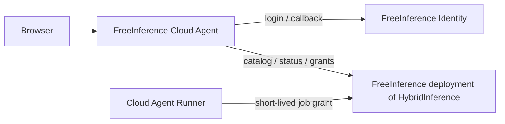
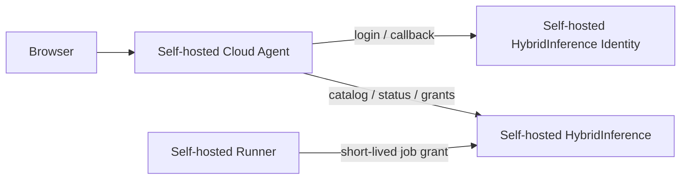

# FreeInference Cloud Agent 登录与开源边界设计

- 日期：2026-09-01
- 状态：Proposed
- 范围：登录认证归属、Hosted/Self-hosted 边界、开源边界
- 涉及仓库：`hybridInference`、`freeinference-cloud-agent`

## 1. 要解决的问题

Cloud Agent 已经是独立服务和独立仓库。现在只需要回答两个问题：

1. 官方 `agents.freeinference.org` 的用户通过谁登录？
2. 当 `freeinference-cloud-agent` 开源后，自托管用户是否必须依赖 FreeInference.org？

本文不讨论产品定位、目标用户、域名部署、Compose 打包、runner/sandbox 架构或功能路线图。

第 8 节是一个例外，而且是必要的例外：它说明这两个问题属于**哪一条**解耦轴，以及另一条
轴由谁负责。不写清这一点，读者会以为本文覆盖了全部解耦工作。

## 2. 决策摘要

### D0：Cloud Agent 是 HybridInference 的可选下游应用

依赖方向只有一个：

```text
Cloud Agent ──depends on──> HybridInference
HybridInference ──does not depend on──> Cloud Agent
```

一个不部署 Cloud Agent 的 HybridInference 必须仍然是完整产品：推理 API、模型路由、用户系统、配额、审计和管理界面都能独立运行。它不需要 Cloud Agent service、数据库、runner、环境变量或健康状态。

当部署没有选择 Cloud Agent integration 时：

- 不生成 `/agents` 前端 rewrite，访问该路径返回 404；
- 不配置 cross-service identity 时，相应 endpoint 不可用；
- 不配置 dispatch token 时，grant 和 internal lookup endpoint 返回 404；
- HybridInference 的启动、健康检查、CI、发布和正常推理不能等待或探测 Cloud Agent。

“可选”指没有运行时和部署依赖，不要求把少量 gateway-side contract code 做成插件。HybridInference 可以携带默认关闭的 identity/grant endpoint 和它们自己的 contract storage；没有第二个消费者或实际维护问题前，不为此新建扩展框架。

### D1：Hosted Cloud Agent 使用 FreeInference 用户系统

`agents.freeinference.org` 使用 FreeInference 部署中的 identity service。用户继续使用同一个 FreeInference 账号、角色和全局配额，不在 Cloud Agent 中重新注册一套账号。

### D2：Identity 的通用能力仍属于 HybridInference

FreeInference 是 HybridInference 的一个官方 deployment/distribution。因此：

- identity HTTP 契约和可自托管的 reference implementation 留在 HybridInference 开源上游；
- FreeInference 拥有其生产用户数据、登录策略、签名密钥、品牌和运维配置；
- “认证放到 FreeInference”指 Hosted 环境的运营归属，不是让 Cloud Agent 或 HybridInference 开源版依赖 FreeInference.org。

### D3：Cloud Agent 只拥有应用侧认证职责

Cloud Agent 负责：

- `/login` 登录入口和产品内登录体验；
- OAuth-style callback/BFF；
- 自己的 HttpOnly 应用 session；
- job、thread 和 repository 的应用级权限。

Cloud Agent 不负责：

- 密码、MFA、账号恢复和全局用户状态；
- 平台角色、全局配额和模型可见性的真相源；
- 通用 OIDC federation 或可插拔 `IdentityProvider` 框架。

### D4：Self-hosted Cloud Agent 使用自己的 HybridInference

自托管拓扑是：

```text
Self-hosted Cloud Agent
        │
        ├── identity HTTP contract
        ├── model catalog / user status
        └── inference grants
        │
Self-hosted HybridInference
```

自托管者配置自己的 HybridInference 地址、issuer、JWKS 和 redirect URI。默认情况下，身份、代码、prompt 和推理请求都不需要经过 FreeInference.org。

### D5：两个仓库可以分别开源

- HybridInference 开源基础设施层；
- FreeInference Cloud Agent 开源应用层；
- FreeInference.org 的生产配置、密钥、用户数据和运维仍然私有。

开源 Cloud Agent 不需要把 FreeInference 的生产部署一并公开，也不需要在 Cloud Agent 中重建 identity 或 inference provider 层。

## 3. 架构边界

本节两张图只描述“部署者选择启用 Cloud Agent”之后的集成方式，不是 HybridInference 的必选部署拓扑。HybridInference 单独运行始终是有效且受支持的形态。

### 3.1 Hosted



这里的 FreeInference Identity 仍然实现 HybridInference 定义的通用 identity contract，只是由 FreeInference 运营并保存生产状态。

### 3.2 Self-hosted



Hosted 与 Self-hosted 使用相同的服务边界。区别只是 Cloud Agent 指向哪个 HybridInference deployment，而不是 Cloud Agent 内部切换两套实现。

## 4. 登录流程

### 4.1 Hosted 流程

1. 用户访问 Cloud Agent 的 `/login`。
2. Cloud Agent BFF 生成 PKCE verifier 和 `state`，保存到短时 HttpOnly cookie。
3. 浏览器跳转到 FreeInference identity authorize endpoint。
4. FreeInference 完成用户认证和 consent，浏览器以 `GET` 返回 Cloud Agent callback。
5. Cloud Agent BFF 验证 `state`，在服务端 exchange code，并验证 issuer、audience、签名和 expiry。
6. Cloud Agent 建立自己的 HttpOnly、Secure、SameSite session，跳转到应用页面。
7. 特权操作和每次 inference grant mint 都重新查询 FreeInference 用户状态。

浏览器 JavaScript 不持有 identity bearer token、PKCE verifier 或 code exchange secret。Cloud Agent session 是小时级授权缓存，不是另一套长期账号凭证。

### 4.2 权限真相源

| 决策 | 真相源 |
|---|---|
| 用户是否存在、是否 active | HybridInference identity |
| 用户平台角色、全局配额 | HybridInference identity/gateway |
| 用户可见模型 | HybridInference model catalog |
| 用户能否读取某个 job/thread | Cloud Agent |
| 用户能否操作某个 repository | Cloud Agent 与 Git provider |
| runner 能否为某个 job 调用模型 | HybridInference short-lived grant |

Cloud Agent 可以缓存展示所需的 email、role 和 opaque external user ID，但不能把缓存变成新的平台真相源。

### 4.3 用户标识

现阶段继续把 identity token 的 `sub` 当作 opaque external user ID。没有第二个真实 issuer 之前，不增加 `(issuer, subject)` schema，也不提前迁移生产数据。

如果以后需要学校 SSO、GitHub、Google 或企业 IdP，federation 应加在 HybridInference identity 层。所有上层应用随后复用同一个 canonical identity，而不是各自实现登录 provider。

## 5. 开源边界

### 5.1 HybridInference 开源仓库包含

- identity authorize/token/JWKS/user-status 契约及 reference implementation；
- inference grants 和必要的 internal lookup 契约；
- 模型目录、协议适配、路由、配额和用量归属；
- 中立、可自托管的默认配置或示例。

### 5.2 Cloud Agent 开源仓库包含

- Web、control plane、runner 和数据库迁移；
- `/login`、callback BFF 和应用 session；
- job/thread/repository 授权；
- HybridInference identity、catalog 和 grant contract clients；
- 通用部署文档与测试。

### 5.3 FreeInference 私有部署包含

- 生产用户数据库与备份；
- identity signing keys、session secrets 和 service credentials；
- FreeInference 品牌、登录策略、redirect allowlist 和风控配置；
- 模型/provider 密钥、真实路由和配额策略；
- 主机、网络、监控、事故响应和其他生产运维信息。

### 5.4 强制依赖规则

- Cloud Agent 与 HybridInference 只通过版本化 HTTP 契约交互；
- 两个服务不共享数据库，不互相 import 内部源码；
- Cloud Agent 不持有模型 provider 密钥；
- runner 只获得短时、限权的 job grant，不获得 gateway admin secret；
- 开源默认配置不得硬编码 `freeinference.org`；
- 新 inference provider 或协议适配只在 HybridInference 中实现，不复制到 Cloud Agent。

## 6. 与 Ray PR #90 的关系

[freeinference-cloud-agent #90](https://github.com/HarvardMadSys/hybridInference-cloud-agent/pull/90) 实现的是 shared live Agent CLI sessions、native forks 和相关 runner/sandbox lifecycle。

该 PR 不改变：

- identity authority；
- Cloud Agent BFF/session 边界；
- HybridInference identity、catalog 或 grant 契约；
- 本文定义的开源归属。

PR 中的 `deploy/local` 用于该功能的本地验证与 smoke，不在本文中被提升为新的产品或打包策略。

**#90 已于 2026-09-01 前合并**（107 文件、+31.5k，`dev` 的 `ff1b4d6`），本文写作时
的"可以独立评审和合并"已是过去式。核对它对本文的影响仍然成立：登录边界没有变化。

顺带一条读这个仓库的注意事项：`freeinference-cloud-agent` 的默认分支是 `main`，
而 `main` 长期落后 `dev`（2026-09-01 实测 66 个 commit），目录结构也已被 #92 压平。
按 `main` 读文件会得到过期结论——核对一律显式指定 `dev`。

## 7. 验收标准

状态是 2026-09-01 逐条核对代码后标注的，不是计划意图。**"已成立"一律附证据**；
没有证据的写"未核实"，不写"应该没问题"。

| # | 验收 | 状态 | 证据 |
|---|---|---|---|
| 1 | 全新 HybridInference 无任何 Cloud Agent config 即可启动并正常推理 | 已成立 | identity / agent-grants / internal-lookups 在未配置时返回 **404 而非 401**（`internal_auth.py::require_dispatch_token`），`tests/unit/test_agent_grants.py`、`test_identity_keys.py` 钉住 |
| 2 | 未启用 Cloud Agent 时 `/agents` 与 cross-service endpoint 不暴露能力 | **部分成立** | 后端与 `/agents` rewrite 都是条件的（`apps/frontend/next.config.js`，不设两个 env 即 404）；但 Dashboard 的 Agents 入口按 `hasRole(role,'internal')` 判定，**判的是"你是谁"不是"这个部署有没有装"**，未装时点进去是 404。见第 8 节缺口 G1 |
| 3 | HybridInference 的 CI/发布/健康检查不依赖 Cloud Agent | 已成立 | 无 import、无健康探测；H4 已删除本仓的 agent 代码 |
| 4 | Hosted 用户用现有 FreeInference 账号登录 Cloud Agent | 已成立 | 生产 `/agents` 即此形态 |
| 5 | Cloud Agent 无密码 / MFA / 账号恢复 | 已成立 | 仓内无此类表或接口 |
| 6 | code exchange 只在 BFF，浏览器不持 identity bearer token | **已实现，待真实验证** | cloud-agent PR #93：exchange 移入服务端，verifier 进 HttpOnly cookie，callback 页面与浏览器 PKCE 模块已删除。**所有测试仍 fake 了网关 HTTP 面**，需一次真实 staging 往返 |
| 7 | session 小时级；特权操作与 grant mint 回查用户状态 | **已实现，待真实验证** | PR #93：TTL 7 天 → 8 小时；`require_agent_owner` 与 `verify_admin_access` 在变更类请求上回查。**grant mint 本条本来就成立且不在 Cloud Agent 侧**——网关在 `agent_grants.py` 的 mint 与 renew 内部调 `_active_user()`，检查与签发同一次调用，无 TOCTOU 窗口 |
| 8 | job/thread/repository 权限由 Cloud Agent 独立测试 | 已成立 | `test_other_users_jobs_are_404_not_403`、`test_the_integrations_page_never_shows_another_users_connection`、`test_one_users_connection_is_not_another_users` |
| 9 | Self-hosted 可指向自托管 HybridInference，无需请求 FreeInference.org | **代码层成立，整体待 B 轴** | cloud-agent 全仓仅 7 处 `freeinference.org`，全在契约 `servers:` 示例与一句 docstring，**无运行时默认值**；PR #93 further 把 `GATEWAY_AUTHORIZE_URL` 从浏览器 build 时常量改成服务端可配置。完整成立还依赖第 8 节的中立上游工作流 |
| 10 | 两仓无源码 import / 共享数据库 / 共享 provider secret | 已成立 | 仅三个 HTTP 契约 |
| 11 | FreeInference 生产数据、密钥、运维配置不进公开仓 | **未成立** | `distributions/` 已只剩 `example`（overlay 已搬出），但中立上游 **W8 五项密钥轮换零证据**；见第 8 节 |
| 12 | Cloud Agent 不新增 identity/inference provider 抽象层 | 已成立 | PR #93 未引入任何 provider 框架 |

## 8. 解耦的两条轴，以及本文只覆盖了一条

三个名字容易被读成"三个要互相解耦的组件"，而它们其实是**两类东西**：

| 名字 | 是什么 |
|---|---|
| HybridInference | 软件（开源仓库） |
| FreeInference Cloud Agent | 软件（开源仓库） |
| **FreeInference** | **一个部署**——overlay、密钥、生产数据、运维 |

把 FreeInference 当成第三个组件，会得出错误的任务清单：最典型的就是"在 Cloud Agent
里做 provider 抽象层"，而那恰恰是 D5 明确否掉的。正确的分解是两条轴：

**A 轴 · 应用 ↔ 基础设施**（Cloud Agent ↔ HybridInference 软件）。本文 D0/D4/D5
覆盖的就是这条，验收第 1–10、12 条都在这条轴上。**目前基本成立**，剩一个缺口：

- **G1 · Dashboard 的 Agents 入口按角色判定，不按部署判定。**
  `apps/frontend/src/components/features/dashboard/DashboardView.tsx` 把入口放在
  `hasRole(role,'internal')` 里。角色回答的是"你是谁"，而 D0 要回答的是"这个部署装了
  Cloud Agent 吗"。没装的部署里，internal 用户仍看得到按钮、点进去 404——这正是它
  "感觉像必选项"的来源。应改为由 distribution 的 feature/config 决定，默认关闭。

**B 轴 · 软件 ↔ 部署**（HybridInference ↔ FreeInference）。**本文没有覆盖这条**，
而 D2「FreeInference 是 HybridInference 的一个 deployment」这句话能否成立，取决于它。
这条轴不是空白——它有自己的设计和一条走了大半的工作流，见
[中立上游与多 distribution 设计](./2026-07-16-hybridinference-neutral-upstream-multi-distribution-design.zh.md)：

- `distributions/` 目前只剩 `example`，FreeInference 的 overlay 已搬出本仓（仓库内可
  直接核实）；
- 以下进度**来自 2026-09-01 的会话对账，仓库内没有同步的记录**：那份设计的执行计划
  [`2026-08-03-repo-split-step2-execution.zh.md`](../plans/2026-08-03-repo-split-step2-execution.zh.md)
  自身的状态注记停在 2026-08-12，跟踪 issue #738 的最后一条评论停在 07-29。按对账，
  W0–W6 已关闭、生产已在中立链路上运行；**剩 W7**（console 翻 digest，被 compose-base
  决策阻塞）**和 W8**（五项密钥轮换，目前零证据）。读者应以执行计划的下一次对账为准，
  而那次对账本身是一项待办；
- W8 未完，本文验收第 11 条就不成立；
- 那份设计另有 10 条待决策，其中 **#5（RouteWise 是 workspace 还是正式 wheel）阻塞
  Phase 3 的中立 artifact**，且两个选项都意味着 RouteWise 代码公开，需结合在审论文定。

**因此本文与那份设计必须一起读。** 验收第 9 条（self-hosted 不需请求
FreeInference.org）同时压在两条轴上：A 轴已成立，B 轴未完。任何一份文档单独看，都会
让人以为核心问题没有被设计。

### 8.1 待维护者确认的取舍

以下三条本文不替维护者决定，但必须显式记录，否则会以"默认行为"的形式悄悄生效：

1. **停用用户的读窗口。** 变更类操作立即拒绝；**GET 读取会持续到 session 过期（≤8
   小时）**。这是有意的取舍：读也回查会让网关一抖就关掉所有人已打开的页面，且轮询会
   放大到网关上。如果 job 日志、代码 artifact 属于敏感数据，需另行收紧（例如读也回查
   但加短缓存）；否则应在此明确记为接受的窗口。
2. **命名。** 仓库名 `freeinference-cloud-agent`、OAuth client id `cloud-agent`、
   环境变量前缀 `GATEWAY_*`。都不是运行时耦合，但对一个希望陌生人自托管的开源产品，
   命名是采用信号。改与不改都可以，需要一次拍板。
3. **契约文件里的具体部署。** 三份 `contracts/*.openapi.yaml` 的 `servers:` 列着
   `https://freeinference.org`。中立文档里点名一个具体部署，与 D2 的立场不一致。

## 9. 跨仓发布顺序

登录改动横跨两个仓库，**顺序不能反**：Cloud Agent 的 `dev` 在 CI 绿后会自动部署
staging（`deploy-staging.yml` 的 `workflow_run`），而新的三个 control-plane 变量在
compose 里是 `:?` 必填——先合并会让 staging 部署直接失败。

正确顺序：

1. FreeInference 的 `IDENTITY_ALLOWED_REDIRECTS` **同时允许新旧两个 callback**
   （它是逗号分隔的精确匹配列表，两条可以并存）；
2. 配好 `GATEWAY_AUTHORIZE_URL`、`AGENT_SESSION_REDIRECT_URI`、`AGENT_WEB_BASE_URL`；
3. 合并 Cloud Agent 的登录 PR；
4. 跑一次**真实** staging 登录往返；
5. 确认后再删除旧 callback。

不要求两个仓库"同一瞬间切换"——那既做不到，也会在中间那段时间让所有人登不进去。

## 10. 非目标

本文不决定：

- Cloud Agent 的市场定位或目标用户；
- 主页视觉和产品文案；
- Cloudflare DNS/Tunnel 的具体配置；
- self-hosted Compose、安装器或一键部署；
- runner/sandbox 隔离方案；
- Ray #90 的 live session/fork 实现细节；
- 第二个 issuer 出现前的多 issuer schema；
- 未来 hosted 商业功能。

这些事项不能作为落实本文登录边界或开源 Cloud Agent 的前置条件。

## 11. 相关文档

- [HybridInference 中立上游与多 distribution 设计](./2026-07-16-hybridinference-neutral-upstream-multi-distribution-design.zh.md)
- [HybridInference 开源解耦设计](./2026-06-18-opensource-decoupling.zh.md)
- [Cloud Agent 拆仓计划](../plans/2026-08-03-cloud-agent-repo-split.md)
- [Ray PR #90](https://github.com/HarvardMadSys/hybridInference-cloud-agent/pull/90)

本文是登录与开源边界的跨仓 proposal。具体代码变更仍在其所属仓库完成。
