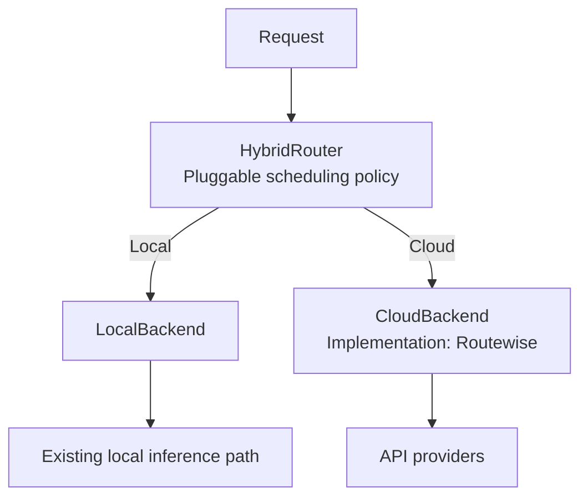

# Hybrid Routing 抽象重构设计

- 日期：2026-09-12
- 修订：2026-09-14，按用户确认收缩为抽象重构；同日补充实现落点与验证结果
- 状态：抽象与封装已实现并验证；生产接入仍未启用
- 代码基线：HybridInference `dev@46fdb06a2efab27e8317818979772ac2f43f5fd6`
- 开发分支：`murphy/dev/hybrid-routing-abstract`（worktree：`.worktrees/hybrid-routing-abstract`）

## 1. 本次目标

把混合调度、local 调用和 cloud 调用之间的接口整理清楚，让后续策略可以组合现有执行能力。

本次交付是 **HybridRouter 抽象与 backend 封装**。

已经确定的关系如下：



HybridRouter 是通用抽象，混合调度发生在它内部。Greedy/Nimbus 是未来可以接入的策略；本次只用测试策略验证这个替换点。LocalBackend 只保留名称和调用职责，不因增加这个抽象而承担新的资源管理系统。

## 2. 当前代码已经提供的能力

| 现有能力 | 代码 | 本次处理 |
|---|---|---|
| 普通、流式、反馈与状态接口 | [RouterProtocol](../../../apps/backend/routing/protocols.py) | 原样复用，未新增请求格式 |
| endpoint 调用，包括本地 OpenAI-compatible 引擎 | [BaseAdapter](../../../apps/backend/serving/adapters/base.py) | 保留现有实现 |
| 固定选择与 fallback | [FixedRouter](../../../apps/backend/routing/routers.py) | 作为 LocalBackend 背后的现有执行路径 |
| 云端候选选择与执行 | [RouteWiseRouter](../../../apps/backend/routing/routewise/router.py) | 由 RouteWiseCloudBackend 薄封装委托 |
| 候选表与模型范围 | [RouteTableView](../../../apps/backend/routing/route_table.py) | 通过 RouteScopeView 明确传入每个 backend 的候选范围 |
| 当前模型路由入口 | [ModelRouterRegistry](../../../apps/backend/routing/model_router_registry.py) | 保持 fixed/routewise 既有行为不变 |

现有代码统一了调用接口，但没有把“混合决策”与“可替换的云端实现”明确组合为上述关系。本次补的是这个组合边界。

## 3. 组件职责与实现落点

| 组件 | 职责 | 实现方式 |
|---|---|---|
| [HybridRouter](../../../apps/backend/routing/hybrid.py) | 对外接收请求，内部策略选择 backend，再委托调用 | 通用组合对象；策略经构造参数注入 |
| [LocalBackend](../../../apps/backend/routing/backends.py) | 暴露现有 local 调用能力 | 包装调用方已配置好范围的 `RouterProtocol`（通常是 `FixedRouter`） |
| [RoutingBackend](../../../apps/backend/routing/backends.py) | cloud 调用能力接口 | 结构协议，仅 `RouterProtocol` 加 `name` 与 `owns_observation`，不依赖任何厂商或 RouteWise 细节 |
| [RouteWiseCloudBackend](../../../apps/backend/routing/backends.py) | 使用 Routewise 完成 cloud 调用 | 委托已有 `RouteWiseRouter`，复用其算法与执行 |
| [RouteScopeView](../../../apps/backend/routing/route_scope.py) | 明确传入每个 backend 的候选范围 | 只读 `RouteTableView` 投影；按模型与 endpoint 过滤 |

组合方式：

```python
router = HybridRouter(
    policy=policy,
    local=local_backend,
    cloud=cloud_backend,
)
```

调度策略在 `routing/hybrid.py` 中定义为 `BackendSelection` 协议，属于 HybridRouter 内部替换点，不增加串行的路由服务。测试使用 `_ForceBackend` 这类强制选择 local 或 cloud 的策略；它不代表已经实现 Greedy。

LocalBackend 和 CloudBackend 使用同一调用契约，复用 `RouterProtocol` 中的 `model_id`、`messages`、`RoutingRequestOptions` 与生成参数。本次没有复制一套只有类名不同的接口，也没有引入新的请求格式。

## 4. 薄封装的边界

**LocalBackend** 把请求交给已有本地执行路径，保留普通响应、流式响应和既有错误语义。本次没有加入队列、资源预留、token 统计、TTFT 预测或 GPU 取消确认机制。本地候选集由构造方通过“把哪些 adapter 注册进被包装的 router”来表达。

**RouteWiseCloudBackend** 包装已有 `RouteWiseRouter`。选择、fallback、quota/concurrency 与流式处理继续使用它已有的实现；本类只贡献候选范围与委托。

cloud 候选范围通过 `endpoint_scope` 显式传入（endpoint id 和/或 provider 标签），可另加 `model_scope`。该类在构造时把 `RouteScopeView` 绑定到被包装的 router，因此 primary、fallback 以及 router 自己的后台探测都只看到 cloud 范围内的 endpoint。没有从 localhost、URL 或 provider 名字推断归属。空范围直接抛 `ValueError`，禁止退化为“整张表”。

封装保留请求参数、实际 provider/endpoint、响应元数据和已有反馈语义：

- HybridRouter 不叠加跨 backend 重试；某个 backend 内部的 fallback 与 hedging 仍留在该 backend 内。
- 流式路径不缓冲：`LocalBackend` 与 `HybridRouter` 都返回下游自己的迭代器/转发迭代器，关闭消费者会关闭下游迭代器。
- 反馈只投递给一个 owner，按以下顺序判定：
  1. 该 `request_id` 在派发时由策略选中的 backend；
  2. 唯一认领该 endpoint 的 backend（`owns_observation`）；
  3. 无人认领或有多个认领者时**丢弃**，不再广播——把样本同时记给两个 backend 会污染未服务该请求一方的在线状态，比丢一个样本更糟。
- 派发记录只在**终结**观测到达时消费。一个请求会产生多条观测：`CompletionsLogger` 先为每个失败尝试发送 `terminal=False` 的样本，再发送 `terminal=True` 的最终结果。若第一条就吃掉记录，最终结果在"两个 backend 都认领该 endpoint"时就无法归属。
- local 侧也提供显式的 `endpoint_scope` / `model_scope`（可与 cloud 范围互补），使常见情况下恰好只有一个 owner，而无需依赖派发记录。`endpoint_scope` 的条目可以是 canonical endpoint id 或 provider 标签；provider 标签会通过 backend 自身路由表解析成实际 endpoint 集合，使**执行范围与反馈归属一致**（否则观察到的是 endpoint id，永远匹配不上 provider 标签）。未声明范围的 `LocalBackend` 会认领所有 endpoint，只适用于单域组合。
- 对象创建、初始化和关闭仍由构造方负责。生命周期是显式 opt-in（`manage_lifecycle`，默认 False）；即使开启，backend 也只停止**自己启动过**的实例：`start()` 返回布尔值表示"本次调用是否真正拉起后台任务"，底层 router 已在运行（例如构造方先启动）时返回 False，包装层不会因此取得所有权。
- `refresh_route_table()` 沿用被包装 router 自身的刷新语义：只丢弃范围视图的投影缓存，不重新绑定视图，因此不会走到 `attach_route_table` 的 attach 路径去清空 `pending_prefix_cache`（那会丢掉所有在途请求的 prefix-cache 反馈）。

新增的委托都有明确所有者，没有因为多包一层丢失现有生命周期操作。

## 5. 接入范围

本次提供可直接构造、可测试的组合入口，使用现有 router 加 mock adapters 验证封装；既有 fixed/routewise 请求入口继续工作。

本次**没有**把生产 registry 中的顶层 Routewise 替换成嵌套对象，也没有启用新的生产 hybrid 策略。未来启用组合路由时，至少需要同步处理以下几处（本次已在文档中记录，未改动代码）：

1. `ModelRouterRegistry` 以 strategy 名为键构造 router；hybrid 需要一个新的策略名与参数模型。
2. [bootstrap](../../../apps/backend/serving/servers/bootstrap.py) 的 `_collect_routewise_routers` 直接 `isinstance(router, RouteWiseRouter)` 判定，嵌套在 `RouteWiseCloudBackend` 里的 router 不会被识别，因此其 `start()`/`stop()` 与 `attach_operational_store()` 不会被调用。
3. 生产 `FixedRouter` 持有全部路由；要构造“只有本地候选”的 LocalBackend，需要在组装处按范围分别注册，或给本地侧提供同样显式的范围输入。

## 6. 完成条件与验证

| 完成条件 | 验证 |
|---|---|
| 1. 可注入两个 backend 与测试策略；选择任一侧时只执行对应侧 | `tests/unit/routing/test_hybrid_router.py::test_forced_local_policy_executes_only_the_local_backend`、`...forced_cloud...` |
| 2. 普通与流式均可用；参数、路由控制字段、输出顺序与元数据正确 | `test_router_owned_options_never_reach_the_adapter`、`test_streaming_forwards_order_and_attributes_the_backend`、`test_hybrid_streams_through_a_real_local_backend_in_order` |
| 3. 不缓冲完整流、不吞异常与取消，已启动迭代器按现有语义关闭 | `test_streaming_does_not_run_the_backend_before_the_first_read`、`test_closing_the_hybrid_stream_closes_the_downstream_iterator`、`test_stream_exceptions_propagate_unchanged` |
| 4. LocalBackend 复用现有调用路径；RoutewiseCloudBackend 实际委托 RouteWiseRouter | `tests/unit/routing/test_routing_backends.py`；共享契约参数化里的 `local-backend` / `cloud-backend` |
| 5. cloud 候选与 fallback 不越到 local；共享对象与反馈不重复处理 | `test_cloud_backend_never_dispatches_a_local_candidate`、`test_cloud_backend_fallback_stays_inside_the_cloud_range`、`test_cloud_backend_excludes_local_endpoints_from_background_probes`、`test_observation_is_recorded_by_exactly_one_owning_backend`、`test_dispatch_record_attributes_feedback_when_both_backends_claim_the_endpoint`、`test_ambiguous_feedback_without_a_dispatch_record_is_dropped` |
| 6. 既有 router contract、路由表、registry 与 stream 回归通过 | `tests/unit/routing/`、`tests/unit/servers`、`tests/servers/test_admin_routing_*`、`tests/integration/test_routing_yaml_driven_dispatch.py`；全量 `pytest -m "not external and not dbtest"` |

第 5 条另有三项封装正确性契约（2026-09-14 review 后补）：

| 契约 | 验证 |
|---|---|
| 云请求的反馈不进入 local 学习状态 | `tests/unit/routing/test_routing_backends.py::test_local_backend_owns_only_observations_inside_its_declared_scope`、`test_hybrid_router.py::test_dispatch_record_attributes_feedback_when_both_backends_claim_the_endpoint` |
| 非终结反馈不消费派发记录，终结反馈才释放 | `test_hybrid_router.py::test_nonterminal_attempt_feedback_does_not_consume_the_dispatch_record`、`test_terminal_feedback_releases_the_dispatch_record` |
| provider 标签范围能认领它实际服务的 endpoint | `test_routing_backends.py::test_local_backend_resolves_a_provider_scope_to_the_endpoints_it_serves`、`test_route_scope.py::test_observation_scope_resolves_a_provider_label_to_its_endpoints` |
| 不接管外部已启动 router 的生命周期 | `test_routing_backends.py::test_cloud_backend_does_not_stop_a_router_started_by_another_owner`、`test_backend_lifecycle_is_opt_in`、`test_hybrid_router.py::test_backend_that_reports_already_started_is_not_stopped_here`、`test_routewise_router.py::test_start_reports_whether_this_call_activated_the_router` |
| 刷新候选保留在途请求的反馈状态 | `test_routing_backends.py::test_cloud_backend_refresh_preserves_inflight_prefix_cache_state` |

这次重构不承诺新的资源准入能力或 Greedy/Nimbus 调度效果。将来算法需要哪些状态、队列或资源能力，在对应算法接入时单独定义，不预先塞进基础 backend 接口。

## 7. 设计取舍

- **范围而不是分类。** cloud 范围由构造方给出 endpoint/provider 集合，代码里没有“这个 endpoint 是不是本地”的推断；`AGENTS.md` 已说明 endpoint 后缀不可作为归属信号。
- **权重不重归一化。** `RouteScopeView` 保留过滤前的权重（例如 cloud 侧 0.5 在只剩 cloud 的视图里仍是 0.5），因为它是 operator 配置的整池份额，不是过滤后残余的份额。
- **反馈先查派发记录，再退回 owner 判定，绝不广播。** 观测是同步接口，策略只在请求路径上被调用，所以 `HybridRouter` 在派发时按 `request_id` 记下选中的 backend（有界 LRU，终结反馈到达时弹出）。这解决了两个 backend 都认领同一 endpoint 时无法区分的问题；记录缺失时用唯一 owner 判定，仍无法判定就丢弃样本。
- **范围声明与归属判定用同一套语义。** provider 标签在 `ObservationScope` 里通过 backend 自己的路由表解析为 endpoint 集合，而不是在归属判定时退化成字符串比较；这样"我声明的范围"和"我能认领的 endpoint"不会分叉。
- **生命周期是显式 opt-in 而不是推断。** `manage_lifecycle` 默认 False，把所有权留给构造方；`start()` 返回布尔值让包装层能区分"我拉起的"与"本来就在跑的"，避免包装层替外部 owner 取消后台任务。
- **`_routing` 增加 `backend` 字段。** 既有 `_routing` 字典上 `setdefault("backend", name)`，用于观测与测试归因；不覆盖 router 已写入的内容，且和其它 `_routing` 键一样被 `sanitize_chunk` 剥离，不会出现在客户端。

## 8. 开发范围

在现有 routing 包中增加了最少的接口、组合对象和封装：

- `apps/backend/routing/route_scope.py`
- `apps/backend/routing/backends.py`
- `apps/backend/routing/hybrid.py`
- `apps/backend/routing/__init__.py` 导出新增符号
- `tests/unit/routing/test_route_scope.py`、`test_routing_backends.py`、`test_hybrid_router.py`
- `tests/unit/routing/test_router_contract.py` 参数化加入两个 backend

没有创建 resources、prediction 或 engine 管理模块。`routing/executor.py` 保持为兼容导出，未改动。
