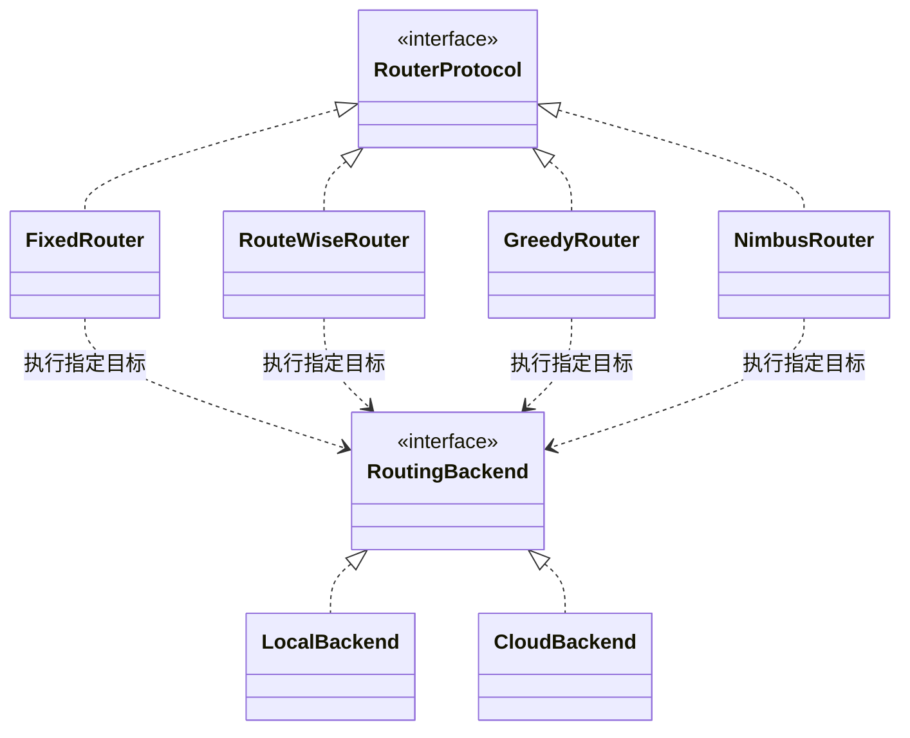
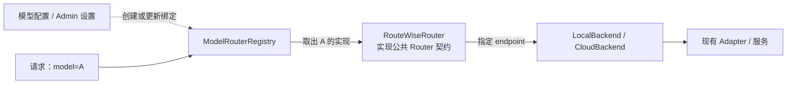

# Hybrid Routing 抽象重构设计

> 后续边界以 [9/14 设计](2026-09-14-composable-hybrid-routing-design.zh.md) 为准。本文的“只执行指定 endpoint”约束对应现在的 LeafBackend；LocalBackend / CloudBackend 已是 TreeBackend 池包装，可委托内部 Router 在授权范围内选路。下文保留早期方案用于对照，不能将其当作当前池契约。

- 日期：2026-09-12
- 修订：2026-09-14，按用户最新确认，采用公共 Router 契约、独立策略实现与共享 Backend 执行契约
- 状态：本轮更新设计文档；目标架构尚未据此完成代码调整或部署验证
- 当前代码参照：PR #1454，`murphy/dev/hybrid-routing-abstract@ea9ad22fe14d96b9b2d414e337cba040d9ce28a4`
- 实施计划：[Hybrid Routing 抽象重构实施计划](../plans/2026-09-13-hybrid-routing-implementation.zh.md)

本文分别描述最终设计、参照提交的实际实现，以及后续代码调整的验收边界。本轮文档修改不改变运行代码、配置或线上流量，也不沿用旧提交的测试结果来宣称新设计已经实现。

## 1. 设计决定与范围

**统一 Router 的公共契约，保留各策略自己的请求处理流程；Backend 执行 Router 已经指定的目标。**

1. HybridRouter 表示通用路由抽象。FixedRouter、RouteWiseRouter，以及未来的 GreedyRouter / NimbusRouter 是它的同层实现。
2. 一个 Router 实现可以同时负责选路、重试、hedging、资源预留和反馈协调。公共接口不要求所有实现共用一套内部控制循环。
3. Fixed 与 RouteWise 都能在完整的 local / cloud 候选池中选择具体 provider 或 endpoint。RouteWise 不属于 CloudBackend 内部的必经子策略。
4. LocalBackend / CloudBackend 是执行域。收到指定 endpoint 后负责调用和响应，不自行重新抽样、替换目标或执行跨 endpoint fallback。
5. 模型配置、Registry、默认策略与 Admin 切换沿用现有机制。配置声明使用哪个 Router 实现，不增加一层按请求运行的“策略选择算法”。
6. 保留现有 Fixed 与 RouteWise 的外部配置和请求行为，继续复用 adapter、共享状态与 `llm-routewise` library。
7. 本次不新增 Greedy / Nimbus、本地 GPU 资源管理、队列、预测器或另一套容量系统。

这项决定取代先前“所有 Router 都拆成 Policy，再注入同一个具体 HybridRouter 执行引擎”的终态要求。**不要求提取独立 RouteWisePolicy 类。** 保持行为不变也不等于禁止调整内部调用边界：Router 到 Backend 的实际派发仍需完成接入与验证。

## 2. 类型关系与职责

### 2.1 公共抽象与具体实现



这是类型关系图，图中的 RouterProtocol 承载 HybridRouter 公共抽象，GreedyRouter / NimbusRouter 是未来扩展。图中“child”表示实现同一公共契约；Python 可以通过结构协议实现，不必增加名义继承或把现有类强制改成 ABC。

公共契约本身不作为一个额外对象先处理请求。配置为 `routewise` 时，Registry 直接返回 RouteWiseRouter，是返回该抽象的一种实现；不要求外面再包一层通用 Router 才算统一架构。

### 2.2 命名与现有代码的映射

现有 [RouterProtocol](../../../apps/backend/routing/protocols.py) 已提供普通请求、流式、反馈和状态接口。**代码继续以它作为唯一公共 Router 契约**，按实际需求补齐能力；文中的 HybridRouter 是这项架构职责的名称，不要求再造一个内容相同的接口。

参照提交的 [routing.hybrid.HybridRouter](../../../apps/backend/routing/hybrid.py) 则是一个接受 `policy`、`local`、`cloud` 的具体组合类，**不是上图中的公共接口**。本文称它为“现有组合 Router”。它可以继续作为一种实现或兼容路径存在；后续若调整名称或模块，须保留既有导入和调用兼容。不能只给它改名或添加继承声明，就宣称 Backend 接入已经完成。

FixedPolicy / BackendSelection 可以继续作为现有 Fixed 组合的内部实现细节。其他 Router 不必实现该选择接口，也不必把自身行为改造成 Fixed 的逐候选循环。

### 2.3 Router、Backend 与 Adapter

| 组件 | 负责什么 | 不承担什么 |
|---|---|---|
| Router 公共契约 | 统一请求、流式、反馈及诊断的调用方式 | 不规定各策略的内部选路与重试算法 |
| FixedRouter | 按原全局权重选目标，组织原有 fallback，协调结果与反馈 | 不局限于本地副本选择 |
| RouteWiseRouter | 全池决策、容量预留、重新求解、hedging、反馈与其状态管理 | 不自动先按 local / cloud 分域，不强拆 RouteWisePolicy |
| LocalBackend / CloudBackend | 校验目标归属，执行指定 endpoint，返回响应、流或失败 | 不自行改选其他 endpoint，不管理新的本地排队或预算系统 |
| Adapter | 连接、认证、provider 协议和响应适配 | 不决定全局候选顺序或路由策略 |

例如：候选为本地 L、云 A、云 B。FixedRouter 按权重抽中 A，CloudBackend 调用 A。如果 A 失败，Backend 返回失败，FixedRouter 根据原规则决定尝试 B、L 或返回错误。RouteWiseRouter 则可以依据成本、延迟和容量直接选中 L，再由 LocalBackend 调用 L。

Backend 是薄的执行边界，直接复用现有 adapter 及必要的单目标调用辅助逻辑。Local 与 cloud 使用相同协议时可以共享实现。最终不依靠“Backend 再调用一个能自主选路的完整 Router”来实现基本派发。

## 3. 模型配置、Registry 与请求的联动

配置关系与请求路径分别如下：



### 3.1 配置与创建

| 模型配置 | Router 实现 | 候选范围 |
|---|---|---|
| `router: fixed` | Fixed 路由实现，可复用已有 FixedPolicy 和组合代码 | 该模型原有完整候选池 |
| `router: routewise` | RouteWiseRouter | 该模型原有完整候选池，包含 local 与 cloud |
| 未指定 `router` | 现有默认策略对应的实现 | 沿用现有模型范围 |

继续使用 `router` / `router_params`，不增加必填的 `router: hybrid`，也不要求修改模型配置才能保留旧行为。Registry / factory 根据配置构建对应实现并缓存，启动时继续进行现有配置校验。

统一抽象不等于只有一个全局对象。模型可以分别绑定不同实现，别名沿用 canonical model 映射；Fixed 仍可复用现有共享对象。资源池、健康状态和连接按原来的共享边界复用，不能因为按模型绑定 Router 就复制实际共享的容量。

### 3.2 请求处理

普通请求通过 `model` 查找并复用已绑定的 Router，Router 再选择实际 endpoint。Registry 不计算 provider 权重或决定 local / cloud；请求也不需要指定算法名称。

示意代码使用现有契约名称，不代表本轮修改了运行接口：

```python
router: RouterProtocol = registry.get_router(model_id)
response = await router.chat_completion(model_id, messages, **params)
```

本设计默认按模型绑定策略，保留默认值和 Admin 切换。按请求、租户或实验组选择不同策略不属于本次范围。

### 3.3 运行中切换与 pin

复用现有准备、校验、启动与发布绑定的机制。目标要求是：先准备新实现，再发布新绑定；已开始的请求继续由原实现处理，包括流式、反馈和资源清理，旧实例在这些责任完成后再回收。发布失败不应丢失旧绑定；共享资源不能因切换被重置。

这些是需要验证的生命周期语义，不宣称参照提交已完整保证在途请求排空。不得在每个请求开始时修改一个共享对象的全局策略字段。

现有通过权限与参数校验的 HTTP `pin_provider` 请求绕过 per-model Registry，交给共享 FixedRouter。保留这条兼容通路，不要求第三个 Backend，也不把 pin 硬塞进拒绝它的 RouteWiseRouter。它是显式目标请求的兼容处理，不是第二种自动分域策略。

## 4. local / cloud 与资源类型是两个维度

local / cloud 描述执行归属；`on_demand` / `quota` / `concurrency` 描述 RouteWise 如何对候选建模。

RouteWise 论文 Discussion 的 “Generalization to Local GPU Deployments” 将拥有 k 个副本的 GPU 集群映射为 concurrency-limited provider，并说明路由算法可保持不变、仅容量 profiling 不同。因此 RouteWise 本身适用于本地部署。

| 维度 | 示例 | 影响 |
|---|---|---|
| 执行归属 | local、cloud | 由哪个 Backend 执行 |
| 资源类型 | on_demand、quota、concurrency | 有效成本、可行候选与容量准入 |

本地 endpoint 可以显式配置：

```yaml
provider_type: concurrency
concurrency_pool: local-model-pool
concurrency:
  limit: 4
```

该候选仍参与全池 RouteWise；实际派发取得槽位，完成或取消后按原规则释放。`limit` 是请求并发容量，不由 GPU 数量或 endpoint 地址自动推断。

当前 `provider_type` 缺省为 `on_demand`，云端服务同样可以配置为 concurrency。参见 [候选解析](../../../apps/backend/routing/routewise/candidates.py)、[并发槽管理](../../../apps/backend/routing/routewise/concurrency.py) 和 [配置示例](../../../config/examples/models.routewise.yaml)。

执行归属由部署配置决定。现有 factory 支持 `local_scope` / `local_ownership`；bootstrap 的 hostname 默认值可能把自建 LAN 或集群 DNS endpoint 归入 cloud。不要从 provider 名称、endpoint id 后缀或资源类型猜测归属，也不借本轮文档修改改变部署默认值。

## 5. Router 到 Backend 的执行契约

### 5.1 一次派发有一个明确目标

目标 Backend 契约要求每次派发携带已解析的 canonical endpoint id。provider 标签与 endpoint id 不可混用；Router 可复用候选表和解析辅助方法，将 provider 约束解析为可执行目标。

- Backend 校验 endpoint 属于自己的执行范围，然后调用对应 adapter。
- 目标在本次 attempt 适用的候选与准入视图中缺失或不在范围内时，报告不可派发，不偷偷改成另一个候选。
- 上游执行失败时，报告该目标的失败，由 Router 决定是否继续及下一个目标。
- 流式调用同样绑定该 endpoint，保持输出与关闭语义。
- 一个 endpoint 内部现有的协议处理或传输重试另按原行为保留；本契约禁止的是 Backend 自主改变路由目标。

候选表更新后，已选中或已预留目标是否继续派发，沿用原有快照与准入规则；不能仅按最新表重新解析 endpoint，就覆盖在途请求已经绑定的 adapter 或资源对象。

单域部署可以只提供该域的执行能力，无须为了满足两侧构造参数创建一个空 Backend。

### 5.2 与参照提交的兼容关系

当前 [RoutingBackend](../../../apps/backend/routing/backends.py) 仍提供近似完整 Router 的请求接口，允许 `target=None`，并可以借被包装 Router 进行域内选择或 fallback。这是现有兼容组合的能力，**不是上述最终执行契约**。

当前 `preferred_endpoint_id`、`require_target`、`allow_fallback`、`endpoint_scope` 用于协调两层 Router 的控制权。在兼容路径中保留其语义及测试；后续引入严格的单 endpoint 派发入口时，由兼容层映射这些控制，不能无提示改变公开调用行为。最终 Router 到 Backend 的基本调用不依赖一个“可自行重选”的目标偏好。

`RoutingDecision`、`FallbackAttempt`、`BackendSelection` 可继续服务现有组合实现，但不成为所有 Router 必须采用的决策数据结构。RouteWise 的带预留决策和请求 trace 可以保留。

### 5.3 重试与错误由对应 Router 协调

Fixed 的全局权重、模态、健康、亲和、prefill 估算和 fallback 顺序沿用旧规则。例如 route 顺序是 `L1 → cloud → L2`，L1 失败后仍应试 cloud，不能先耗尽本地域。一个候选的 claim 被拒与一次实际执行失败须区别记录，不能凭空生成上游故障样本。

RouteWise 保留自己的重求解、容量准入和 hedging 流程，不套用 Fixed 的静态候选计划。每个实际 attempt / hedge leg 都必须追踪其 endpoint、资源预留和执行结果。

内部 `_routing` 元数据不构成客户端可见输出。保持原来的流式提交边界、最终错误规则及失败历史：可见输出前按原规则处理失败；可见输出后不能把另一条回答重新拼接进同一个流。`failed_attempts` 保留 `provider`、`endpoint_id`、`error_type`、`error`，额外域信息不能破坏既有归因。

## 6. 状态、反馈与生命周期所有权

| 对象或责任 | 所有者与约束 |
|---|---|
| 策略决策、重试、hedging 与学习 | 对应 Router 及其已有协作者；允许实现之间不同 |
| quota / concurrency / 健康状态 | 沿用原共享范围，不按 Backend 或模型实例重复建池、claim 或记账 |
| 一次 attempt 的容量预留 | Router 的请求流程持有既有预留对象；绑定实际取得的资源实例，按原规则清理 |
| 连接、响应流与协议资源 | Backend / adapter 清理自己取得的资源，取消时与 Router 的 finally 路径配合 |
| 反馈归属 | 对应实际 attempt 的 Router、endpoint 和执行版本，不能重新查询当前模型绑定后误投 |
| 启动、停止、存储接入与刷新 | 构造和生命周期所有者负责；共享对象只管理一次 |

继续复用现有 RouteWise 状态和预留实现，不把它们迁入 LocalBackend / CloudBackend。并发槽和健康 claim 按原规则释放；已消费 quota 不因一般清理操作而错误退还。资源取得失败、上游失败、取消和 hedge loser 需要分别保留原语义。

反馈基于实际执行记录，一个请求可能有多个 attempt。不能广播给不相关 Backend，不能让非终结反馈提前消费整条请求的归属。现有兼容包装的 `owns_observation` 契约继续有效；记录缺失时只接受唯一 owner。

动态刷新保留在途预留、反馈和 pending 状态，更新候选投影及归属索引；不能通过重新 attach 清空未完成请求，也不能在释放时误用刷新后替换的资源池。

生命周期继续利用 [ManagedRouter](../../../apps/backend/routing/routers.py) 和 [RouteTableRefreshable](../../../apps/backend/routing/protocols.py) 等已有能力。RouteWise 的探测、operational store、校准与启动 / 停止保持原责任归属。若保留嵌套兼容对象，相关入口必须能访问真实所有者；包装层不能默认接管外部已启动对象。

## 7. 当前实现与最终设计的差异

以下是 `ea9ad22f` 的实际状态，不是本轮文档更新后的运行结果：

| 项目 | 参照提交 | 最终设计要求 |
|---|---|---|
| 公共 Router 契约 | 已有 RouterProtocol | 复用为唯一契约，不新增重复接口 |
| 混合 `router: fixed` | Registry → 现有具体 HybridRouter → FixedPolicy 与两侧 Backend；底层共享 FixedRouter | 可复用已有逻辑，但选路控制留在 Router，Backend 逐目标执行 |
| 单域 `router: fixed` | Registry → 共享 FixedRouter | 允许共享实例与单域部署，适配同一公共和执行契约 |
| `router: routewise` | Registry → RouteWiseRouter，自己管理全池决策与请求流程 | 直接返回该实现符合公共抽象；仍须验证 Backend 派发边界，无须迁入具体组合 HybridRouter |
| Backend | 多个实现封装完整 Router，部分接口允许重选 | 接入严格的单 endpoint 执行能力，保留所需兼容入口 |
| HTTP pin | 共享 FixedRouter 兼容路径 | 保留原权限、约束和失败行为 |

接线见 [ModelRouterRegistry](../../../apps/backend/routing/model_router_registry.py)、[bootstrap](../../../apps/backend/serving/servers/bootstrap.py)、[hybrid_composition.py](../../../apps/backend/serving/servers/hybrid_composition.py) 和 [completions.py](../../../apps/backend/serving/servers/routers/completions.py)。

**RouteWise 直接由 Registry 返回，既不等于绕过公共 Router 抽象，也不自动证明执行层重构已完成。** 需要通过真实请求路径证明其使用约定的 Backend 边界，且行为保持兼容。

现有 FixedCloudBackend / RouteWiseCloudBackend 是兼容包装类。RouteWiseCloudBackend 只表示对明确 cloud 范围的可选封装，不是 RouteWise 的架构归属或默认生产入口。保持公开类兼容不要求继续扩大这套嵌套关系，也不要求本轮删除这些类。

## 8. 复用、取舍与不做的工作

| 能力 | 继续复用的实现 |
|---|---|
| 普通请求、流式、反馈与状态接口 | RouterProtocol 及现有能力协议 |
| endpoint 调用与协议适配 | [BaseAdapter](../../../apps/backend/serving/adapters/base.py) 和现有 adapter |
| Fixed 选择及相关状态 | [FixedRouter](../../../apps/backend/routing/routers.py) 和现有 Fixed 组合中可复用的逻辑 |
| RouteWise LP | [lp.py](../../../apps/backend/routing/routewise/lp.py) 对 `llm_routewise.core.solve_budget_lp` 的适配 |
| quota 成本与 hedging 原语 | [effective_cost.py](../../../apps/backend/routing/routewise/effective_cost.py) 与 [RouteWiseRouter](../../../apps/backend/routing/routewise/router.py) 中的 library 调用 |
| 候选表与范围投影 | [RouteTableView](../../../apps/backend/routing/route_table.py) 与 [RouteScopeView](../../../apps/backend/routing/route_scope.py) |

[pyproject.toml](../../../pyproject.toml) 声明 `llm-routewise>=0.2.0`，参照提交的 [uv.lock](../../../uv.lock) 锁定为 `0.2.0`。本设计不升级或重写该算法核心。

| 取舍 | 选定：公共契约 + 独立 Router | 先前方案：统一具体引擎 + Policy |
|---|---|---|
| 共用范围 | 接口、Backend 与确实相同的辅助能力 | 接口及公共控制流程 |
| RouteWise 调整 | 保留完整流程，调整执行边界 | 拆分决策与执行，并交接状态 |
| 后续成本 | 部分流程可能重复 | 通用引擎需要表达各策略的不同规则 |

当前选择优先保持既有行为，减少强拆 RouteWise 的范围。只有后续出现明确的公共流程复用需求时，再提取相应实现，不预设必须形成独立 RouteWisePolicy。

不新增请求级策略选择、不另建部署资源管理、队列或预测系统、不实现 Greedy / Nimbus、不加入“先 Fixed 分域再 RouteWise 云内选择”的默认路径，不把类名重命名或删除兼容包装当作功能完成条件。

## 9. 完成条件与验证

| 验收项 | 要证明的行为 |
|---|---|
| 公共抽象 | Registry / serving 依赖共同契约；Fixed、RouteWise 同层，且区分接口与具体组合类 |
| Backend 边界 | 普通与流式派发有明确 endpoint；Backend 不暗中重选或跨目标 fallback；调用确实经过该边界 |
| Fixed 兼容性 | 全局权重、模态、prefill、健康 claim、亲和、候选顺序、错误与完整失败记录保持原行为 |
| RouteWise 兼容性 | 完整候选池包含显式 concurrency 的 local；原选择、容量、quota、hedging、反馈、探测和存储生命周期保持原行为 |
| 配置与请求 | 保留 router / router_params、默认值、别名、pin、取消及输出元数据语义 |
| 刷新与切换 | 在途请求、预留、反馈及共享状态有正确所有者；新绑定发布及失败恢复按实际实现验证 |
| 真实入口 | 从 Registry / bootstrap / serving 入口验证具体 Router 到 Backend 的接线；不以单独构造对象代替 |

既有测试包括 [test_hybrid_composition.py](../../../tests/unit/routing/test_hybrid_composition.py)、[test_hybrid_router.py](../../../tests/unit/routing/test_hybrid_router.py)、[test_routing_backends.py](../../../tests/unit/routing/test_routing_backends.py)、[test_routewise_router.py](../../../tests/unit/routing/test_routewise_router.py) 和 [bootstrap 接线测试](../../../tests/unit/servers/test_hybrid_bootstrap_wiring.py)。保留其行为覆盖，后续围绕实际执行边界调整补充测试。

行为对照记录明确的旧实现与新提交，在候选、随机性、时间和资源状态受控时比较选择、尝试顺序及结果。测试通过不自动等同于生产验证。

本轮文档检查为 `uv run --frozen python ops/ci/check_docs_links.py` 与 `git diff --check`；运行代码调整另按实施计划和仓库要求执行测试及部署验证。
