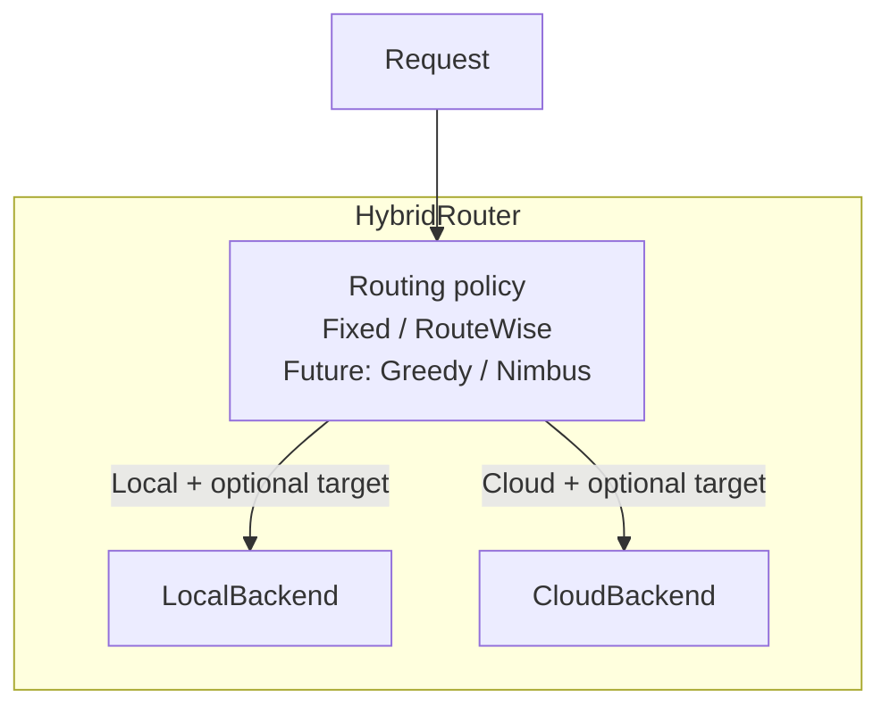

# Hybrid Routing 抽象重构设计

- 日期：2026-09-12
- 修订：2026-09-14，按用户确认，将 Fixed 与 RouteWise 放在同一 routing policy 层
- 状态：设计已确认；Fixed 组合已接入代码；现有 RouteWise 调用路径与行为保留
- 实现参照：PR #1454，`murphy/dev/hybrid-routing-abstract@3ed570362`
- 实施计划：[Hybrid Routing 抽象重构实施计划](../plans/2026-09-13-hybrid-routing-implementation.zh.md)

本文描述目标职责、当前实现与本次验收边界。代码已接线不代表已部署上线；本文不替代对应提交的测试与部署记录。

## 1. 已确认的设计与本次范围

**Fixed 和 RouteWise 都属于全局 routing policy；LocalBackend 和 CloudBackend 属于执行域。**

1. HybridRouter 是通用组合对象，调度发生在它内部，policy 是其可替换组件。
2. Fixed、RouteWise，以及未来的 Greedy / Nimbus 是同层策略。策略可在 local、cloud、具体 provider 或 endpoint 之间做选择。
3. RouteWise 的候选可以同时包含本地与云端资源。本地 GPU 部署可以按 concurrency 类型建模。
4. 本次重构必须保留现有 `router: routewise` 的选路、容量准入和请求处理行为；保留它的现有入口符合本次要求。
5. 本次整理接口、组合关系与既有执行能力，不新增本地资源管理、队列、预测器或 Greedy / Nimbus 算法。

**“将 RouteWise 迁入 CloudBackend，并在前面加 Fixed 分域”不再是本设计的目标，也不是 PR #1454 的待完成项。** 这会把原来的全池选择改成两阶段选择，不能作为保持行为的抽象重构自动发生。

## 2. 目标架构



上图是职责划分，policy 不是 HybridRouter 之外的另一层串行服务。每次请求由选定的一种策略决策，再交给执行域处理。

| 组件 | 目标职责 | 边界 |
|---|---|---|
| HybridRouter | 接收请求、调用策略、按决策与重试计划派发、协调结果与反馈 | 不内置某一种选路算法 |
| FixedPolicy | 按配置权重，在全局候选中选择；保留既有 fallback 顺序 | 可以控制 local / cloud 及具体 provider 的份额 |
| RouteWisePolicy | 在完整候选池中，根据成本、延迟及 quota / concurrency 状态选择 | 能选择 local 或 cloud，不限定为云端策略 |
| GreedyPolicy / NimbusPolicy | 后续实现的可替换调度策略 | 不属于本次开发范围 |
| LocalBackend | 执行属于本地域的请求 | 复用现有 adapter 与调用逻辑，不新建资源调度系统 |
| CloudBackend | 执行属于云端域的请求 | 是执行角色，不以 RouteWise 算法定义自身 |
| RoutingBackend | 两侧共用的调用、身份、范围与反馈归属契约 | 保留领域角色，不绑定某一个 policy |

`RoutingPolicy` 是本文的职责名称；当前组合接口仍名为 `BackendSelection`。`FixedPolicy` 已有实现；`RouteWisePolicy` 表示目标职责，**目前没有独立提取成这个名字的类**。现有 `RouteWiseRouter` 同时承担决策、状态管理与执行，本次不为了图中的命名强拆它。

## 3. local / cloud 与资源类型是两个维度

local / cloud 描述执行域；`on_demand` / `quota` / `concurrency` 描述 RouteWise 如何对候选建模。两者不能互相替代。

RouteWise 论文 Discussion 的 “Generalization to Local GPU Deployments” 将拥有 k 个副本的 GPU 集群映射为 concurrency-limited provider，并说明路由算法可保持不变、仅容量 profiling 不同。因此 RouteWise 本身的适用范围包含本地部署。

| 维度 | 示例 | 影响 |
|---|---|---|
| 执行归属 | local、cloud | 请求由哪个 backend 执行 |
| 资源模型 | on_demand、quota、concurrency | 候选的有效成本、容量与准入规则 |

例如，一个本地 endpoint 可以声明：

```yaml
provider_type: concurrency
concurrency_pool: local-model-pool
concurrency:
  limit: 4
```

在现有 RouteWise 实现中，该池有可用槽位时才进入可行候选，实际派发需要取得槽位，完成或取消时释放。这里的 `limit` 是配置的请求并发容量，不能只凭 GPU 数量或 endpoint 地址自动推断。

当前代码根据显式 `provider_type` 读取资源模型，省略时默认为 `on_demand`；本地地址不会自动变成 concurrency。云端订阅服务也可以是 concurrency 类型。参见 [候选解析](../../../apps/backend/routing/routewise/candidates.py)、[并发槽管理](../../../apps/backend/routing/routewise/concurrency.py) 与 [配置示例](../../../config/examples/models.routewise.yaml)。

**兼容性要求：原来参与 RouteWise 的 local 候选继续参与；原来的 concurrency 配置、槽位共享与释放规则继续生效。** 不能因为引入 LocalBackend 就把它从 RouteWise 候选中移除，或改走没有对应准入行为的执行路径。

## 4. 复用现有实现与 RouteWise library

当前 RouteWise 采用 **`llm-routewise` 算法核心 + hybridInference 运行集成**。本次不另写一套 RouteWise 算法。

| 能力 | 当前实现 | 本次处理 |
|---|---|---|
| 普通请求、流式、反馈与状态契约 | [RouterProtocol](../../../apps/backend/routing/protocols.py) | 复用已有参数与调用方式 |
| endpoint 调用与 provider 协议适配 | [BaseAdapter](../../../apps/backend/serving/adapters/base.py) 及各 adapter | 保留实现 |
| 全局固定选择、健康、亲和、prefill 与执行 | [FixedRouter](../../../apps/backend/routing/routers.py) | FixedPolicy 复用其选择逻辑，backend 复用其执行能力与共享状态 |
| 成本预算下的 LP 求解 | [lp.py](../../../apps/backend/routing/routewise/lp.py) 调用 `llm_routewise.core.solve_budget_lp` | 保留库调用与数据适配 |
| quota 有效成本、hedging 概率及备选选择 | [effective_cost.py](../../../apps/backend/routing/routewise/effective_cost.py)、[RouteWiseRouter](../../../apps/backend/routing/routewise/router.py) 调用 `llm_routewise.core` | 保留库调用 |
| RouteWise 候选、容量状态、执行、流式与反馈 | [routing/routewise](../../../apps/backend/routing/routewise/) | 保留既有生产集成 |
| 候选表、模型范围与域投影 | [RouteTableView](../../../apps/backend/routing/route_table.py)、[RouteScopeView](../../../apps/backend/routing/route_scope.py) | 域范围约束执行，不把全局策略的候选自动缩成单一域 |

[pyproject.toml](../../../pyproject.toml) 声明 `llm-routewise>=0.2.0`，参照提交的 [uv.lock](../../../uv.lock) 锁定为 `0.2.0`。本次文档修订不升级该依赖。

FixedRouter 当前也包含决策与执行两类职责。它被 LocalBackend / FixedCloudBackend 复用，不意味着 Fixed 策略属于 LocalBackend；同理，存在 RouteWiseCloudBackend 不意味着 RouteWise 策略只能属于 cloud。

## 5. 决策、目标与重试契约

### 5.1 结构化决策

现有 [decisions.py](../../../apps/backend/routing/decisions.py) 提供以下结构：

```python
@dataclass(frozen=True, slots=True)
class RoutingTarget:
    provider: str | None = None
    endpoint_id: str | None = None

@dataclass(frozen=True, slots=True)
class RoutingDecision:
    backend: str
    target: RoutingTarget | None = None
```

provider 标签与 canonical endpoint id 必须区分。policy 可以给出具体目标，也可以只指定执行域：

- 指定目标时，backend 按对应目标语义派发，实际执行的 endpoint 必须可追踪。
- `target=None` 时，backend 可以使用已有的域内选择与 fallback 能力。这是一般组合能力，不规定 RouteWise 必须在 backend 内部执行。
- 全局 RouteWise 的目标职责是对完整候选池决策，不能把它替换成“先 Fixed 分域，再在 cloud 内运行 RouteWise”。

### 5.2 首选、严格候选与调用方 pin

| 控制 | 语义 | 不可用或失败时 |
|---|---|---|
| 自动首选目标 | `preferred_endpoint_id` 是首选，不等于管理员强制 pin | 按既有自动路由规则处理；若实际目标改变，必须更新派发记录并避免重复尝试 |
| 计划中的严格候选 | `require_target=True`，本次 attempt 只能使用指定 endpoint | 不得被亲和或重新抽样替换；不可派发时交回计划继续处理 |
| 调用方强制 pin | `pin_provider` 沿用原 HTTP 权限、校验与派发语义 | 不自动切到其他目标 |

严格候选仍受健康与半开探测 claim 约束，不能借用 pin 来绕过准入。未取得派发资格与上游实际执行失败须分开记录；前者不能制造该 endpoint 的上游故障样本。

### 5.3 两种计划形态

| 形态 | 当前来源 | 执行约束 |
|---|---|---|
| 逐 endpoint 计划 | `FixedPolicy.fallback_attempts()` | HybridRouter 按全局 route 顺序派发，禁用被包装 router 的内部 fallback 循环；后续指定候选必须严格执行 |
| 只分域计划 | `BackendSelection.fallback_backends()` | 保留 backend 的候选选择与域内 fallback；没有 target 的条目不能被丢弃 |

Fixed 路径必须满足：

1. 全局首选继续使用原权重、模态、健康、亲和与请求 prefill 估算，不复制第二套抽样算法。
2. 路线 `L1 → cloud → L2` 在 L1 执行失败后按原顺序尝试 cloud，不改成先耗尽本地域。
3. 同一次自动 fallback 计划中，一个 endpoint 最多实际派发一次。首选被替换后，去重以实际 endpoint 为准。
4. 严格目标的优先级高于会话亲和；探测 claim 被拒后不能在域内偷偷换成计划尚未到达的 endpoint。
5. 最终错误复用原 `select_surfaced_error()` 规则。失败历史保留所有实际尝试及其 provider / endpoint 归属。

这些是 Fixed 路径的兼容性约束。现有 RouteWise 的容量预留、重试和 hedging 继续由自身实现管理，本次不把 Fixed 的候选循环套到 RouteWise 上。

## 6. 执行、反馈与状态所有权

### 6.1 执行域与范围

LocalBackend / CloudBackend 使用同一请求契约，复用现有 adapter 和执行路径。域范围可以用 endpoint 集合或 provider 标签声明；标签必须解析成实际 endpoint，执行范围与反馈归属使用同一来源。

Fixed 组合中的两侧当前包装**同一个共享 FixedRouter**，由 `endpoint_scope` 限定派发范围，不复制路由表、健康状态或 prefill 状态。`CloudBackend` 的 `owns_observation` 抽象契约继续保留，避免不完整实现到反馈阶段才失败。

本地归属由部署决定。当前 factory 支持显式 `local_scope` / `local_ownership`，生产 bootstrap 默认使用 hostname 判定；LAN 或集群 DNS 上的自建服务可能被归入 cloud，`_LOCAL_HOSTS` 的 IPv6 条目也存在差异。资源模型 `provider_type` 与这项域判定独立，文档不宣称默认值能覆盖所有部署。

### 6.2 流式与错误

保持原有请求参数、错误、输出顺序和关闭语义。内部 `_routing` 元数据不构成客户端可见输出；上游在可见输出前失败时可按既有规则 fallback。产生客户端可见输出后不得重启另一条回答并拼接到同一 SSE 流。取消或关闭迭代器时继续清理下游和已经取得的资源。

`failed_attempts` 保留 `provider`、`endpoint_id`、`error_type`、`error` 等既有字段；组合可以补充 `backend` 归属。内部 `_routing` 继续由输出清理逻辑移除。

### 6.3 反馈与生命周期

- 反馈以实际执行的 attempt / endpoint 归属为准，一个 request_id 可能有多个尝试，不能把所有样本算给最初选中的 backend。
- 非终结反馈不能提前消费整条请求的归属记录；记录缺失时只接受唯一 owner，不能广播给不相关的 backend。
- 现有 RouteWise 的 quota、concurrency、学习状态与反馈仍由原 RouteWiseRouter 管理，不因命名变化搬到 LocalBackend 或 CloudBackend，也不重复记账。
- 对共享底层对象的状态更新与生命周期操作须避免重复。包装层默认不取得外部对象的生命周期所有权；显式托管时也只关闭自己启动的实例。
- 动态刷新同步更新候选范围与归属索引，保留在途请求的反馈和容量预留；不能通过重新 attach 清空 pending 状态。

将来若独立提取 RouteWisePolicy，须同时明确决策状态、预留与释放、反馈和后台任务的所有者，并保持上述行为。仅把 RouteWiseRouter 改名为 policy 不能完成这种职责分离。

## 7. 当前调用路径与类的定位

以下描述参照提交的实际接线，不把目标图中的类名当作已经实现的独立类型。

| 配置或请求 | 当前入口 | 本次要求 |
|---|---|---|
| `router: fixed`，同时存在本地与云端候选 | registry → HybridRouter，内部 FixedPolicy；两侧为 LocalBackend / FixedCloudBackend，共享 FixedRouter | 保留原全局选路与请求行为 |
| `router: fixed`，只有一个执行域 | registry → 共享 FixedRouter | 保持已有处理，无需空 backend 组合 |
| `router: routewise` | registry → 原 RouteWiseRouter，对该模型完整候选池选择 | **保留现有入口与行为，是本次有效实现，不列为迁移缺口** |
| 通过现有权限和校验的 HTTP pin 请求 | 共享 FixedRouter | 保留兼容通路，不要求第三个 backend |

入口见 [ModelRouterRegistry](../../../apps/backend/routing/model_router_registry.py)、[bootstrap](../../../apps/backend/serving/servers/bootstrap.py)、[hybrid_composition.py](../../../apps/backend/serving/servers/hybrid_composition.py) 与 [completions.py](../../../apps/backend/serving/servers/routers/completions.py)。

`router: fixed` 和 `router: routewise` 仍是同层的模型策略选择。当前二者的内部组合形态不同；这不要求通过改变 RouteWise 行为来强行统一调用图。

### 7.1 RouteWiseCloudBackend 的保留边界

代码中已有 RouteWiseCloudBackend，可对显式给定的 cloud 范围包装 RouteWiseRouter；相关测试验证这种封装的局部契约。它是可选的范围封装，**不再承担“RouteWise 的标准归属”这一架构含义**。

本次不因更新设计文档直接删除公开类或改写调用方，也不把它接到现有 `router: routewise` 入口。将来若专门启用这种受限组合，需要单独定义候选变化、嵌套对象生命周期与 operational store 接入；不能用它冒充原全池 RouteWise 的等价替换，也不把这些工作列为本 PR 的完成前置条件。

## 8. 完成条件与验证方式

| 验收项 | 要验证的行为 |
|---|---|
| 架构与命名 | Fixed / RouteWise 属于同层 policy；local / cloud 属于执行域；设计、实施计划与 AGENTS.md 一致 |
| Fixed 兼容性 | 权重、模态、prefill、健康 claim、亲和、严格目标、候选顺序、最终错误与完整失败历史保持原行为 |
| 计划兼容性 | 逐候选计划不重复派发；只分域策略仍可进行域内及跨域 fallback |
| RouteWise 兼容性 | 原配置、完整候选池（含配置为 concurrency 的 local）、容量预留与释放、反馈、hedging、探测与存储生命周期不变 |
| 请求契约 | 普通与流式请求、pin、别名、取消、元数据、动态刷新及在途状态保持正确 |
| 运行接线 | Fixed 从真实 registry / bootstrap 入口构建；RouteWise 保留既有入口；不以单独构造包装类的测试宣称全路径接入 |

现有回归覆盖位于 [test_hybrid_composition.py](../../../tests/unit/routing/test_hybrid_composition.py)、[test_hybrid_router.py](../../../tests/unit/routing/test_hybrid_router.py)、[test_routing_backends.py](../../../tests/unit/routing/test_routing_backends.py)、[test_routewise_router.py](../../../tests/unit/routing/test_routewise_router.py) 与 [bootstrap 接线测试](../../../tests/unit/servers/test_hybrid_bootstrap_wiring.py)。后续实现按实际改动补充有意义的行为用例。

文档修改运行 `uv run --frozen python ops/ci/check_docs_links.py` 与 `git diff --check`。涉及执行行为时运行相关 routing / serving 测试及仓库要求的检查；测试结论应注明提交版本。完成代码验证与部署验证分别记录。

## 9. 本次不要求的后续工作

- 不要求新增 Greedy / Nimbus、GPU 资源预算、队列或预测能力。
- 不要求把原 RouteWise 迁入 cloud，也不要求新增“Fixed 分域 + RouteWise 云内选择”的生产配置。
- 不要求立即提取独立 RouteWisePolicy 类；未来统一内部接口时，以行为等价为前提继续复用现有 library 与运行集成。
- 不以删除 RouteWiseCloudBackend 或改名 FixedRouter 作为验收条件。

当前交付应聚焦：**清楚的策略 / 执行边界、可复用的组合接口，以及现有 Fixed 和 RouteWise 的行为兼容。**
