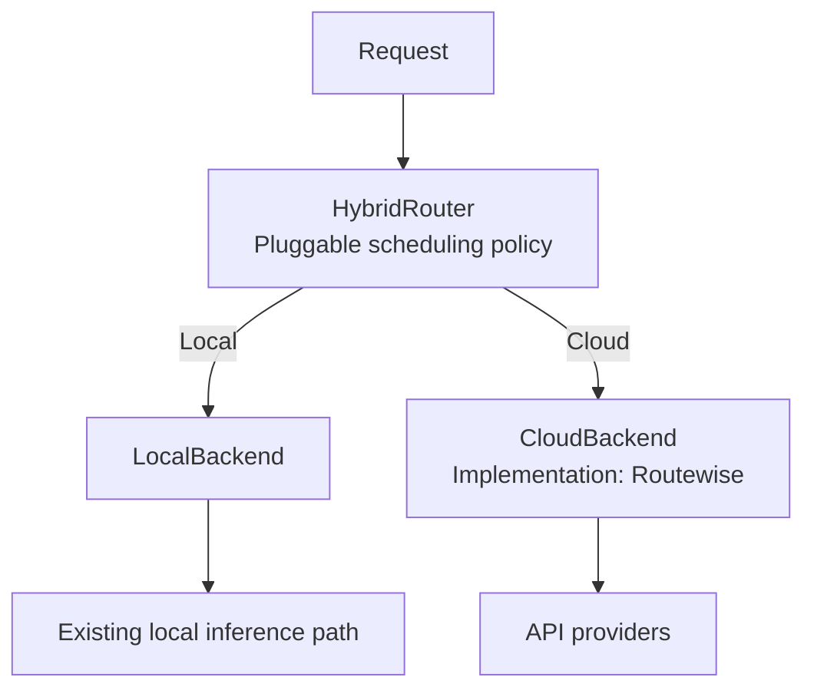

# Hybrid Routing 抽象重构设计

- 日期：2026-09-12
- 修订：2026-09-14，按用户确认收缩为抽象重构；同日补充实现落点与验证结果
- 状态：抽象与封装已实现并验证；生产接入仍未启用
- 代码基线：HybridInference `dev@46fdb06a2efab27e8317818979772ac2f43f5fd6`
- 开发分支：`murphy/dev/hybrid-routing-abstract`（worktree：`.worktrees/hybrid-routing-abstract`）

## 1. 本次目标

把混合调度、local 调用和 cloud 调用之间的接口整理清楚，让后续策略可以组合现有执行能力。

本次交付是 **HybridRouter 抽象与 backend 封装**。

已经确定的关系如下：



HybridRouter 是通用抽象，混合调度发生在它内部。Greedy/Nimbus 是未来可以接入的策略；本次只用测试策略验证这个替换点。LocalBackend 只保留名称和调用职责，不因增加这个抽象而承担新的资源管理系统。

## 2. 当前代码已经提供的能力

| 现有能力 | 代码 | 本次处理 |
|---|---|---|
| 普通、流式、反馈与状态接口 | [RouterProtocol](../../../apps/backend/routing/protocols.py) | 原样复用，未新增请求格式 |
| endpoint 调用，包括本地 OpenAI-compatible 引擎 | [BaseAdapter](../../../apps/backend/serving/adapters/base.py) | 保留现有实现 |
| 固定选择与 fallback | [FixedRouter](../../../apps/backend/routing/routers.py) | 作为 LocalBackend 背后的现有执行路径 |
| 云端候选选择与执行 | [RouteWiseRouter](../../../apps/backend/routing/routewise/router.py) | 由 RouteWiseCloudBackend 薄封装委托 |
| 候选表与模型范围 | [RouteTableView](../../../apps/backend/routing/route_table.py) | 通过 RouteScopeView 明确传入每个 backend 的候选范围 |
| 当前模型路由入口 | [ModelRouterRegistry](../../../apps/backend/routing/model_router_registry.py) | 保持 fixed/routewise 既有行为不变 |

现有代码统一了调用接口，但没有把“混合决策”与“可替换的云端实现”明确组合为上述关系。本次补的是这个组合边界。

## 3. 组件职责与实现落点

| 组件 | 职责 | 实现方式 |
|---|---|---|
| [HybridRouter](../../../apps/backend/routing/hybrid.py) | 对外接收请求，内部策略选择 backend，再委托调用 | 通用组合对象；策略经构造参数注入 |
| [LocalBackend](../../../apps/backend/routing/backends.py) | 暴露现有 local 调用能力 | 包装调用方已配置好范围的 `RouterProtocol`（通常是 `FixedRouter`） |
| [RoutingBackend](../../../apps/backend/routing/backends.py) | 两侧共用的调用接口 | 结构协议，仅 `RouterProtocol` 加 `name`、`owns_observation` 与域声明，不依赖任何厂商或 RouteWise 细节 |
| [CloudBackend](../../../apps/backend/routing/backends.py) | cloud 调用能力抽象 | `HybridRouter` 面向的云端角色；抽象基类，`owns_observation` 为抽象方法，换云端算法时替换的实现点 |
| [RouteWiseCloudBackend](../../../apps/backend/routing/backends.py) | 使用 Routewise 完成 cloud 调用 | `CloudBackend` 的具体实现，委托已有 `RouteWiseRouter`，复用其算法与执行 |
| [RouteScopeView](../../../apps/backend/routing/route_scope.py) | 明确传入每个 backend 的候选范围 | 只读 `RouteTableView` 投影；按模型与 endpoint 过滤 |

组合方式：

```python
router = HybridRouter(
    policy=policy,
    local=local_backend,
    cloud=cloud_backend,
)
```

类的层次是设计里那条关系图的直接映射，`HybridRouter` 只依赖抽象角色，组装时才注入具体实现：

```text
RoutingBackend                  两侧共用的调用接口（结构协议）
├── LocalBackend                本地执行域
└── CloudBackend                云端执行域抽象（HybridRouter 面向它）
    └── RouteWiseCloudBackend   Routewise 的具体实现
```

调度策略在 `routing/hybrid.py` 中定义为 `BackendSelection` 协议，属于 HybridRouter 内部替换点，不增加串行的路由服务。测试使用 `_ForceBackend` 这类强制选择 local 或 cloud 的策略；它不代表已经实现 Greedy。

LocalBackend 和 CloudBackend 使用同一调用契约，复用 `RouterProtocol` 中的 `model_id`、`messages`、`RoutingRequestOptions` 与生成参数。本次没有复制一套只有类名不同的接口，也没有引入新的请求格式。

## 3.5 架构边界修订（2026-09-14 第二轮）

上一节的职责划分把 FixedRouter 留在了 LocalBackend 内部，这是错的。现有
`FixedRouter` 的权重覆盖整个候选集合：它在 local、cloud 以及各 provider/endpoint
之间分流。**这个全局决策职责属于 HybridRouter 这一层**，不属于 LocalBackend。
LocalBackend 只承接本地调用。

### 3.5.1 FixedRouter 现有职责的归属

| 现有职责 | 迁移后归属 | 处理方式 |
|---|---|---|
| 权重解析（`raw_adapters` / `weight_override_resolver` / `disabled_provider_resolver`） | 留在 `FixedRouter` | 不变 |
| 候选资格、模态过滤、健康准入、亲和、prefill 负载选择 | 留在 `FixedRouter` | 不变 |
| 全局首选目标（哪个域、哪个 provider/endpoint） | 上移到策略层 | 新增 `FixedPolicy`，调用 `FixedRouter.select_adapter()` |
| dispatch claim（半开探测、并发占位） | 留在 `FixedRouter` | 由 `_select_and_claim_adapter` 在真正派发时取得 |
| 执行、fallback 循环、流式、取消清理、健康记录、`_routing` 元数据 | 留在 `FixedRouter` | 不变，不复制 |

关键点：**选路算法只实现一次**。`FixedRouter` 暴露一个无副作用的
`select_adapter()`（现有 `_select_adapter` 的公开入口），策略层用它做全局首选，
执行侧在真正派发时再走一次同样算法的限定范围选择并 claim。不存在第二套加权抽样
实现，也不存在"策略选中后后端再独立抽一次把它改掉"的情况——后端的候选范围由策略
选中的目标收敛。

### 3.5.2 结构化调度结果

`BackendSelection` 的返回值从 backend 名字改成结构化结果：

```python
@dataclass(frozen=True, slots=True)
class RoutingTarget:
    """首选目标：provider 标签与 canonical endpoint id 明确区分。"""
    provider: str | None = None      # 对应 provider 标签，例如 "zai"
    endpoint_id: str | None = None   # 对应 canonical endpoint id，例如 "m:zai-api"

@dataclass(frozen=True, slots=True)
class RoutingDecision:
    backend: str                      # 选中哪个 backend
    target: RoutingTarget | None = None   # None 表示由该 backend 内部算法选择
```

必须支持两种场景：

- **A. 只指定 cloud**：`target is None`，由 `CloudBackend` 内部算法（RouteWise）选择 provider。
- **B. 指定 cloud + provider/endpoint**：backend 必须遵守该目标，不能重新做一次不受约束的选择。

只有 `target=None` 时才允许后端自行选择；一旦给定目标，目标在范围内就必须被遵守，
不在范围内则由该后端按既有规则选择并记录（不静默接受越界目标）。

### 3.5.3 首选目标与强制 pin 的区别

| | 自动路由首选目标（本层） | 调用方强制 pin（既有） |
|---|---|---|
| 来源 | `FixedPolicy` 的全局权重 | `RoutingRequestOptions.pin_provider` |
| 失败后 | 按既有规则 fallback（同域或跨域） | 不 fallback，直接抛错 |
| 找不到目标 | 退化为该 backend 的常规选择 | `ProviderPinError` / `ValueError` |
| 元数据 | 记录首选与实际服务端点 | 现状不变 |

这两个语义不能混用：`FixedRouter` 的 `pin_provider` 会关闭自动 fallback，而
`RouteWiseRouter` 明确拒绝带 `pin_provider` 的请求（要求它们走 shared FixedRouter）。
因此不能把内部选定目标塞进现有 `pin_provider` 就声称行为兼容。

### 3.5.4 现有 fixed / routewise 配置迁移后的真实调用链

| 配置 | 迁移前 | 迁移后（已实现） | 目标架构 |
|---|---|---|---|
| `router: fixed` | `ModelRouterRegistry.get_router()` → 共享 `FixedRouter` | → `HybridRouter(policy=FixedPolicy, local=LocalBackend(共享 FixedRouter), cloud=FixedCloudBackend(共享 FixedRouter))`；策略给出全局候选顺序，hybrid 层逐个候选派发，两侧的 `endpoint_scope` 仅用于限定候选归属 | cloud 侧换成 `RouteWiseCloudBackend` 时即成为"全局分流 + 域内 RouteWise 选 provider"；组合根通过 `HybridFixedRouterFactory(cloud_backend=...)` 选择算法 |
| `router: routewise` | → `RouteWiseRouter`（**全池**候选） | **未迁移**：仍是全池 `RouteWiseRouter`，完全绕过 `HybridRouter` | 迁入 `HybridRouter` + `RouteWiseCloudBackend`；需显式配置，前置条件见 §3.5.4.3 |

已实现与目标之间的差异是有意的，不是漏做：

- `fixed` 模型的 cloud 算法是 operator 配置的权重（`FixedCloudBackend`），因为那正是
  `router: fixed` 的语义。`RouteWiseCloudBackend` 是同一 `CloudBackend` role 的另一个
  实现，通过 `HybridFixedRouterFactory(cloud_backend=...)` 注入，已有组合级测试覆盖
  （`test_routewise_can_serve_as_the_cloud_domain_inside_the_composition`）。
- `router: routewise` 是**迁移前的旧路径**，不是"HybridRouter 层的策略"。在它迁入
  cloud 域之前，不能把它算作新架构的一部分。

### 3.5.4.1 候选计划：两种形态，不能混同

`HybridRouter` 自己驱动整条候选序列，因此它必须知道策略给出的是哪一种计划：

| 形态 | 来源 | 每次 attempt 的语义 |
|---|---|---|
| 逐 endpoint 计划 | `FixedPolicy.fallback_attempts()` | 计划已指定该 attempt 打哪个 endpoint。因此同时设置 `allow_fallback=False`（被包装的 router 不许自行走 fallback 循环）与 `require_target=True`（不许在选择阶段替换成别的候选）。目标不可派发时抛 `TargetUnavailableError`，由 hybrid 层**跳过该候选并继续计划**——与旧 `FixedRouter` 在 `begin_dispatch` 被拒时 `continue` 同一语义，且不记录成上游故障 |
| 只分域计划 | `BackendSelection.fallback_backends()` | 策略只表达"先 local，失败后 cloud"，没有候选信息。此时保留 backend 自行选择候选的能力，也保留其域内 fallback（`allow_fallback=True`），目标留空而不是被当作不可达候选丢弃 |

判定由 `_requested_fallbacks()` 返回，两种形态不得相互推断：把只分域计划当成"候选不可达"会让另一域永远不被执行；把逐 endpoint 计划交给 backend 自行重选会打乱全局顺序、并让已经在计划中越过的候选被打第二次。

### 3.5.4.2 强制 pin 的归属（已决定，不需要第三个 backend）

生产 HTTP 入口对带 pin 的请求**根本不进 registry**：

```python
# apps/backend/serving/servers/routers/completions.py
active_router = router_exec
if model_router_registry is not None and pin_provider is None:
    active_router = model_router_registry.get_router(model)
```

即 pin 请求走共享 `FixedRouter`，由它的 pin 分支保证"不 fallback、找不到就 `ProviderPinError`"；`RouteWiseRouter` 拒绝 pin 的那条例外路径因此不会被触发。**保留这条兼容通路**，不引入第三个 backend。

将来若把 pin 也统一进 `HybridRouter`，届时按目标归属派发：云端 pin 属于 `CloudBackend`，需要 `RouteWiseRouter` 接受 pin（当前它直接 `raise ValueError`），并明确 pin 是唯一不受 `endpoint_scope` 约束的越域豁免。

### 3.5.4.3 `router: routewise` 的迁移（需要显式配置，且不得宣称等价）

顶层策略先用 `FixedPolicy` 的分域就够，不必等 Greedy/Nimbus：按配置比例决定 local/cloud；选中 cloud 且没有指定具体目标时，由 `RouteWiseCloudBackend` 内部的 RouteWise 选择云 provider。原有"全局固定 provider 权重"模式继续保留。

把现有 `router: routewise` 迁进这个组合必须是**显式配置**，并且不能宣称与原来的全池选择等价——全池 RouteWise 的候选范围、quota/concurrency 记账与生命周期都不同。迁移还需同步处理：

1. `_collect_routewise_routers` 依赖 `isinstance(router, RouteWiseRouter)`；嵌套进 `RouteWiseCloudBackend` 后取不到，`start()`/`stop()` 与 `attach_operational_store()` 不会发生。
2. RouteWise 的 envelope 校准需要 operational store 已挂载，否则 `start()` 会因未校准而 hard-fail，因此嵌套 RouteWise 的生命周期必须由组合根接管。

### 3.5.5 反馈归属：一个 request 可能对应多个 backend

若保留跨 backend fallback，一个 request 的不同 attempt 可能由不同 backend 执行。
反馈必须归属**实际执行该 attempt 的 backend**。因此：

- 派发记录从"request_id → 单个 backend"改为按 attempt 的 endpoint 判定；
- 不能继续假设一个 `request_id` 永远只对应一个 backend；
- 不能广播，否则污染未服务该 attempt 的学习状态。

## 4. 薄封装的边界

**LocalBackend** 把请求交给已有本地执行路径，保留普通响应、流式响应和既有错误语义。本次没有加入队列、资源预留、token 统计、TTFT 预测或 GPU 取消确认机制。本地候选集由构造方通过“把哪些 adapter 注册进被包装的 router”来表达。

**RouteWiseCloudBackend** 包装已有 `RouteWiseRouter`。选择、fallback、quota/concurrency 与流式处理继续使用它已有的实现；本类只贡献候选范围与委托。

cloud 候选范围通过 `endpoint_scope` 显式传入（endpoint id 和/或 provider 标签），可另加 `model_scope`。该类在构造时把 `RouteScopeView` 绑定到被包装的 router，因此 primary、fallback 以及 router 自己的后台探测都只看到 cloud 范围内的 endpoint。没有从 localhost、URL 或 provider 名字推断归属。空范围直接抛 `ValueError`，禁止退化为“整张表”。

封装保留请求参数、实际 provider/endpoint、响应元数据和已有反馈语义：

- **fallback 由 HybridRouter 承担，且是单一全局循环**：计划来自 `FixedPolicy.fallback_attempts`（route 顺序、逐候选、含 endpoint），每个 attempt 以 `allow_fallback=False` 派发，因此被包装的 router 只打这一个候选。某个 backend 内部的 hedging 等算法仍留在该 backend 内。
- **已输出即提交**：流式路径每个 attempt 只缓冲**首帧**，用来判断该 attempt 是否已经产生客户端可见输出。一旦有输出，该 attempt 即被提交——后续异常直接向上抛出，不再切到另一个 backend。这与旧 `FixedRouter` 的 `chunks_yielded` 守卫一致；没有它就会把两个 backend 的回答拼进同一条 SSE 流并吞掉原始错误。未产生任何输出的 attempt 视为失败，可以继续 fallback。
- 关闭语义：`LocalBackend` 返回下游自己的迭代器；`HybridRouter` 是转发迭代器，退出时在 `finally` 里 `aclose()` 下游迭代器。
- 反馈只投递给一个 owner，按以下顺序判定：
  1. 该 `request_id` 在派发时由策略选中的 backend；
  2. 唯一认领该 endpoint 的 backend（`owns_observation`）；
  3. 无人认领或有多个认领者时**丢弃**，不再广播——把样本同时记给两个 backend 会污染未服务该请求一方的在线状态，比丢一个样本更糟。
- 派发记录只在**终结**观测到达时消费。一个请求会产生多条观测：`CompletionsLogger` 先为每个失败尝试发送 `terminal=False` 的样本，再发送 `terminal=True` 的最终结果。若第一条就吃掉记录，最终结果在"两个 backend 都认领该 endpoint"时就无法归属。
- local 侧也提供显式的 `endpoint_scope` / `model_scope`（可与 cloud 范围互补），使常见情况下恰好只有一个 owner，而无需依赖派发记录。`endpoint_scope` 的条目可以是 canonical endpoint id 或 provider 标签；provider 标签会通过 backend 自身路由表解析成实际 endpoint 集合，使**执行范围与反馈归属一致**（否则观察到的是 endpoint id，永远匹配不上 provider 标签）。未声明范围的 `LocalBackend` 会认领所有 endpoint，只适用于单域组合。
- 对象创建、初始化和关闭仍由构造方负责。生命周期是显式 opt-in（`manage_lifecycle`，默认 False）；即使开启，backend 也只停止**自己启动过**的实例：`start()` 返回布尔值表示"本次调用是否真正拉起后台任务"，底层 router 已在运行（例如构造方先启动）时返回 False，包装层不会因此取得所有权。
- `refresh_route_table()` 沿用被包装 router 自身的刷新语义：只丢弃范围视图的投影缓存，不重新绑定视图，因此不会走到 `attach_route_table` 的 attach 路径去清空 `pending_prefix_cache`（那会丢掉所有在途请求的 prefix-cache 反馈）。

新增的委托都有明确所有者，没有因为多包一层丢失现有生命周期操作。

### 3.5.6 实现状态（2026-09-14 第三轮，接入已完成）

已完成（`8ab0f33b`，verified）：

- `RoutingDecision` / `RoutingTarget` 结构化调度结果，provider 与 endpoint_id 明确区分；
- `FixedRouter.select_adapter()` 公开无副作用入口，加权抽样提取为单一实现；
  `preferred_endpoint_id`（首选目标，失败仍可 fallback）与 `endpoint_scope`
  （候选范围，作用于 modality/健康/亲和/fallback 之前）；
- `FixedPolicy`：fixed 的全局首选，复用同一 `FixedRouter` 选路，不重写算法；
- `HybridRouter`：解析决策、跨 backend fallback、目标元数据、按 attempt 归属反馈；
- backend 侧 `dispatch_scope()` / `serves()`，使被委托 attempt 的 fallback 候选
  不越出自身域。

接入状态：已接线并在生产 bootstrap 路径上生效（`router: fixed` + 至少一个本地端点）。
以下各项均已实现；§3.5.4.3 与 §5 列出尚未迁移的部分。

1. **registry / bootstrap 组装**：`ModelRouterRegistry` 增加可选
   `HybridRouterFactory`（`set_hybrid_router_factory()` 在首次 `get_router` 前绑定）。
   `router: fixed` 分支在 factory 接受时返回 `HybridRouter`，拒绝时保持原共享
   `FixedRouter`。
2. **域内 fallback 保留、跨域由 hybrid 层掌握**：`endpoint_scope` 现在同时作用于
   选择、`eligible_adapters` 以及 `chat_completion` / `stream_chat_completion` 的
   **两条 fallback 循环**。因此本地域仍会按原有顺序在本地副本间 fallback，但不会越入
   cloud；整域失败后由 `HybridRouter` 按策略的 fallback 计划跨域。
   校验：`test_failed_domain_falls_back_to_the_other_domain`、`test_a_failed_spot_moves_to_the_next_candidate_in_the_route`。

   **跨域 fallback 保留旧的全局候选顺序。** 旧 `FixedRouter` 的 fallback 走**全局
   route 顺序**（`L1, cloud, L2` 在 `L1` 失败后由 cloud 接手）；hybrid 层必须复现
   同一顺序，而不是"先耗尽一个域再切另一个域"（那样会由 `L2` 接手，是不同 endpoint、
   不同成本、不同容量）。因此 `HybridRouter` 自己驱动**整条候选序列**：
   `FixedPolicy.fallback_attempts` 按 route 顺序给出每个候选及其 endpoint，每次派发
   只打一个候选（`RoutingRequestOptions.allow_fallback=False`），域内 router 不再自行
   走 fallback 循环。校验：`test_fallback_follows_the_route_order_across_domains`。
3. **`local_scope` 的来源**：`serving/servers/hybrid_composition.py` 从共享 router
   已注册的 route 计算本地 endpoint 集合；权重不参与（权重为 0 的路由仍是本域容量）。
   本地归属是**部署决策**，按优先级取三者之一：显式 `local_scope` 集合、注入的
   `local_ownership` 解析器、或兼容默认的 `_LOCAL_HOSTS` hostname 判定
   （`serving.adapters.upstream_limiter.is_local_endpoint`）。hostname 默认会漏判：
   LAN 地址（`http://10.0.0.5:8000`）与集群 DNS 名（`http://vllm-1.svc...`）都读作
   远端，`0.0.0.0` 读作本地，且 `servers.registry._LOCAL_HOSTS` 与
   `serving.observability.alerts._LOCAL_HOSTS` 目前不一致（后者含 `::1`）。
   全部为远端时 factory 返回 None，模型留在共享 router 上。

   域划分**不冻结在构造时**：`_LiveDomainScopes` 每次从当前 route 表重新推导，
   两侧 backend 与 policy 共用同一个读取口，`refresh_route_tables()` 之后新增/删除的
   endpoint 会同时改变派发、目标解析与反馈归属。
4. **cloud 侧执行域**：新增 `FixedCloudBackend`（`CloudBackend` 的具体实现），持有
   只含 cloud 候选的 router。这一点是必需的：若把共享 router 交给 cloud backend，
   当首选 cloud 目标失败时它会沿整条路由 fallback 回本地。
5. **兼容性测试**：`tests/unit/routing/test_hybrid_composition.py` 从真实 registry
   入口构建组合，覆盖 local/cloud/provider 分流、跨域 fallback、域内 fallback、
   强制 pin、指定目标不被重抽样、routewise 不被缩窄、反馈按 attempt 归属。

## 5. 接入范围

本次**已接线**：`bootstrap._build_model_router_registry` 在建 registry 的同一次调用里装上 hybrid factory，`router: fixed` 且至少有一个本地端点的模型经 `HybridRouter` 进入；不再需要新的 strategy 名（复用 `fixed`）。两侧 backend 都包装**共享** `FixedRouter`，由 `endpoint_scope` 限定各自域，因此不需要按范围分别注册路由。

本次**没有**迁移 `router: routewise`：生产 registry 里的顶层 RouteWise 仍是全池候选，绕过 `HybridRouter`。按 §3.5.4.3 的决定，迁移必须显式配置、不得宣称与全池选择等价，并同步处理：

1. [bootstrap](../../../apps/backend/serving/servers/bootstrap.py) 的 `_collect_routewise_routers` 直接 `isinstance(router, RouteWiseRouter)` 判定，嵌套在 `RouteWiseCloudBackend` 里的 router 不会被识别，因此其 `start()`/`stop()` 与 `attach_operational_store()` 不会被调用。
2. RouteWise 的 envelope 校准与 quota pool 需要 operational store 已挂载，否则 `start()` 会因未校准而 hard-fail；这决定了嵌套 RouteWise 的生命周期必须由组合根接管。
3. `router: routewise` 模型需要一个新的顶层策略来回答"本地还是云端"；现有 `FixedPolicy` 的语义是"operator 配置的全局权重抽签"，与 RouteWise 模型的既定行为不必然一致。

## 6. 完成条件与验证

| 完成条件 | 验证 |
|---|---|
| 1. 可注入两个 backend 与测试策略；选择任一侧时只执行对应侧 | `tests/unit/routing/test_hybrid_router.py::test_forced_local_policy_executes_only_the_local_backend`、`...forced_cloud...` |
| 2. 普通与流式均可用；参数、路由控制字段、输出顺序与元数据正确 | `test_router_owned_options_never_reach_the_adapter`、`test_streaming_forwards_order_and_attributes_the_backend`、`test_hybrid_streams_through_a_real_local_backend_in_order` |
| 3. 不缓冲完整流、不吞异常与取消，已启动迭代器按现有语义关闭 | `test_streaming_does_not_run_the_backend_before_the_first_read`、`test_closing_the_hybrid_stream_closes_the_downstream_iterator`、`test_stream_exceptions_propagate_unchanged` |
| 3a. 已输出后不再跨域重启（对齐 `FixedRouter` 的 `chunks_yielded`） | `test_hybrid_composition.py::test_stream_failure_after_a_forwarded_chunk_does_not_restart_elsewhere` |
| 3b. 首选目标是自动调度而非强制 pin，必须取半开探测 claim | `test_hybrid_composition.py::test_policy_preference_does_not_bypass_the_half_open_probe` |
| 3c. 域划分随 `refresh_route_tables()` 同步（增删两个方向） | `test_hybrid_composition.py::test_route_refresh_moves_dispatch_off_a_removed_cloud_endpoint`、`test_route_refresh_moves_a_new_local_endpoint_into_the_local_domain` |
| 3d. alias 请求保持 canonical 域划分；云域保留注册权重与后挂的 override resolver | `test_hybrid_composition.py::test_alias_requests_keep_the_canonical_domain_split`、`test_cloud_domain_keeps_the_registered_weight_override_baseline`、`test_weight_override_resolver_attached_after_build_still_applies` |
| 3e. 接入从生产入口验证，且晚于首次 lookup 的安装会被拒绝 | `tests/unit/servers/test_hybrid_bootstrap_wiring.py` |
| 3f. RouteWise 可作为 cloud 域接入组合，且域界仍然成立 | `test_hybrid_composition.py::test_routewise_can_serve_as_the_cloud_domain_inside_the_composition` |
| 3g. 声明的 `cloud_scope` 真正约束策略；provider 标签范围能认领云侧反馈 | `test_hybrid_composition.py::test_a_declared_cloud_scope_gates_the_policy`、`test_provider_label_cloud_scope_still_attributes_cloud_feedback` |
| 4. LocalBackend 复用现有调用路径；RoutewiseCloudBackend 实际委托 RouteWiseRouter | `tests/unit/routing/test_routing_backends.py`；共享契约参数化里的 `local-backend` / `cloud-backend` |
| 5. cloud 候选与 fallback 不越到 local；共享对象与反馈不重复处理 | `test_cloud_backend_never_dispatches_a_local_candidate`、`test_cloud_backend_fallback_stays_inside_the_cloud_range`、`test_cloud_backend_excludes_local_endpoints_from_background_probes`、`test_observation_is_recorded_by_exactly_one_owning_backend`、`test_dispatch_record_attributes_feedback_when_both_backends_claim_the_endpoint`、`test_ambiguous_feedback_without_a_dispatch_record_is_dropped` |
| 6. 既有 router contract、路由表、registry 与 stream 回归通过 | `tests/unit/routing/`、`tests/unit/servers`、`tests/servers/test_admin_routing_*`、`tests/integration/test_routing_yaml_driven_dispatch.py`；全量 `pytest -m "not external and not dbtest"` |

第 5 条另有三项封装正确性契约（2026-09-14 review 后补）：

| 契约 | 验证 |
|---|---|
| 云请求的反馈不进入 local 学习状态 | `tests/unit/routing/test_routing_backends.py::test_local_backend_owns_only_observations_inside_its_declared_scope`、`test_hybrid_router.py::test_dispatch_record_attributes_feedback_when_both_backends_claim_the_endpoint` |
| 非终结反馈不消费派发记录，终结反馈才释放 | `test_hybrid_router.py::test_nonterminal_attempt_feedback_does_not_consume_the_dispatch_record`、`test_terminal_feedback_releases_the_dispatch_record` |
| provider 标签范围能认领它实际服务的 endpoint | `test_routing_backends.py::test_local_backend_resolves_a_provider_scope_to_the_endpoints_it_serves`、`test_route_scope.py::test_observation_scope_resolves_a_provider_label_to_its_endpoints` |
| provider 索引覆盖两种 router 形态，且刷新时整体重建 | `test_routing_backends.py::test_local_backend_refresh_drops_a_removed_endpoint_from_its_scope`、`test_route_scope.py::test_observation_scope_indexes_adapters_seen_after_construction` |
| 不完整的 cloud 实现在构造时被拒绝 | `test_routing_backends.py::test_cloud_backend_role_cannot_be_implemented_without_ownership`、`test_routewise_cloud_backend_is_a_concrete_cloud_role` |
| 不接管外部已启动 router 的生命周期 | `test_routing_backends.py::test_cloud_backend_does_not_stop_a_router_started_by_another_owner`、`test_backend_lifecycle_is_opt_in`、`test_hybrid_router.py::test_backend_that_reports_already_started_is_not_stopped_here`、`test_routewise_router.py::test_start_reports_whether_this_call_activated_the_router` |
| 刷新候选保留在途请求的反馈状态 | `test_routing_backends.py::test_cloud_backend_refresh_preserves_inflight_prefix_cache_state` |

这次重构不承诺新的资源准入能力或 Greedy/Nimbus 调度效果。将来算法需要哪些状态、队列或资源能力，在对应算法接入时单独定义，不预先塞进基础 backend 接口。

## 7. 设计取舍

- **范围而不是分类。** cloud 范围由构造方给出 endpoint/provider 集合，代码里没有“这个 endpoint 是不是本地”的推断；`AGENTS.md` 已说明 endpoint 后缀不可作为归属信号。
- **权重不重归一化。** `RouteScopeView` 保留过滤前的权重（例如 cloud 侧 0.5 在只剩 cloud 的视图里仍是 0.5），因为它是 operator 配置的整池份额，不是过滤后残余的份额。
- **反馈先查派发记录，再退回 owner 判定，绝不广播。** 观测是同步接口，策略只在请求路径上被调用，所以 `HybridRouter` 在派发时按 `request_id` 记下选中的 backend（有界 LRU，终结反馈到达时弹出）。这解决了两个 backend 都认领同一 endpoint 时无法区分的问题；记录缺失时用唯一 owner 判定，仍无法判定就丢弃样本。
- **范围声明与归属判定用同一套语义。** provider 标签在 `ObservationScope` 里通过 backend 自己已绑定的路由表解析为 endpoint 集合，而不是在归属判定时退化成字符串比较；这样"我声明的范围"和"我能认领的 endpoint"不会分叉。索引来源覆盖两种既有形态：`FixedRouter` 自身即路由表（`iter_effective_routes()`），`RouteWiseRouter` 把表放在 `route_table` 上。索引在刷新时按当前快照**整体重建**而不是增量追加：被移除的 endpoint 必须停止被认领，否则它会永久留在归属范围里（当该 endpoint 后来由另一侧服务时归属变歧义、反馈被丢弃），且反复的路由变会更加让这个映射无界增长。
- **抽象角色而不是单一泛化对象。** local 与 cloud 并不对称：local 服务它自己 router 里注册的候选，cloud 是在共享路由表上构造、必须被告知哪些 endpoint 属于它。因此保留 `CloudBackend` 作为云端角色，`HybridRouter` 面向它，具体算法由其子类提供。
- **`owns_observation` 是抽象方法而不是默认实现。** 委托部分由 `RoutingBackendBase` 提供，唯独归属判定无法给一个有意义的默认值：一个说不出自己服务过哪些 endpoint 的 cloud 实现仍然满足请求契约，问题只会在派发记录被淘汰后的反馈路径上暴露，而那里丢一次归属就是静默少一个学习样本。声明为抽象方法后，不完整的实现在**构造时**就报错，而不是在第一次需要归属时。
- **生命周期是显式 opt-in 而不是推断。** `manage_lifecycle` 默认 False，把所有权留给构造方；`start()` 返回布尔值让包装层能区分"我拉起的"与"本来就在跑的"，避免包装层替外部 owner 取消后台任务。
- **`_routing` 增加 `backend` 字段。** 既有 `_routing` 字典上 `setdefault("backend", name)`，用于观测与测试归因；不覆盖 router 已写入的内容，且和其它 `_routing` 键一样被 `sanitize_chunk` 剥离，不会出现在客户端。

## 8. 开发范围

在现有 routing 包中增加了最少的接口、组合对象和封装：

- `apps/backend/routing/route_scope.py`
- `apps/backend/routing/backends.py`
- `apps/backend/routing/hybrid.py`
- `apps/backend/routing/__init__.py` 导出新增符号
- `tests/unit/routing/test_route_scope.py`、`test_routing_backends.py`、`test_hybrid_router.py`
- `tests/unit/routing/test_router_contract.py` 参数化加入两个 backend

没有创建 resources、prediction 或 engine 管理模块。`routing/executor.py` 保持为兼容导出，未改动。
