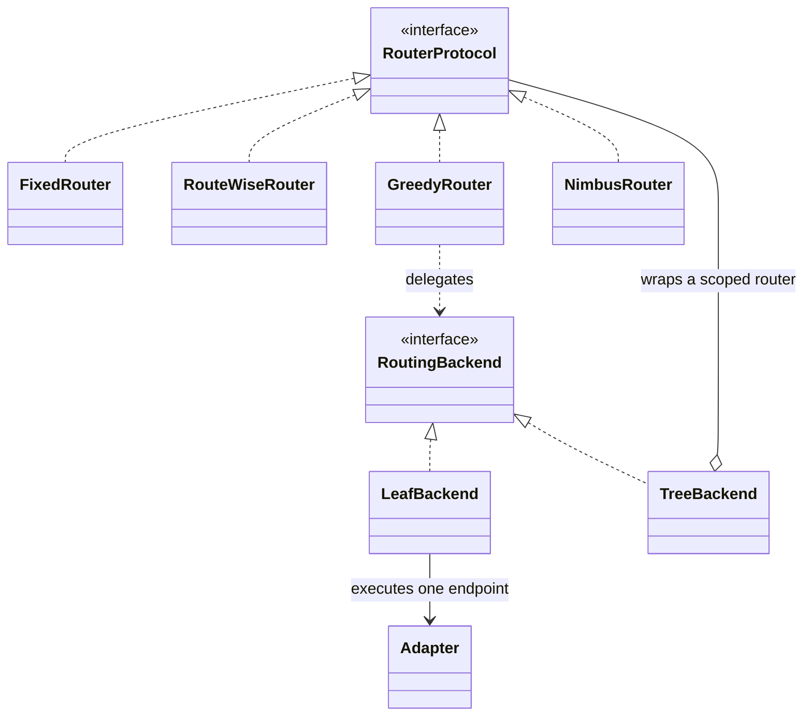
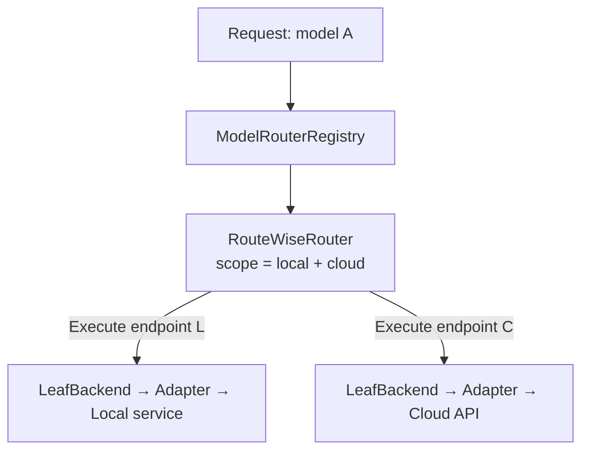
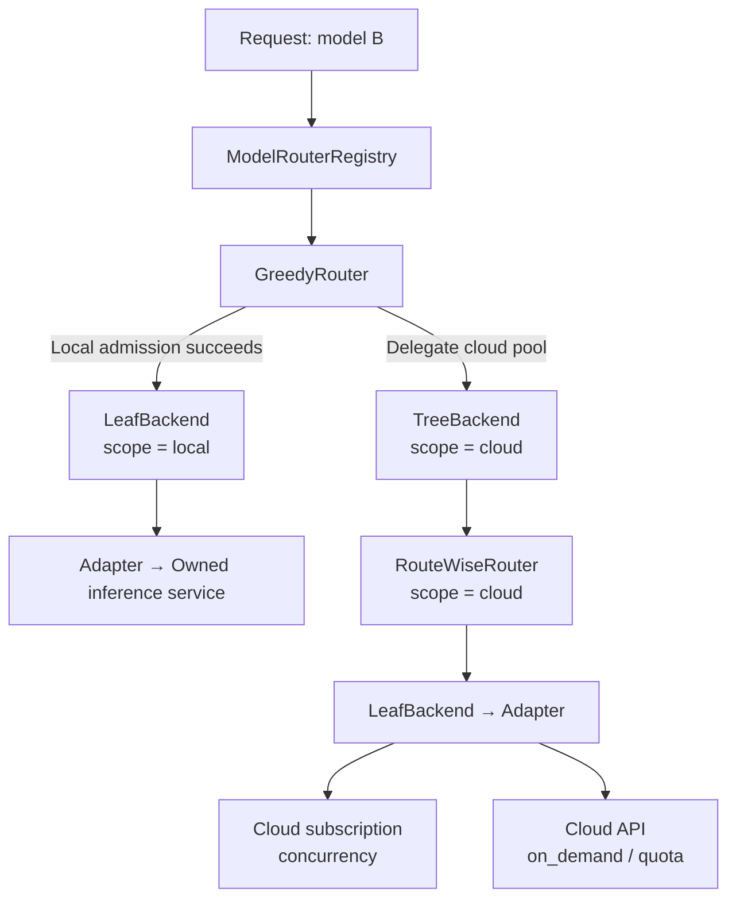

# 可组合的 Hybrid Routing 设计

- 日期：2026-09-14
- 状态：设计提案；本文新增文档，不代表所述接口、配置和 Greedy 生产接线已经实现
- 代码参照：PR #1454，`murphy/dev/hybrid-routing-abstract@ea9ad22fe14d96b9b2d414e337cba040d9ce28a4`
- 核心场景：RouteWise 可以直接路由 local + cloud，也可以在 Greedy / 未来 Nimbus 下面只路由 cloud
- 前序设计：[Hybrid Routing 抽象重构设计](2026-09-12-hybrid-routing-abstraction-design.zh.md)

## 1. 设计决定

**路由算法可以替换，也可以组合。Router 表达决策和请求编排；Backend 表达上层可以委托的推理能力，既可以是单个 endpoint，也可以是内部带 Router 的服务池。**

采用以下决定：

1. 继续以 `RouterProtocol` 作为唯一公共 Router 契约。FixedRouter、RouteWiseRouter、GreedyRouter 和未来 NimbusRouter 是它的不同实现，各自保留自己的控制流程。
2. 一个模型通过现有 Registry 绑定入口 Router。入口可以直接是 RouteWise，也可以是内部委托云端 RouteWise 的 Greedy；组合在构建时完成。
3. 算法、候选范围和组合位置分别配置。同一份 RouteWise 实现可以绑定完整候选池或 cloud 子集，不增加两套 RouteWise 算法。
4. `RoutingBackend` 表达可调用的服务能力。`LeafBackend` 是递归终点，通过 Adapter 执行精确 endpoint；`TreeBackend` 是路由子树的入口，把请求委托给范围受限的内部 Router。
5. “执行这个 endpoint”和“交给这个 pool”是两种显式指令。前者不能改选，后者允许子 Router 在授权范围内选路、重试和 hedging。
6. local / cloud 是部署归属；on_demand / quota / concurrency 是资源模型。两者独立。
7. 实际容量按资源池共享，尝试、预留、反馈和生命周期都有明确所有者。增加一层包装不能复制容量或重复记账。

这份提案更新前序设计中的 Backend 边界：“只能执行指定 endpoint”适用于叶子派发；明确委托服务池时，池内 Router 可以选择 endpoint。前序关于公共 Router 契约、保留 Fixed / RouteWise 行为、模型绑定和复用 Adapter 的决定继续保留。前序实施计划和 AGENTS.md 中较窄的 Backend 定义，不应被当作本提案的最终契约；本次不改写那些历史文件。

### 1.1 交付范围

目标实现首先支持以下两种拓扑，并保持现有 Fixed 入口兼容：

- 全池模式：`RouteWise(local + cloud)`。
- 分层模式：`Greedy(local admission, cloud = RouteWise(cloud scope))`。

第一版组合限制为入口 Router 加一个云端子 Router，不提供任意递归路由图。Nimbus、云端估计接口与基于这些估计的跨层决策列入后续阶段。本文不要求重写 `llm-routewise`、统一所有策略的内部循环，也不改变未选择新拓扑的模型行为。

## 2. 核心对象与关系

### 2.1 RouterProtocol 与 RoutingBackend

| 对象 | 职责 | 边界 |
|---|---|---|
| RouterProtocol | 统一普通请求、流式、反馈和诊断的对外调用 | 不要求所有算法返回同一种内部决策结构或共用控制循环 |
| 具体 Router | 在自身范围内选路，组织准入、重试、hedging 和学习 | 只管理自己获得的决策权限和请求状态 |
| RoutingBackend | 向上层提供可委托的推理能力及明确范围 | 不根据一个含糊的 target 偏好猜测是否有重新选路权限 |
| LeafBackend，拟议角色 | 叶子节点，执行已经绑定的 endpoint | 复用 Adapter；递归到此结束，不再向下委托或跨 endpoint fallback |
| TreeBackend，拟议角色 | 路由子树的入口，通过内部 Router 选择下游 | 校验范围、传递上下文和结果；不重复实现内部 Router 的算法 |
| LocalBackend / CloudBackend | 表达部署归属的角色或便捷包装 | 可以采用叶子或服务池实现，不要求两套相同的协议代码 |
| Adapter | 连接、认证、协议和响应适配 | 不承担上层候选池选择 |

现有代码中的 [RouterProtocol](../../../apps/backend/routing/protocols.py) 与 [RoutingBackend](../../../apps/backend/routing/backends.py) 是两个独立的结构协议。后者的方法形状接近前者，并增加身份、目标及反馈归属能力；这种相似性不意味着它们必须形成继承关系。

这里采用组合：`RouteWiseRouter` 实现 Router 契约，`TreeBackend(router=RouteWiseRouter(...))` 对上层提供 Backend 能力。RouteWiseRouter 被 TreeBackend 持有，不继承 LeafBackend 或 TreeBackend。

`LeafBackend` 表示递归终点；`TreeBackend` 表示内部还有一棵路由子树，结构上可继续委托给 LeafBackend 或另一个 TreeBackend。名称表达这种可组合结构，第一版仍只支持第 1.1 节规定的两层组合，不因此开放任意递归。local / cloud 表示服务归属，与 Leaf / Tree 的结构角色独立；云端服务池可以是 `scope = cloud` 的 TreeBackend，不要求再增加一层 CloudBackend 继承。



这是类型关系图，箭头表示接口实现、持有或调用依赖，不表示请求依次经过所有方框。TreeBackend 连到 RouterProtocol，表示它持有一个符合该契约的具体 Router，例如 RouteWiseRouter。`LeafBackend` / `TreeBackend` 是拟议角色名称，可通过现有类和薄的辅助组件实现。没有实质职责的转发包装不必单独建类。现有具体 `routing.hybrid.HybridRouter` 仍是一种组合实现，不是公共接口；其 FixedPolicy 等内部抽象无需强加给 RouteWise。

### 2.2 三种容易混淆的 pool

| 名称 | 表达什么 | 示例 |
|---|---|---|
| Backend pool / scope | 可以选择哪些执行目标 | 模型 A 的 cloud endpoints |
| Resource pool | 多个调用共同消耗哪份容量或配额 | 一个账号的并发槽、一组自建 GPU 的 KV 预算 |
| RouteWise 的内部预算或学习分组 | 算法在哪个范围统计、建模和求解 | 保留现有 RouteWise pool 配置语义 |

候选池不同可以共享同一资源池；候选范围缩小也不会自动划分出一份独立物理容量。配置和日志应分别记录这些身份。

## 3. 支持的运行结构

### 3.1 全池 RouteWise



RouteWise 在模型完整候选池中决策，保持原有成本、延迟、准入、重新求解和 hedging 语义。它不必先决定 local / cloud，也不必经过 Greedy。显式配置为 concurrency 的本地 endpoint 继续参与全池选择。

### 3.2 Greedy + 云端 RouteWise



Greedy 管理自建资源的本地准入；决定转云后，把云端选择权交给子 RouteWise。RouteWise 的候选、fallback、hedge 和主动探测都只覆盖 cloud 范围。

例如，一个按并发槽提供服务的云端订阅可同时具有 `execution_domain = cloud` 和 `provider_type = concurrency`。用户提到的 Featherless 类场景按实际账号套餐建模；不从厂商名称推断容量值，也不把 concurrency 自动归为 local。

这两种拓扑复用同一个 RouteWise 类。不同范围使用分别构建和缓存的实例；不能在请求之间修改一个活跃实例的 scope 来模拟两种位置。

## 4. 派发契约：精确执行与服务池委托

### 4.1 两种指令

| 指令 | 上层已决定什么 | 下层可以做什么 |
|---|---|---|
| ExecuteEndpoint | 具体 canonical endpoint，以及本次 attempt 的绑定 | 调用该 endpoint；返回响应、流或失败 |
| DelegatePool | 一个明确的 Backend pool，以及适用约束 | 子 Router 在池内选目标、准入并执行自己的请求流程 |

以下为拟议数据结构示意，尚非可导入的运行 API；不要求各 Router 重写自己的内部决策结构：

```python
from __future__ import annotations

from dataclasses import dataclass


@dataclass(frozen=True)
class ExecuteEndpoint:
    binding: EndpointBinding


@dataclass(frozen=True)
class DelegatePool:
    pool_id: str


BackendDispatch = ExecuteEndpoint | DelegatePool
```

`EndpointBinding` 表示已解析的 endpoint id、实际 Adapter 及适用的路由快照/版本；不只是在派发时重新查表的字符串。对应 attempt 另外持有已经取得的预留。`DelegatePool.pool_id` 必须匹配 Backend 的声明范围，并与模型、模态、调用方约束取交集。

LeafBackend 只接受它绑定的那一个 ExecuteEndpoint，并在构造时要求被包装的 Router 声明支持精确派发（`supports_exact_dispatch`）；不声明的 Router 在构建阶段被拒绝，而不是接受之后忽略约束。

TreeBackend **以 DelegatePool 为主**：委托给它的池由内部 Router 选路。它还接受**落在自己声明范围内**的 ExecuteEndpoint，这是保留旧包装精确派发的兼容能力，不是角色互斥的例外：越界绑定同样在 I/O 前拒绝。两种角色的严格互斥是目标，当前对 TreeBackend 保留这一条兼容路径，已由 `TreeBackend.check_instruction` 与测试锁定。

派发入口在产生上游 I/O 前拒绝不匹配的指令。若父 Router 已经选定具体 endpoint，就走 LeafBackend 派发，不再调用子 Router 重新选一次。组合错误（不匹配指令、空范围）不计入 attempt、不产生 provider 故障样本、不触发自动 fallback，普通与流式两条路径一致。

范围在比较和求交之前**统一规范化为当前模型的 canonical endpoint 集合**：声明范围与绑定可能分别用 provider 标签和 endpoint id 表达，直接对两者做字符串集合运算会把同一个有效范围误判为空。窄于池声明范围的调用方范围必须传到子 Router 的候选集合，而不只是放在请求选项里。

只分域步骤落到 leaf 上时的处理**只适用于 fallback 条目**：该步骤没有点名 endpoint，而 leaf 无法选路，它自己的绑定就是这一步唯一可能的含义，因此展开为精确目标。**首选 attempt 不这样展开**——调用方为它指定了 target，leaf 服务不了该 target 时，这个 attempt 仍然是委托并被 leaf 拒绝，不会退化成“改打它自己绑定的那个 endpoint”。

### 4.2 共同上下文

普通请求和流式请求使用相同的派发语义，并保留以下请求上下文：

- request id、父调用记录、当前 Router 实例/版本及 route path。
- 端到端 deadline、首 token 期限、取消信号，以及适用的重试/hedge 预算。
- canonical model、模态、输出上限和经过验证的调用方限制。
- 实际 attempt 的绑定、资源预留及执行记录。

子调用不能重新开始计算端到端期限，也不能丢弃上层约束。新分层路径的上游尝试预算在整个请求内共享，实际派发和 hedge leg 才消耗尝试额度；Wrapper 转发不算一次上游尝试。原有单层路径的默认行为保持兼容。

具体数据载体可复用现有 request options、trace 和 observation；路由控制字段必须在 Adapter 边界被隔离，不泄露到 provider 参数或客户端输出。

### 4.3 与现有 target / pin 的兼容

现有 `target=None`、`preferred_endpoint_id`、`require_target`、`allow_fallback` 同时承载偏好、硬目标和委托语义。旧公开入口保留原行为，新组合入口使用显式指令，由兼容适配层进行映射；不能直接把旧 preference 改成 hard target。

provider 标签可能对应多个 endpoint，不等同于精确 endpoint id。经过现有校验的 HTTP `pin_provider` 继续保留到共享 FixedRouter 的兼容路径；如果其目标与新拓扑共享受限资源，也必须纳入同一容量账本或被配置校验阻止绕过。保持 pin 的对外行为不等于允许绕过资源上限。

## 5. Greedy 第一版的行为

### 5.1 本地准入

采用本地优先基线：只有在本地资源和预测 TTFT 均可接受时才留在本地，否则委托云端池。生产接入复用 Nimbus 仓库中现有 Greedy 算法的思路，但补齐 gateway 并发、观测和响应生命周期。

所需数据包括：tokenizer 对齐的 prompt 长度、已规范化且实际执行会遵守的生成上限、KV block 大小和容量、部署校准的 prefill/decode 参数，以及已接纳请求的等待/执行状态。不能使用请求完成后才知道的真实生成长度。

峰值预留按 `ceil((prompt_tokens + generation_cap) / kv_block_size) * kv_block_size` 计算；预测检查和预留提交位于同一个同步边界，或通过版本检查后重试，防止两个到达同时看到相同空闲容量。

第一版使用一个有明确校准和容量归属的本地执行池。预留与被调用的 endpoint/实际资源池一致；不能对池 A 预留后让另一个本地 Router 随意改去池 B。支持异构本地池或复杂副本选择时另行扩展。

准入配置缺失或不合法时启动失败。运行时观测缺失、过期或估计不受支持时，本地按不可准入处理，转云并记录原因。该 TTFT 模型需要部署校准，不能被描述为端到端 SLO 或 TPOT 的保证。

### 5.2 请求流程

1. 入口 Router 取得请求上下文，读取本地状态并尝试准入。
2. 准入成功：持有本地预留，精确调用已经绑定的本地 endpoint。
3. 准入拒绝：不持有本地预留，向 CloudBackend 发送 DelegatePool。
4. 云端 RouteWise 在 cloud 范围内完成选择、原子准入和执行，返回实际结果与尝试记录。
5. 执行所有者处理完成、失败或取消，清理对应资源并记录反馈。

Greedy 第一版不对已经接纳的请求做主动淘汰，也不维护一个可供 Nimbus 挑选卸载对象的新调度队列。已有上游等待工作可以参与预测；这与新增应用层 waiting queue 是两回事。

### 5.3 失败与流式提交

- 本地执行在任何客户端可见输出前失败：默认允许 Greedy 转云一次，受剩余 deadline 和尝试预算约束。释放本地预留前须满足实际执行结束或确认取消的条件。
- 云端请求的 provider fallback、重求解和 hedging 由云端 RouteWise 管理；其最终失败返回 Greedy。第一版不自动从 cloud 再回 local，避免循环和重复本地准入。
- 无可行候选、容量 claim 被拒和实际 provider 失败分别记录；没有发出上游请求就不产生上游故障样本。
- 任一路径已经产生客户端可见输出后，不切换为另一条回答拼接进同一个流；沿用现有流式提交和最终错误语义。
- 取消传递到子 Router、全部活动 hedge leg 和底层响应流。客户端断开不等于上游已经释放 GPU；上游取消无法确认时，按实际完成或既有回收规则持有相应容量，防止提前超额接纳。

## 6. 资源、反馈与生命周期所有权

### 6.1 资源池共享是组合的前提

资源池身份按实际资源界定，例如 `(provider account, concurrency pool)` 或自建部署的 KV 池。scope、模型、Router 实例和 Backend 包装都不是新容量的来源。

| 状态或责任 | 所有者 |
|---|---|
| Greedy 本地选择和准入逻辑 | GreedyRouter 及其本地准入协作者 |
| 本地 KV/并发账本 | 实际本地资源池的唯一管理对象 |
| 云端选择、重试、hedging、算法学习 | 绑定 cloud scope 的 RouteWiseRouter |
| 账号 quota / concurrency 账本 | 对应实际资源池的共享管理对象 |
| 一次 attempt 的预留 | 实际取得它的 Router 请求流程；引用原资源对象 |
| 连接与响应流 | 取得该资源的 Backend / Adapter |
| Router 实例的启动、停止和排空 | 构建整个组合的生命周期所有者 |

同一 attempt 的同一容量约束只取得一次。父 Router 委托 cloud pool 时不先占一份云端槽位再由子 Router 再占一次；子 Router 对实际派发负责。不同真实约束可以分别计数，例如共享 GPU KV 与另一个独立并发上限，但不能把同一额度换名计算两次。

并发槽按实际完成/取消回收，已消费 quota 按原有语义结算，不能由通用 cleanup 无条件退还。估计接口不取得这些资源。

**当前代码存在明确差距：**[RouteWiseRouter 的资源构建](../../../apps/backend/routing/routewise/router.py) 中，concurrency manager 保存在 Router 实例内；[RouterBuildDependencies](../../../apps/backend/routing/dependencies.py) 当前只显式提供共享健康注册表。相同 pool id 并不自动保证多个 RouteWise 实例共用同一个计数器。

实现必须把现有 manager 的取得/注入移动到实际资源池的共享所有者，保持原有资源算法和释放语义。此能力完成前，构建器应拒绝多个独立实例同时访问同一受限池，或显式配置其容量分区并保证总量不超出真实额度。单 worker 不能解决同一 worker 内多个 Router 各自记账的问题。

跨 worker 的原子容量共享也不是本次包装自动获得的能力。继续保留现有 stateful provider 的 worker 限制；多 worker 需要真正的共享准入实现，不能只关闭校验。上层和下层同时运行、模型并存、pin 旁路以及热切换的新旧实例都要纳入所有权检查。

### 6.2 反馈与计费归属

每个实际上游 attempt/hedge leg 记录 request id、attempt id、父调用、Router 实例版本、pool、canonical endpoint、资源池、时间、结果和可获得的 token/cost 数据。例：`greedy-root → cloud-pool → routewise-cloud → endpoint-B`。

云端 RouteWise 消费自己实际尝试的学习反馈；Greedy 可以消费云端聚合结果用于端到端统计或后续决策。原始 attempt 和聚合结果是不同事件，聚合结果不能再次作为 provider 样本入账。成本未知时保留未知，不写成零；计费统计覆盖实际计费的失败或 hedge leg。

去重和归属以执行记录为准；不能因两个 Router 的 endpoint 范围重叠，就把反馈广播给二者。请求完成后的反馈仍发给原 Router 版本，不重新查询模型当前绑定。现有 `failed_attempts` 字段和归因兼容保留。

### 6.3 构建、刷新与热切换

Registry 继续按模型配置返回入口 Router。构建器负责解析模型与候选池、建立子 Router、注入共享资源、校验范围、连接 operational store，并管理启动/停止。第一版禁止循环、自引用和超过规定深度的组合。

子 Router 的探测、校准、状态恢复和配置更新必须能被生命周期与管理入口访问。只枚举顶层 RouteWise 的管理代码需要补齐，不能因嵌套而丢失这些能力。

候选范围刷新遵循原路由快照规则，保留在途绑定、预留和 pending 学习状态。已有 `attach_route_table` 会清理部分 pending 状态，不应作为每次请求或普通刷新时改变 scope 的工具。

热切换先构建和启动新组合，再原子发布模型绑定。新请求使用新组合，旧请求及迟到反馈继续由旧组合处理，完成后排空并回收。准备或发布失败保留旧绑定；共享资源池不能随新组合初始化而清零。包装层只关闭自己拥有的对象，不能停止外部仍在使用的共享实例。

## 7. 模型配置与实例构建

保留 `router` / `router_params`、默认策略、别名映射和 Admin 切换。`router` 继续表示模型的入口算法，不增加必填的 `router: hybrid`，普通请求仍只指定 model。

### 7.1 全池 RouteWise：沿用现有字段

以下是 `models.yaml` 中省略了模型目录和 routes 定义的片段；候选仍来自该模型已有路由表：

```yaml
models:
  - id: model-a
    router: routewise
    router_params:
      budget_alpha: 0.2
```

构建结果为一个绑定模型完整候选池的 RouteWiseRouter。Fixed 模型继续使用 `router: fixed`；未显式选择组合时，不自动改成两阶段选择。

### 7.2 分层模式：新增的拟议配置

以下字段为设计草案，当前解析器尚不支持。示例中的 endpoint id、容量和校准值仅用于解释结构；正式配置必须引用真实部署、已有 endpoint 和测量得到的参数。

拟议在 `routing.yaml` 中声明服务池与本地准入 profile：

```yaml
backend_pools:
  owned-model-b:
    execution_domain: local
    endpoint_ids: ["model-b:owned-cluster"]
  cloud-model-b:
    execution_domain: cloud
    endpoint_ids: ["model-b:subscription-api", "model-b:metered-api"]

local_admission_profiles:
  local-model-b-v1:
    resource_pool: owned-model-b-kv
    mode: kv_ttft
    kv_capacity_tokens: 65536
    kv_block_size: 16
    generation_cap_tokens: 2048
    prefill_tokens_per_second: 10000
    decode_seconds_per_token: 0.03
    first_token_overhead_ms: 20
    ttft_slo_ms: 1500
    ttft_guard_ms: 100
```

模型通过 `router_params` 选择池和云端算法：

```yaml
models:
  - id: model-b
    router: greedy
    router_params:
      local:
        pool: owned-model-b
        admission_profile: local-model-b-v1
      cloud:
        pool: cloud-model-b
        router: routewise
        router_params:
          budget_alpha: 0.2
```

构建结果：

```text
model-b
  └─ GreedyRouter
       ├─ local: LeafBackend(owned-model-b endpoint) + shared admission state
       └─ cloud: TreeBackend(cloud-model-b)
                    └─ RouteWiseRouter(cloud-model-b endpoints)
```

`execution_domain` 是服务池归属声明，必须与显式部署配置一致；云端 endpoint 的 `provider_type`、`concurrency_pool`、`quota_pool` 等资源配置继续放在已有 route 配置中。声明 Backend pool 不复制这些资源定义。

准入 profile 的固定生成上限是第一版预测和预留使用的保守 cap。实际调用必须受同一 cap 约束；请求超过 cap 时在路由前明确拒绝，不静默截断用户要求。请求更小的 cap 可以保守地按 profile cap 预留。输出参数的适配和校验保证 local/cloud 两条路径具有一致的规范化语义。

### 7.3 构建校验

- 池和准入 profile 均可解析，endpoint 属于模型及声明的部署归属，参数单位和取值合法。
- 本模型的 local/cloud 范围不重叠；初次启用时要求两侧均非空。单域模型可沿用原入口，无须虚构另一侧。
- 运行中候选池变空只使该路径不可用，不能把空 scope 解释为全池。
- 第一版 cloud 子算法只接受已经完成池委托适配的实现；不因所有对象满足 RouterProtocol 就假定它们支持任意嵌套。
- 子范围不得超出父委托范围；禁止循环及不支持的组合深度。
- 同一物理资源的容量声明一致，并通过资源所有权检查；尚未共享的重复受限池拒绝启用。
- 保留原有模态、provider pin、别名和策略参数校验。拓扑字段由构建器解析，算法参数由各 Router 的原校验器处理。

Admin 切换必须准备完整的目标配置。只指定 `greedy` 而缺少所需池/profile 时应拒绝，不临时猜测部署信息。

## 8. 从分层协作到跨层决策

### 8.1 第一版优化的边界

全池 RouteWise 在其候选模型内比较 local/cloud；分层模式先由 Greedy 决定本地准入，再由 RouteWise 优化被转云的请求。两种结构解决的优化问题不同。

例如，本地仍可准入、云端订阅槽位也空闲时，严格 Greedy 仍会选本地。子 RouteWise 没有权限把这个请求改去云端。因此分层组合可以有效分工，但不保证与全池求解得到相同决策或整体最优。

另一方面，全池 RouteWise 也不会因看到了 local endpoint，就自动拥有 Nimbus 的 KV 预测、等待队列和选择性卸载能力。评价时需要明确算法各自获得的观测和控制能力。

RouteWise 的 `budget_alpha` 在当前候选成本范围内解释；限定 cloud scope 后，其候选范围和接收的流量分布都会变化。全池和分层模式使用相同 alpha，不代表具有相同的美元预算或端到端成本约束。

### 8.2 后续可选的 Backend 估计能力

为了让外层能权衡“本地执行、等待、转云”，服务池可以增加可选的只读估计接口。它不是第一版所有 Backend 必须实现的方法。

| 估计内容 | 语义 |
|---|---|
| 请求和约束标识 | 估计针对相同的模型、输出上限和请求特征 |
| 可行性 | 当前存在可行候选、暂不可行或未知；不保证派发时仍有容量 |
| 预估成本 | 声明币种、计费单位，以及边际费用或容量机会成本的口径 |
| 预估 TTFT / 完成时间 | 声明统计口径；池内耗时与已经发生的上层等待分开 |
| 观测时间和候选版本 | 支持外层判断估计是否过期 |
| 不确定性或不可用原因 | 缺少证据时返回未知，不伪造零成本或零延迟 |

估计不得创建请求预留、消费 quota、产生实际 attempt，或通过调用现有带副作用的 select/commit 路径占住容量。真实执行仍需原子准入，估计失效时按剩余 deadline 重新决策或返回不可用。

外层若仍采用严格 Greedy 规则，仅提供估计不会自动产生联合优化；需要采用能消费这些信息的策略。未来 Nimbus 可在自己定义的目标下使用这些信号，并接入独立的 waiting 集合、进度观测和 tick 调度。

Nimbus 若要卸载等待请求，应优先在尚未派发的集合上做决定；已发送到本地引擎的请求必须有可靠的取消/执行状态机制才能迁移。不能在已占用本地资源的同时，把一次普通队列转移当作资源已经释放。

### 8.3 评价口径

比较两种拓扑时，以全部到达请求为分母记录成功率、端到端 TTFT/SLO、尾延迟、成本和本地资源利用率；额外观察 cloud 子流量的分布与性能。云端 TTFT 不能替代包含本地等待和 fallback 的端到端 TTFT。

实际计费、订阅摊销和算法使用的边际/机会成本分别报告；聚合统计包含应计费的失败与 hedge leg，并避免把子统计再加到已经包含它的父统计。初步对照应固定 workload、模型能力、资源上限、随机性和校准版本，而不是只对齐 alpha。

## 9. 与其他方案的取舍

| 方案 | 优点 | 主要代价 | 本设计的选择 |
|---|---|---|---|
| 仅独立同层 Router | 结构简单，适合全池算法直接替换 | 不方便表达 Greedy 委托云端 RouteWise | 保留该用法，同时允许组合 |
| 只把 RouteWise 放在 cloud | 本地准入与云端选择分工直接 | 限制全池 RouteWise，跨域权衡受上层规则约束 | 作为可选拓扑，不固定算法位置 |
| 统一具体 HybridRouter 引擎 + Policy | 公共循环足够时，新策略接入短 | 需要表达 RouteWise 的重求解/hedging 和 Nimbus 的队列行为 | 不强制，复用确实相同的辅助逻辑 |
| 任意 Router 递归组合 | 扩展范围大 | 配置、预算、循环、资源与反馈所有权复杂 | 第一版只提供有界两层组合 |
| 可替换 Router + 显式池委托 | 同时覆盖全池和分层模式 | 必须补清范围、共享资源和请求所有权 | 采用 |

## 10. 当前代码的复用点与差距

以下针对参照提交，不表示本提案已修改这些文件。

| 现有实现 | 复用方式与需要完成的工作 |
|---|---|
| [protocols.py](../../../apps/backend/routing/protocols.py) | 保留唯一 RouterProtocol；为新的显式委托上下文设计兼容入口 |
| [backends.py](../../../apps/backend/routing/backends.py) | 已有 Local/Cloud 包装及 RouteWiseCloudBackend；后者的范围限制与委托可作为 TreeBackend 基础，补齐与精确叶子执行的语义区分 |
| [route_scope.py](../../../apps/backend/routing/route_scope.py)、[route_table.py](../../../apps/backend/routing/route_table.py) | 复用候选范围投影、模型/endpoint 解析与快照，不复制 Adapter 状态 |
| [hybrid.py](../../../apps/backend/routing/hybrid.py)、[decisions.py](../../../apps/backend/routing/decisions.py) | 复用已有转发、记录和兼容行为；旧 preference/fallback 组合不能代替新契约的显式权限 |
| [RouteWiseRouter](../../../apps/backend/routing/routewise/router.py) | 保留算法、学习、重求解、hedging 和全池入口；云端子实例绑定受限视图，补齐共享资源注入和叶子派发接线 |
| [concurrency.py](../../../apps/backend/routing/routewise/concurrency.py) | 复用现有 manager 的原子准入原语，修正跨 Router 实例的取得和共享边界 |
| [FixedRouter](../../../apps/backend/routing/routers.py) | 保持全局权重、健康、亲和、prefill 和 fallback 顺序；不把原 `L1 → cloud → L2` 改成先耗尽一个域 |
| [model_router_registry.py](../../../apps/backend/routing/model_router_registry.py) | 继续按模型构建/缓存入口；补充完整组合配置的构建、切换和排空 |
| [hybrid_composition.py](../../../apps/backend/serving/servers/hybrid_composition.py)、[bootstrap.py](../../../apps/backend/serving/servers/bootstrap.py) | 已有可注入 cloud backend 的构建入口；补充 Greedy 工厂、共享资源所有者和子 Router 生命周期管理 |
| [BaseAdapter](../../../apps/backend/serving/adapters/base.py) | 继续承担真实 provider 调用；不因引入 Backend 重写协议适配 |

Nimbus 仓库的 `router/greedy.py` 已有基于 KV 预留和预测 TTFT 的基线；`router/nimbus.py` 提供请求状态与 tick 逻辑。这些位于另一个仓库，不是 hybridInference 的已安装依赖。集成时固定来源版本、明确模块归属并接入真实生命周期，不直接把实验 runner 当作生产 Router。源码位置作为复用线索，本设计不附带迁移这些文件。

## 11. 实施顺序

### 阶段 A：契约和资源边界

落实精确 endpoint / 池委托的显式语义、请求上下文和兼容映射；保留现有公共导入和单层行为。构建共享资源所有者并注入现有 manager，未覆盖的重复受限池和 worker 组合启动失败。

验收重点是语义与所有权：实际调用哪个 endpoint、哪一个请求持有什么资源、谁允许发起下一次尝试。`routing/executor.py` 的兼容 shim 保持不动。

### 阶段 B：同时跑通两种拓扑

保留直接全池 RouteWise；新增 Greedy 的本地准入适配和 cloud 池委托，复用受限 RouteWise 包装。按模型配置构建入口，接通普通请求、SSE、取消、反馈、探测和状态恢复。

验收通过真实 serving / Registry / bootstrap 路径完成，而不只单独构造包装类。

### 阶段 C：动态配置和行为对照

验证新旧组合切换、路由范围变化、共享池容量更新及旧请求排空。对 Fixed / RouteWise 既有行为做回归对照，对 Greedy + RouteWise 做受控 workload 比较和运行部署验证。

### 阶段 D：估计接口与 Nimbus

先明确云端估计口径与误差，再接入 Nimbus 所需的等待集合、进度和选择性卸载；使用相同端到端评价口径验证协同收益。阶段 D 不作为 A–C 的前置依赖，也不由增加一层包装宣称完成。

## 12. 验收标准

| 场景 | 必须证明的行为 |
|---|---|
| 同一算法两种位置 | 全池 RouteWise 能选择 local；cloud 子 RouteWise 的请求、重试、hedge 和探测均不能访问 local |
| 精确派发 | 指定 endpoint 缺失、越界或不可准入时，不调用另一个 endpoint |
| 池委托 | 上层只指定 cloud pool，实际 endpoint 由子 Router 选择；父层不先重复抽签或占用同一云端槽 |
| Greedy 基线 | 同步到达不会超额预留；本地可接纳时执行本地，KV/TTFT 不可接受时转云；预测只用当时可知的数据 |
| 资源类型正交 | cloud concurrency 候选可用且有槽时参与云端决策；local concurrency 仍能参与全池 RouteWise |
| 多实例共享 | 两个 Router/模型/新旧版本访问同一资源池，总使用不超过真实上限；未实现共享时配置被拒绝 |
| 资源生命周期 | 成功、失败、取消、hedge loser 和准入竞争失败均正确清理；quota 不被通用释放错误退还 |
| 失败边界 | 本地失败后受预算控制转云；云端内部失败由子 Router 处理；无循环、重复尝试和虚构 provider 故障 |
| 流式 | 普通/SSE 路径目标语义一致；关闭迭代器向下取消；可见输出后不拼接另一条回答 |
| 反馈与成本 | 反馈回到实际 Router 版本和 endpoint；失败/hedge 信息保留，叶子与父聚合不重复学习或计费 |
| 动态范围与切换 | 空 scope 不扩成全池；刷新不丢在途状态；新组合发布失败保留旧入口，旧预留引用原池 |
| 配置兼容 | 原 fixed / routewise 配置、默认值、别名、pin 和错误归因保持原行为；新字段通过明确校验 |
| 真实入口 | 生命周期、Admin、operational store 和探测能访问云端子 Router；启动/停止责任只执行一次 |

回归基础包括 [test_routing_backends.py](../../../tests/unit/routing/test_routing_backends.py)、[test_hybrid_router.py](../../../tests/unit/routing/test_hybrid_router.py)、[test_routewise_router.py](../../../tests/unit/routing/test_routewise_router.py) 和 [test_hybrid_bootstrap_wiring.py](../../../tests/unit/servers/test_hybrid_bootstrap_wiring.py)。新增测试应能区分错误实现，例如两个实例争用同一个只有一个槽位的池，而不只是检查类名和构造成功。

本轮为 Markdown 文档交付，检查本文件与仓库本地链接、代码围栏、Python/YAML 示例语法和空白。新文件尚未进入 Git 索引时，仓库的 tracked-file 链接检查不会自动覆盖它，必须单独检查。上述行为测试和部署验证属于后续代码实施，不能用文档检查结果替代。
