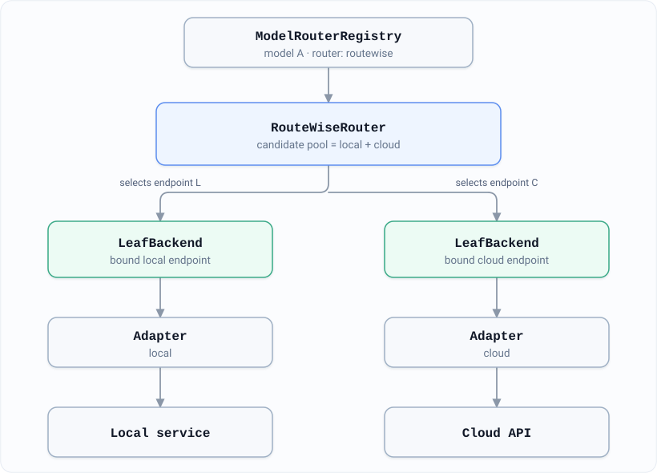
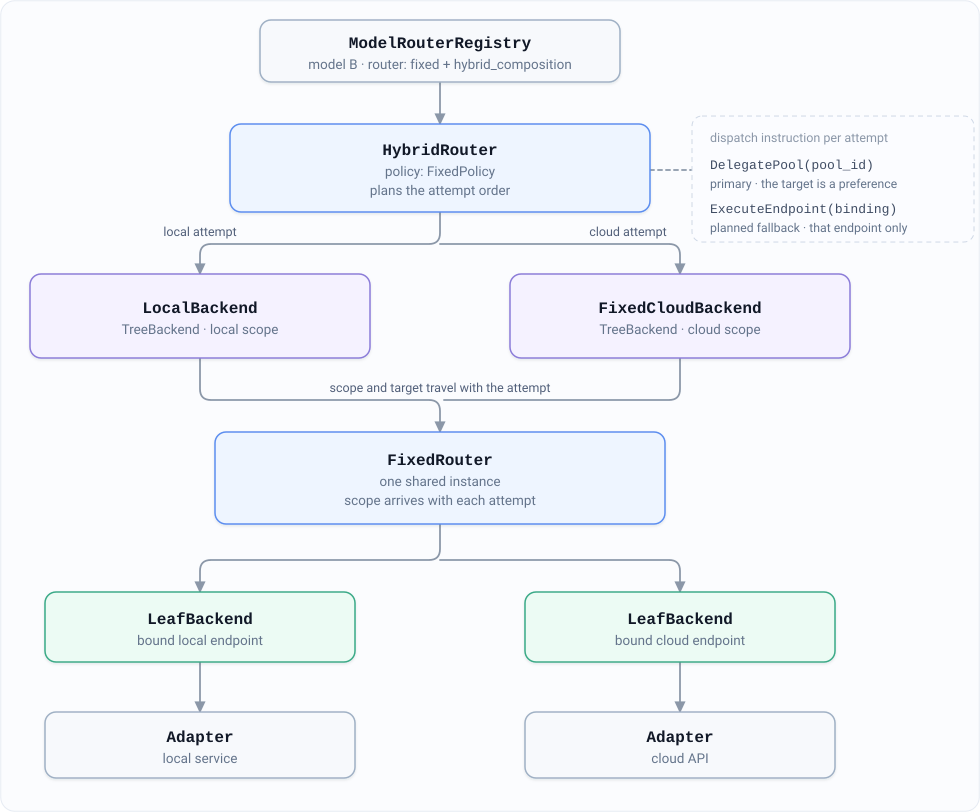
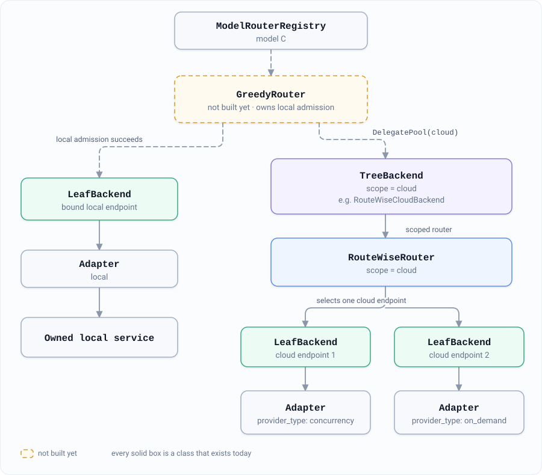

# Routing Internals

This page is for contributors changing the routing engine. It explains how a
router runs the endpoint it chose, how one router can hand a request to
another, and the experimental composition built on that. Nothing here needs
configuring to run a gateway; [Routing](routing.md) covers what does.

The short version: a router picks an endpoint and then calls that endpoint's
adapter through a thin wrapper called a *leaf*, which runs exactly the adapter
the router picked and nothing else. A *pool* is the other kind of wrapper: it
hands the request to a second router that makes its own choice within a
limited set of endpoints. Every router in use today executes through leaves;
pools are used only by the opt-in composition described at the end.

## How a request reaches an adapter

A router owns selection, admission, retries, and feedback. Once it chooses an
endpoint, it creates an `EndpointBinding` holding the selected adapter, and a
`LeafBackend` calls that adapter. A `TreeBackend` provides a different capability:
it delegates to a router inside a declared candidate pool. The wrapped router
keeps its own selection and execution flow. See
[Leaves, pools, and dispatch instructions](#leaves-pools-and-dispatch-instructions).

Startup wiring lives in `apps/backend/serving/servers/bootstrap.py`: it
registers routes from the model registry into one process-scoped
`FixedRouter`, optionally applies the `RoutingManager`, then builds a
`ModelRouterRegistry` over the same route table. Routers for every known model
are constructed eagerly at boot, so a bad strategy name or bad `router_params:`
is reported at startup rather than on the first request. What the registry
returns for a model depends on its `router:` field:

- `routewise` — a `RouteWiseRouter` over the model's full candidate pool, local
  and cloud alike.
- `fixed` — the shared `FixedRouter`, unless the model opts in to composition
  with `router_params.hybrid_composition: true` **and** has both local and cloud
  candidates. In that case `apps/backend/serving/servers/hybrid_composition.py`
  builds a `HybridRouter` over a `LocalBackend` and a cloud backend instead. All-local and all-cloud models keep the shared `FixedRouter`
  even when the option is enabled.

**The leaf execution boundary is already used by ordinary Fixed and RouteWise.**
Existing configurations use these paths without enabling composition:

```text
FixedRouter     -> LeafBackend -> selected Adapter
RouteWiseRouter -> LeafBackend -> selected Adapter
```

Both routers can select from local and cloud endpoints in the same model's
route. `hybrid_composition` enables the additional `HybridRouter` layer that
plans across separate local/cloud pools; it is not required to use either the
leaf boundary or a mixed candidate pool.

## Leaves, pools, and dispatch instructions

`LeafBackend` uses the adapter's call signature and directly forwards its
chat call or stream iterator. It does not implement the router-shaped
`RoutingBackend` protocol. Pool wrappers such as `TreeBackend` implement that
protocol and forward requests to a scoped router.

For composed dispatch, `HybridRouter` uses two explicit instructions
(`apps/backend/routing/dispatch.py`) to state what a pool may do:

| Instruction | Permission | Pool behavior |
|---|---|---|
| `ExecuteEndpoint(binding)` | Execute exactly the bound endpoint. | `TreeBackend` accepts a binding within its model and endpoint scope. The child router admits that target and executes it through a leaf, with re-selection and fallback disabled. |
| `DelegatePool(pool_id)` | Select inside the named pool. | `TreeBackend` delegates selection, admission, retries, and hedging to its scoped router. |

An exact dispatch can therefore pass through a child router for admission;
the instruction limits that router to the bound endpoint. `check_dispatch()`
and the pool's request validation reject a wrong pool, an excluded model, or an
out-of-scope binding before upstream I/O. Such composition errors propagate
without fallback or a provider failure sample. A leaf has no pool-selection
capability and cannot carry out `DelegatePool`.

`EndpointBinding` carries the endpoint id, the model, the pool, a diagnostic
route-table `generation`, and **the adapter itself**. Holding the adapter is the
point: execution does not look the target up a second time, so an admin route
edit cannot redirect a request that is already in flight. Binding and leaf
construction both reject an inconsistent endpoint identity, and a leaf refuses a
composite executor that reports outcomes for several endpoints at once. Each
hedge leg gets its own leaf. If a RouteWise candidate has been replaced by a
different adapter object for the same endpoint, RouteWise rejects the old
binding before reserving capacity: admission and execution must use the same
adapter. `generation` is diagnostic only; it does not decide whether a binding
is stale.

**Accounting stays with the owning router.** Selection, the admission claim, the prefill
lease, retry and hedge bookkeeping, `_routing` metadata, and the feedback handed
to `record_observation()` all stay with the router that chose the endpoint. A
leaf adds no second copy of this state or accounting.

**Pool scopes constrain selection and fallback.** `LocalBackend` and
`FixedCloudBackend` enforce model grants and narrow `RoutingRequestOptions.endpoint_scope`
before forwarding to the shared router. `RouteWiseCloudBackend` also binds a
`RouteScopeView` (`route_scope.py`), keeping the child router's candidate
selection, retries, hedge legs, and active probes inside its cloud range.
Provider labels are expanded to canonical endpoint ids within the requested
model before scopes are compared. A caller's scope can narrow the pool's grant;
an empty intersection is refused, never treated as unrestricted access.

**Requests keep the router API.** Calls use `chat_completion()` or
`stream_chat_completion()` with `routing_options`. For each composed attempt,
`dispatch_for_attempt()` constructs the instruction; the resolved binding,
scope, and target/fallback controls travel through `RoutingRequestOptions` to
the child router. A preferred endpoint allows selection of another candidate
unless `require_target` is set. `allow_fallback` controls retries after an
executed attempt fails.

**Admission refusal does not report an upstream failure.** A configured pool
with no available capacity can raise `TargetUnavailableError`. `HybridRouter`
then tries the next permitted attempt; a successful fallback is returned normally.
If all attempts are refused without reaching an upstream, the final refusal
maps to **503**. A streaming response whose headers have already been sent
carries code **503** in its SSE error instead of changing the HTTP status.
If upstream attempts did fail, the router's error-selection rules determine
the final error.

Composition is opt-in per model, and off by default:

```yaml
router: fixed
router_params:
  hybrid_composition: true
```

Its affinity updates, its re-selection after a rejected primary claim, and its
fallback circuit timing are not yet proven equivalent to the original `Fixed`
loop, so the default entry point stays the shared `FixedRouter` until they are;
see [#1457](https://github.com/HarvardMadSys/hybridInference/issues/1457). Pins
from the HTTP API and the admin playground keep using the shared `FixedRouter`
regardless.

Candidate scopes do not divide physical capacity. Each `RouteWiseRouter` still
owns its resource managers; sharing a constrained pool across independent
instances and rejecting unsupported duplicate-pool configurations remain
deferred to the same issue.

## Router types and execution boundaries

Routing also has a composition implementation, `HybridRouter`
(`apps/backend/routing/hybrid.py`), which plans across a local and a cloud pool
and delegates each attempt to a `TreeBackend`. It is not a third `router:`
value: a `router: fixed` model opts in with
`router_params.hybrid_composition: true`, and composition is built only when
both local and cloud candidates exist. Every other `fixed` model keeps the shared
`FixedRouter`, and `routewise` models keep their own entry point and full
candidate pool. The ordinary Fixed and RouteWise paths already execute through
`LeafBackend`; enabling composition is a separate choice.

The pool side exists so that one algorithm can own admission for a domain while
a different algorithm owns selection inside it, with neither one enumerating the
other's endpoints.

The diagrams below adapt the [composable routing design](https://github.com/HarvardMadSys/hybridInference/blob/dev/docs/agents/specs/2026-09-14-composable-hybrid-routing-design.zh.md) into a map of
the current implementation and its planned extensions. The first shows type
relationships; the following three show request paths. A dashed box or edge
marks something that does not exist yet.


*Router contracts and endpoint execution. Dashed boxes and edges mark what is
not built yet.*

`FixedRouter` and `RouteWiseRouter` are peer implementations of `RouterProtocol`;
future `GreedyRouter` and `NimbusRouter` belong at that same level. `HybridRouter`
sits there too, as a composition rather than a strategy: it selects no endpoint
itself and hands every attempt to a pool. Each router keeps its own selection,
admission, retry and feedback flow. `LeafBackend` binds one adapter
and executes it. It uses the adapter's calling convention and does not implement
the router-shaped `RoutingBackend` protocol, which is what makes a leaf the end
of the recursion. `TreeBackend` implements that pool protocol and holds a scoped
router; the held router can be RouteWise without making RouteWise a different
kind of strategy.

## Full-pool RouteWise: available today



*Full-pool RouteWise selects across local and cloud candidates directly.*

With `router: routewise`, the registry returns `RouteWiseRouter` directly. It
keeps the model's full candidate pool, reservations, re-solving, hedging and
learning. The two branches show possible endpoints, not a requirement to call
both: each actual attempt or hedge leg executes its own bound leaf. The ordinary
`router: fixed` path also uses `FixedRouter` → `LeafBackend` → `Adapter`, without
enabling composition.

## Fixed composition: explicitly enabled



*Current Fixed composition: two scoped pool wrappers, one shared FixedRouter.*

A mixed `router: fixed` model enters this path only with
`router_params.hybrid_composition: true` and both local and cloud candidates.
`HybridRouter` uses `FixedPolicy` to plan attempts; `LocalBackend` and
`FixedCloudBackend` forward their scope and dispatch constraints to the same
shared `FixedRouter`. The shared instance does not erase those per-attempt
restrictions. Admission and health accounting remain in the router; the leaf
executes the bound adapter.

Each attempt carries one of the two instructions in
`apps/backend/routing/dispatch.py`, which is what makes it a requirement rather
than a suggestion. The primary attempt is a `DelegatePool(pool_id)`: the policy's target
travels with it as a preference, and the pool may select something else inside
its own scope. Every planned fallback is an `ExecuteEndpoint(binding)` — that
endpoint and no other — so the child router cannot reorder the candidates the
composition has committed to. Either way the instruction is checked before any
upstream I/O, and a pool that cannot carry it out reports a composition error
instead of falling back. The full table is in
[Leaves, pools, and dispatch instructions](#leaves-pools-and-dispatch-instructions).

This is the concrete composition class, not the common router interface. Its
affinity, its re-selection after a rejected primary claim and its fallback
circuit timing were never shown equivalent to the ordinary Fixed path —
[#1457](https://github.com/HarvardMadSys/hybridInference/issues/1457) enumerates the differences — which is why composition stays
opt-in instead of becoming the default.

## Greedy with cloud RouteWise: future extension



*Planned topology, not an available router configuration: Greedy would own local
admission; RouteWise would own selection inside the cloud pool.*

The same `RouteWiseRouter` implementation can occupy the model's entry point
in the full-pool diagram or a cloud-scoped position here. Those roles use
separate instances with their own scopes; a live instance is not switched
between scopes per request. After local admission is refused, a future Greedy
router can delegate cloud selection to a `TreeBackend`, whose inner RouteWise
router owns cloud selection, retries and hedging.

What is missing is the entry point, not the pool below it. `TreeBackend` and
`RouteWiseCloudBackend` are in `apps/backend/routing/backends.py` today, and
`HybridFixedRouterFactory` already accepts a `cloud_backend` builder
(`apps/backend/serving/servers/hybrid_composition.py`), so a composition root
can put a cloud-scoped RouteWise under a pool right now. `GreedyRouter` and
`NimbusRouter` are not registered strategies, and no `models.yaml` field names
one, so nothing reaches this shape from configuration.

This example describes two routing levels, not arbitrary recursive
configurations. Sharing physical quota or concurrency across independent router
instances would also need an ownership implementation nobody has written:
separate scopes do not create separate capacity, and [#1457](https://github.com/HarvardMadSys/hybridInference/issues/1457) scopes
what that would take. Local/cloud ownership stays independent of the
`provider_type` values `on_demand`, `quota` and `concurrency`.
