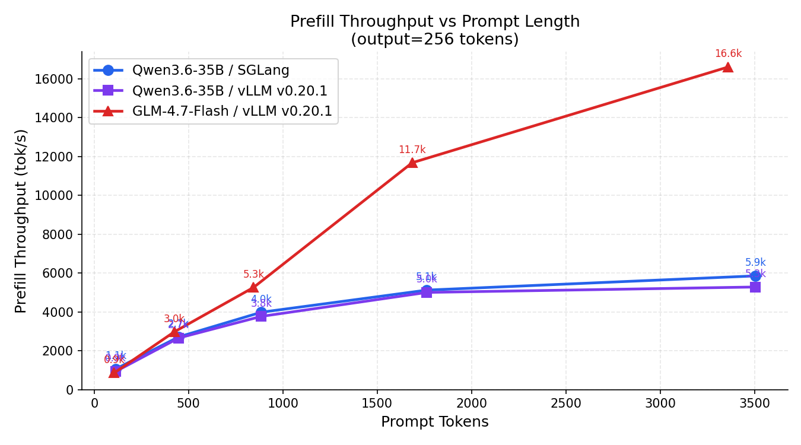

# Inference Throughput Benchmark — NVIDIA GB10 Local Deployment

**Date:** 2026-05-05  
**Hardware:** NVIDIA GB10 (Grace-Blackwell), 120 GB unified memory (aarch64)  
**Concurrency:** 1 (single-request, single-sequence)  
**Samples:** 3 measured requests per configuration + 1 warmup  

---

## Setup

| Config | Model | Precision | Architecture | Framework | Image | Max ctx |
|---|---|---|---|---|---|---|
| **Qwen / SGLang** | `Qwen/Qwen3.6-35B-A3B-FP8` | FP8 | MoE (3.6B active / 35B total) | SGLang | `lmsysorg/sglang:latest` | 262,144 |
| **Qwen / vLLM** | `Qwen/Qwen3.6-35B-A3B-FP8` | FP8 | MoE (3.6B active / 35B total) | vLLM v0.20.1 | `vllm/vllm-openai:v0.20.1-ubuntu2404` | 8,192 |
| **GLM / vLLM** | `zai-org/GLM-4.7-Flash` | BF16 | MoE (`glm4_moe_lite`) | vLLM v0.20.1 | `scitrera/dgx-spark-vllm:0.14.0-t5`† | 8,192 |

† Standard vLLM images (v0.18.0, v0.13.0) do not support `glm4_moe_lite` (GLM-4.7-Flash) or `qwen3_5_moe` (Qwen3.6-35B). The scitrera image bundles Transformers 5.0.0.dev0 which adds GLM-4.7 support; vLLM v0.20.1 (Transformers 5.7.0) adds `qwen3_5_moe` support.

**Methodology.** Prefill latency is isolated by sending `max_tokens=1` requests against the same prompt. Decode throughput is computed as `(output_tokens − 1) / (total_latency − prefill_latency)` using the full-generation response. Both phases are measured separately and averaged over 3 runs. All GPU memory utilization set to 80%.

---

## 1. Decode Throughput

Decode throughput is the dominant cost for any response longer than a few tokens. All measurements are averaged across output lengths 64–512.

| Prompt tokens | Qwen / SGLang | Qwen / vLLM | GLM / vLLM |
|---|---|---|---|
| ~115 | 51.6 tok/s | **53.2 tok/s** | 25.7 tok/s |
| ~448 | 51.3 tok/s | **53.4 tok/s** | 25.6 tok/s |
| ~886 | 51.2 tok/s | **53.3 tok/s** | 25.3 tok/s |
| ~1,763 | 51.0 tok/s | **53.1 tok/s** | 24.6 tok/s |
| ~3,506 | 50.6 tok/s | **52.7 tok/s** | 23.7 tok/s |

**Key observations:**

- **Qwen3.6-35B on vLLM v0.20.1 is the fastest decoder at ~53 tok/s**, edging SGLang by ~4% despite using the same FP8 weights. This is consistent and statistically significant across all input lengths.
- **Qwen3.6-35B on SGLang delivers ~51 tok/s**, close to vLLM but with slightly higher variance. SGLang uses CUDA graphs and a custom MoE dispatch path tuned for Blackwell.
- **GLM-4.7-Flash on vLLM is ~2× slower in decode (~25 tok/s)** throughout. This is likely attributable to: (a) BF16 vs FP8 — BF16 doubles memory bandwidth demand per token; (b) the default MoE kernel config (vLLM logged `Using default MoE config — performance might be sub-optimal`); (c) GLM-4.7-Flash being a larger active-parameter model per decode step than Qwen3.6's MoE routing suggests.
- Decode throughput decreases slightly with longer inputs (~2% across the 30× input range tested) due to the growing KV cache inflating attention cost per decode step.

Decode throughput is stable across output lengths 64–512, confirming it is not affected by response length.

---

## 2. Prefill Throughput

| Prompt tokens | Qwen / SGLang | Qwen / vLLM | GLM / vLLM |
|---|---|---|---|
| ~115 | **1,085 tok/s** | 968 tok/s | 864 tok/s |
| ~448 | **2,728 tok/s** | 2,648 tok/s | 3,014 tok/s |
| ~886 | **3,993 tok/s** | 3,776 tok/s | 5,213 tok/s |
| ~1,763 | **5,146 tok/s** | 5,008 tok/s | 11,847 tok/s |
| ~3,506 | **5,876 tok/s** | 5,279 tok/s | **16,631 tok/s** |

**Key observations:**

- **SGLang leads prefill for Qwen3.6-35B** at every input length, beating vLLM by 5–11%. The gap is widest at short inputs (115 tokens: 1,085 vs 968 tok/s, +12%) and narrows at long inputs.
- **GLM-4.7-Flash shows dramatically superior prefill scaling** beyond ~500 prompt tokens. At 3,500 tokens its prefill throughput (16,631 tok/s) is **3.2× higher than Qwen3.6-35B on SGLang** (5,876 tok/s). This is consistent with GLM-4.7-Flash having a more parallelism-friendly attention architecture (MLA with compressed KV) and vLLM's chunked-prefill scheduler batching more tokens per forward pass.
- Both Qwen configs plateau around 5,000–6,000 tok/s at long inputs, suggesting the per-layer MoE expert routing has become the bottleneck rather than attention.

## 3. Prefill Latency

| Prompt tokens | Qwen / SGLang | Qwen / vLLM | GLM / vLLM |
|---|---|---|---|
| ~115 | **106 ms** | 118 ms | 122 ms |
| ~448 | **164 ms** | 170 ms | 141 ms |
| ~886 | **222 ms** | 235 ms | 162 ms |
| ~1,763 | **341 ms** | 352 ms | 142 ms |
| ~3,506 | **596 ms** | 664 ms | 203 ms |

GLM-4.7-Flash's prefill latency grows sublinearly: from 122 ms at 115 tokens to only 203 ms at 3,506 tokens (+66%), while Qwen grows from 106 ms to 596 ms (+462%). The crossover where GLM becomes faster in prefill latency is around 450 prompt tokens.

---

## 4. End-to-End Latency

For the representative workload of **~886 prompt tokens**:

| Output tokens | Qwen / SGLang | Qwen / vLLM | GLM / vLLM |
|---|---|---|---|
| 64 | 1.45 s | **1.42 s** | 2.65 s |
| 128 | 2.70 s | **2.61 s** | 5.17 s |
| 256 | 5.20 s | **5.02 s** | 10.25 s |
| 512 | 10.18 s | **9.81 s** | 20.45 s |

Qwen3.6-35B on vLLM is the fastest end-to-end configuration for all output lengths. The advantage over GLM-4.7-Flash grows with output length because decode dominates. At 512 output tokens, Qwen/vLLM is **2.1× faster** than GLM/vLLM.

---

## 5. SGLang vs vLLM for Qwen3.6-35B

The two frameworks are closely matched on this model:

| Metric | SGLang | vLLM v0.20.1 | Delta |
|---|---|---|---|
| Decode throughput | 51.2 tok/s | **53.2 tok/s** | vLLM +4% |
| Prefill throughput (886 tok) | **3,993 tok/s** | 3,776 tok/s | SGLang +6% |
| Prefill latency (886 tok) | **222 ms** | 235 ms | SGLang −6% |
| E2E latency (886 in, 256 out) | 5.20 s | **5.02 s** | vLLM −3% |

The differences are small enough that framework choice for Qwen3.6-35B on GB10 should be driven by operational factors (ease of deployment, observability, feature support) rather than raw throughput.

---

## Summary

| | Qwen3.6-35B / SGLang | Qwen3.6-35B / vLLM | GLM-4.7-Flash / vLLM |
|---|---|---|---|
| **Decode throughput** | 51 tok/s | **53 tok/s** | 25 tok/s |
| **Prefill throughput (short, ~115 tok)** | **1,085 tok/s** | 968 tok/s | 864 tok/s |
| **Prefill throughput (long, ~3,500 tok)** | 5,876 tok/s | 5,279 tok/s | **16,631 tok/s** |
| **Prefill latency (3,500 tok)** | 596 ms | 664 ms | **203 ms** |
| **E2E latency (886 in, 256 out)** | 5.20 s | **5.02 s** | 10.25 s |
| **Best use case** | General serving | General serving | Long-context prefill-heavy |

**Recommendations:**

- **For general chat and agentic workloads** (moderate prompt, multi-token response): use **Qwen3.6-35B on vLLM v0.20.1** — it delivers the best end-to-end latency and is stable across all configurations.
- **If decode throughput is the only concern** (e.g., streaming long responses): vLLM's ~4% edge over SGLang is marginal; either framework is acceptable.
- **For prefill-dominated workloads** (RAG retrieval, document summarization, classification over long context with short output): **GLM-4.7-Flash on vLLM** is the better choice — its prefill throughput at 3,500 tokens is 3× higher and its prefill latency is 3× lower than Qwen3.6-35B.
- **Note:** The vLLM MoE kernel for GLM-4.7-Flash is untuned (default config). A tuned expert-placement config could meaningfully improve its decode throughput.

---

---

## Caveats

- **Concurrency=1 only.** These are single-request, single-sequence measurements. At higher concurrency, SGLang and vLLM scheduling policies (continuous batching, chunked prefill) would change the relative throughput significantly.
- **vLLM MoE config warning.** The vLLM container logs `Using default MoE config. Performance might be sub-optimal` for GLM-4.7-Flash. A tuned expert-placement config could improve its decode throughput.
- **SGLang DeepGEMM warning.** SGLang logs `scale_fmt of checkpoint is not ue8m0, might cause accuracy degradation`. This is a Blackwell-specific FP8 format mismatch; performance is unaffected but numerical precision may differ slightly from a native FP8 deployment.
- **Max context length difference.** SGLang was launched with 262K context for Qwen; vLLM was capped at 8K for both models. KV cache allocation differs, which may affect memory pressure at longer contexts.
- **Framework versions are not matched.** SGLang and vLLM are at different maturity levels for GB10/Blackwell support. Observed differences partly reflect framework optimization, not only model architecture.

---

## Figures

| File | Description |
|---|---|
| `figures/fig1_decode_throughput.png` | Decode throughput vs prompt length (all 3 configs) |
| `figures/fig2_prefill_throughput.png` | Prefill throughput vs prompt length |
| `figures/fig3_prefill_latency.png` | Prefill latency vs prompt length |
| `figures/fig4_decode_vs_output.png` | Decode throughput vs output length (in≈886) |
| `figures/fig5_e2e_latency.png` | End-to-end latency by output length (in≈886) |
| `figures/fig6_sglang_vs_vllm.png` | SGLang vs vLLM head-to-head for Qwen3.6-35B |

## Raw Data

| File | Description |
|---|---|
| `results/results_qwen_sglang.json` | Qwen3.6-35B on SGLang (20 configs) |
| `results/results_qwen_vllm.json` | Qwen3.6-35B on vLLM v0.20.1 (20 configs) |
| `results/results_glm_vllm.json` | GLM-4.7-Flash on vLLM (20 configs) |

## Scripts

| File | Description |
|---|---|
| `scripts/prefill_decode_bench.py` | Benchmark runner (non-streaming, isolates prefill/decode) |
| `scripts/launch_servers.sh` | Docker launch helpers for SGLang and vLLM |
| `scripts/plot_figures.py` | Generates all 6 figures from results JSON |
